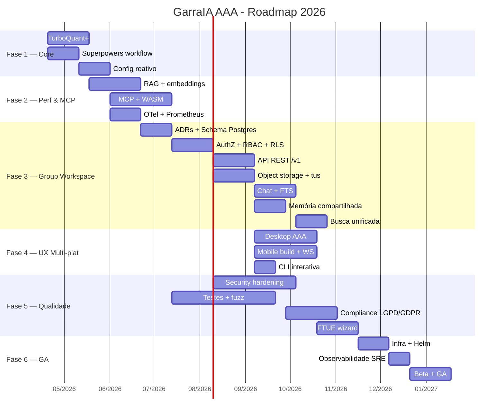

# GarraIA — ROADMAP AAA

> Roadmap unificado do ecossistema GarraIA (CLI, Gateway, Desktop, Mobile, Agents, Channels, Voice) rumo ao padrão **AAA**. Funde o plano de inferência local + workflows agenticos com a nova direção de produto **Group Workspace** (família/equipe multi-tenant) derivada de `deep-research-report.md`.
>
> **Última atualização:** 2026-04-13
> **Owner:** @michelbr84
> **Equipe Linear:** GAR
> **Branch base:** `main`

---

## 0. North Star

> **"Garra é o sistema nervoso de IA da sua família, do seu estúdio e da sua empresa — local-first, privado por padrão, multi-canal, e com agentes que colaboram entre si."**

### Pilares

1. **Local-first & Privado por padrão** — inferência, memória e arquivos rodam na máquina do usuário, sincronização opcional.
2. **Multi-tenant real** — separação rígida entre memória pessoal, de grupo e de chat (novo Group Workspace).
3. **Multi-canal unificado** — Telegram, Discord, Slack, WhatsApp, iMessage, Mobile, Desktop, CLI, Web, todos compartilhando o mesmo runtime de agentes.
4. **Agentico por dentro** — sub-agentes com TDD, worktrees e orquestração mestre-escravo via Superpowers.
5. **Compliance first** — LGPD (art. 46-49) e GDPR (art. 25, 32, 33) tratados como requisito funcional, não afterthought.
6. **Observável e tunável** — OpenTelemetry + Prometheus + traces por request desde o dia 1 das fases novas.

### Critérios globais de "AAA-ready"

- `cargo check --workspace` e `cargo clippy --workspace -- -D warnings` **verdes**.
- Cobertura de testes ≥ 70% em crates de domínio (`garraia-agents`, `garraia-db`, `garraia-security`, `garraia-workspace`).
- Zero `unwrap()` fora de testes; zero SQL por concatenação; zero secrets em logs.
- Changelog por release, migrations forward-only, feature flags por tenant/grupo.
- Runbooks de incidente + backup/restore testados trimestralmente.

---

## 1. Baseline honesto (onde estamos em 2026-04-13)

**O que já existe e compila:**

- Workspace Cargo com 16 crates, Axum 0.8, Tauri v2 scaffold, Flutter mobile scaffold.
- `garraia-gateway`: HTTP + WS, admin API, MCP registry, bootstrap de canais/providers/tools.
- `garraia-agents`: providers OpenAI, OpenRouter, Anthropic, Ollama, `AgentRuntime` com tools.
- `garraia-db`: SQLite via rusqlite (sessions, messages, memory, chat_sync, mobile_users).
- `garraia-security`: `CredentialVault` AES-256-GCM + PBKDF2 (parcial).
- `garraia-channels`: adapters Telegram/Discord/Slack/WhatsApp/iMessage.
- `garraia-voice`: STT Whisper (dual endpoint) + TTS (Chatterbox/ElevenLabs/Kokoro stubs).
- Mobile (Flutter): auth JWT + chat + mascote — roda no emulator Android.
- Desktop (Tauri v2): scaffold + sidecar Windows MSI.

**O que ainda é stub, frágil ou ausente:**

- Sem Postgres (toda persistência é SQLite single-file — bloqueia multi-tenant real).
- Sem object storage (arquivos grandes, anexos, versionamento).
- Sem modelo de grupo/membros/RBAC — hoje é mono-usuário por instalação.
- Sem embeddings locais nem busca vetorial.
- Sem OpenTelemetry, sem métricas estruturadas.
- CredentialVault ainda não é **fonte única** de secrets do gateway (parcialmente wired).
- Mobile build Android com gradle/SDK desatualizados em alguns caminhos.
- Desktop UI sem micro-interações; apenas WebView básico.
- MCP servers não rodam em sandbox WASM.
- Sem wizard de onboarding; `.env.example` ainda é o caminho oficial.
- Cobertura de testes: baixa nos crates de domínio; quase zero em integração.

Esse baseline define o que as fases seguintes precisam mover.

---

## 2. Estrutura do roadmap

O roadmap está dividido em **7 fases + trilhas contínuas**. Cada fase tem:

- **Objetivo** (uma frase)
- **Entregáveis** (checklist executável)
- **Critérios de aceite** (verificáveis)
- **Dependências** (fases/entregáveis prévios)
- **Estimativa** (semanas: baixa / provável / alta)
- **Épicos Linear (GAR)** quando aplicável

Fases 1-2 são **fundação técnica**. Fase 3 é o **salto de produto** (Group Workspace). Fase 4 é **experiência**. Fase 5 é **qualidade/compliance**. Fase 6 é **lançamento**. Fase 7 é **pós-GA**. Trilhas contínuas cortam todas as fases.

---

## Fase 1 — Fundações de Core & Inferência (6-9 semanas)

**Objetivo:** fechar as lacunas do motor local e do runtime para que as fases 2-3 possam construir em terreno firme.

### 1.1 TurboQuant+ — Inferência local otimizada

- [ ] Benchmark dos providers locais atuais (Ollama, llama.cpp) em latência/tokens-por-segundo em `benches/inference.rs` (Criterion).
- [ ] **KV Cache compression** para sessões longas: investigar integração com `llama.cpp` flags `--cache-type-k q8_0 --cache-type-v q8_0`; expor via `garraia-agents` como opção `kv_quant` no provider config.
- [ ] **PagedAttention / Continuous Batching**: avaliar `candle` vs `mistral.rs` como backend alternativo em Rust nativo; decisão registrada em ADR `docs/adr/0001-local-inference-backend.md`.
- [ ] **Backends paralelos**: detectar CUDA/MPS/Vulkan em runtime e passar flags apropriadas.
- [ ] **Quantização**: suporte a modelos Q4_K_M, Q5_K_M, Q8_0 com auto-seleção por VRAM disponível.

**Critério de aceite:**

- Latência p95 ≤ 80% da baseline em sessões ≥ 32k tokens.
- `garraia-cli bench` roda comparação local vs cloud e emite relatório em markdown.

### 1.2 Superpowers Workflow & Auto-Dev

- [ ] `.claude/superpowers-config.md` expandido com perfis de projeto (backend-rust, mobile-flutter, docs-only).
- [ ] **TDD com sub-agentes**: skill `/tdd-loop` chama `@code-reviewer` para validar cada ciclo Red-Green-Refactor.
- [ ] **Git worktrees automatizados**: script `scripts/worktree-experiment.sh` cria branch + worktree + ambiente isolado; integração com Superpowers já existente.
- [ ] **Orquestrador mestre-escravo**: `team-coordinator` pode delegar tarefas para `garraia-agents` localmente (dogfooding) — útil para CI.

**Critério de aceite:**

- Um bug real do backlog é corrigido end-to-end via `/fix-issue` sem intervenção manual além de approve/merge.

### 1.3 Config & Runtime Wiring unificado

- [ ] **Schema único** de config em `garraia-config` (novo crate) com `serde` + `validator`; fontes: `.garraia/config.toml` > `mcp.json` > env > CLI flags.
- [ ] **Reactive config**: endpoint SSE `GET /v1/admin/config/stream` emite eventos ao alterar config via Web UI/CLI; `AppState` reage sem restart.
- [ ] **Provider hot-reload**: alterar API keys ou endpoints propaga para `AgentRuntime` em < 500ms.
- [ ] **Dry-run validation**: `garraia-cli config check` valida config sem iniciar o servidor.

**Critério de aceite:**

- Teste de integração altera `models.default` via PATCH admin e verifica que a próxima chamada de chat usa o novo modelo sem reiniciar processo.

**Estimativa fase 1:** 6 / 8 / 12 semanas.
**Épicos Linear sugeridos:** `GAR-TURBO-1`, `GAR-SUPERPOWERS-1`, `GAR-CONFIG-1`.

---

## Fase 2 — Performance, Memória de Longo Prazo & MCP Ecosystem (8-12 semanas)

**Objetivo:** dar a Garra memória vetorial local veloz, plugins sandboxed e telemetria zero-latency.

### 2.1 Memória de longo prazo & RAG local

- [ ] **Embeddings locais**: integrar `mxbai-embed-large-v1` via `ort` (onnxruntime) em novo crate `garraia-embeddings`. Fallback para `fastembed-rs`.
- [ ] **Vector store**: escolha documentada em ADR `docs/adr/0002-vector-store.md` entre `lancedb` (embutido, colunar) e `qdrant` (embutido ou sidecar). Recomendação inicial: **lancedb** pela simplicidade de deploy.
- [ ] **Schema**: tabelas `memory_embeddings(memory_item_id, vector, model, created_at)` e índice HNSW.
- [ ] **RAG pipeline**: `garraia-agents` ganha `RetrievalTool` que faz ANN search + re-rank por BM25 (via `tantivy`) + injeção em prompt.
- [ ] **Governance**: TTL, sensitivity level (`public|group|private`), auditoria de acesso.

**Critério de aceite:**

- Chat consulta "o que eu disse sobre X semana passada?" e recupera top-5 memórias do próprio usuário em < 200ms p95.

### 2.2 MCP + Plugins WASM

- [ ] **MCP servers expandidos**: registro dinâmico via admin API; health-check periódico.
- [ ] **WASM sandbox**: integrar `wasmtime` em novo crate `garraia-plugins`; plugins expõem interface WIT (`wit-bindgen`).
- [ ] **Capabilities-based**: cada plugin declara permissões (`net`, `fs:/allowed/path`, `llm:call`) — nenhum por padrão.
- [ ] **Self-authoring tools**: sub-agentes podem gerar plugins WASM via template e testá-los no sandbox antes de registrar.
- [ ] **Plugin registry local**: `~/.garraia/plugins/` com manifesto assinado (ed25519).

**Critério de aceite:**

- Um plugin de exemplo (`fetch-rss`) é gerado por sub-agente, compilado para WASM, assinado, carregado e executado sem escapar do sandbox (teste com `proptest`).

### 2.3 Zero-latency streaming & Telemetria

**Status:** ✅ baseline entregue em 2026-04-13 via [GAR-384](https://linear.app/chatgpt25/issue/GAR-384) (commit `84c4753`). Crate `garraia-telemetry` em produção atrás de feature flag `telemetry` (default on). Follow-ups: [GAR-411](https://linear.app/chatgpt25/issue/GAR-411) (TLS docs, cardinality, idempotência) e [GAR-412](https://linear.app/chatgpt25/issue/GAR-412) (/metrics auth não-loopback).

- [ ] **Tokio tuning**: buffers enxutos em WebSocket handlers; `tokio-tungstenite` com `flush_interval` configurável.
- [x] **OpenTelemetry**: crate `garraia-telemetry` com `tracing-opentelemetry` 0.27 + `opentelemetry-otlp` 0.26 (gRPC), fail-soft init, sampler `TraceIdRatioBased`, guard RAII com shutdown em Drop. ✅
- [x] **Prometheus**: `/metrics` baseline com 4 métricas (`requests_total`, `http_latency_seconds`, `errors_total`, `active_sessions`) via `metrics-exporter-prometheus 0.15`, bind default `127.0.0.1:9464`. ✅ (métricas adicionais por subsistema ficam como issue futuro)
- [x] **Trace correlation**: `request_id` via `tower-http::SetRequestIdLayer` + propagate layer; `#[tracing::instrument]` em `AgentRuntime::process_message*` (skip_all, has_user_id boolean para LGPD) e `SessionStore::append_message*`/`load_recent_messages`. ✅
- [x] **PII safety**: `http_trace_layer()` exclui headers dos spans por default; `redact.rs` com header allowlist; `redaction_smoke.rs` como regression guard. ✅
- [x] **Infra local**: `ops/compose.otel.yml` (Jaeger 1.60 + Prometheus v2.54 + Grafana 11.2) com provisioning de datasources. ✅
- [ ] **Dashboards**: templates Grafana em `ops/grafana/dashboards/` para latência, errors, inference p95, fila de jobs. (folder stub existe, dashboards como issue futuro)

**Critério de aceite:**

- [x] Uma requisição de chat gera trace com spans `http.request` → `agent.run` (process_message_impl) → `db.persist` (append_message) — todos correlacionados via `x-request-id`. ✅

**Estimativa fase 2:** 8 / 10 / 14 semanas.
**Épicos Linear sugeridos:** `GAR-RAG-1`, `GAR-WASM-1`, `GAR-OTEL-1`.

---

## Fase 3 — Group Workspace (família/equipe multi-tenant) — **NOVO** (12-20 semanas)

**Objetivo:** transformar Garra de mono-usuário em **workspace compartilhado** com arquivos, chats e memória IA escopados por grupo, conforme `deep-research-report.md`.

**Status (2026-04-13):** 🟡 **Parcialmente desbloqueada.** ADR 0003 ([GAR-373](https://linear.app/chatgpt25/issue/GAR-373)) accepted, fixando **PostgreSQL 16 + pgvector + pg_trgm** como backend; benchmark empírico em [`benches/database-poc/`](benches/database-poc/). Próximo marco: [GAR-407](https://linear.app/chatgpt25/issue/GAR-407) (`garraia-workspace` crate + migration 001). ADRs 0004-0006 ainda pendentes para object storage, identity, search.

> Esta é a fase de maior valor de produto e a de maior risco de segurança. Tudo aqui nasce com "privacidade por padrão" e testes de autorização.

### 3.1 Decisões arquiteturais (ADRs obrigatórios antes de codar)

- [x] [`docs/adr/0003-database-for-workspace.md`](docs/adr/0003-database-for-workspace.md) — **Postgres 16 + pgvector + pg_trgm** escolhido com benchmark empírico em [`benches/database-poc/`](benches/database-poc/). SQLite mantido para dev/CLI single-user. Entregue em 2026-04-13 via [GAR-373](https://linear.app/chatgpt25/issue/GAR-373). ✅
- [ ] `docs/adr/0004-object-storage.md` — S3 compatível (MinIO default self-host; suporte R2/S3/GCS/Azure). Versionamento obrigatório. ([GAR-374](https://linear.app/chatgpt25/issue/GAR-374))
- [ ] `docs/adr/0005-identity-provider.md` — manter JWT interno ou adotar OIDC (Keycloak/Authelia/Authentik). Recomendação: **JWT interno + adapter OIDC plugável**. ([GAR-375](https://linear.app/chatgpt25/issue/GAR-375))
- [ ] `docs/adr/0006-search-strategy.md` — Postgres FTS (tsvector) como start, Tantivy como evolução, Meilisearch como opção externa. ([GAR-376](https://linear.app/chatgpt25/issue/GAR-376))

### 3.2 Domínio & Schema

Crate `garraia-workspace` ✅ **bootstrap merged** em 2026-04-13 via [GAR-407](https://linear.app/chatgpt25/issue/GAR-407). Migration 001 aplica 7 tabelas (users/user_identities/sessions/api_keys/groups/group_members/group_invites) + extensões `pgcrypto` + `citext`, com smoke test testcontainers `pgvector/pgvector:pg16` verde (~7s). PII-safe `Workspace` handle via `#[instrument(skip(config))]` + custom `Debug` redacting `database_url`. Plan: [`plans/0003-gar-407-workspace-schema-bootstrap.md`](plans/0003-gar-407-workspace-schema-bootstrap.md).

**Tabelas (Postgres + SQLx migrations):**

- [x] `users` (`id`, `email citext`, `display_name`, `status`, `legacy_sqlite_id`, `created_at`, `updated_at`) — migration 001 ✅
- [x] `user_identities` (`id`, `user_id`, `provider`, `provider_sub`, `password_hash`, `created_at`) — OIDC-ready, migration 001 ✅
- [x] `sessions` (`id`, `user_id`, `refresh_token_hash UNIQUE`, `device_id`, `expires_at`, `revoked_at`, `created_at`) — migration 001 ✅
- [x] `api_keys` (`id`, `user_id`, `label`, `key_hash UNIQUE`, `scopes jsonb`, `created_at`, `revoked_at`, `last_used_at`) — Argon2id pinned, migration 001 ✅
- [x] `groups` (`id`, `name`, `type`, `created_by`, `settings jsonb`, `created_at`, `updated_at`) — migration 001 ✅
- [x] `group_members` (`group_id`, `user_id`, `role`, `status`, `joined_at`, `invited_by`) — migration 001 ✅
- [x] `group_invites` (`id`, `group_id`, `invited_email citext`, `proposed_role`, `token_hash UNIQUE`, `expires_at`, `created_by`, `created_at`, `accepted_at`, `accepted_by`) — migration 001 ✅
- [ ] `roles`, `permissions`, `role_permissions`
- [ ] `audit_events` (`id`, `group_id`, `actor_user_id`, `action`, `resource_type`, `resource_id`, `ip`, `user_agent`, `metadata_jsonb`, `created_at`)
- [ ] `chats` (`id`, `group_id`, `type`, `name`, `settings_jsonb`)
- [ ] `chat_members`, `messages`, `message_threads`, `message_attachments`
- [ ] `folders` (`id`, `group_id`, `parent_id`, `name`)
- [ ] `files`, `file_versions`, `file_shares`
- [ ] `memory_items` (`id`, `scope_type`, `scope_id`, `group_id`, `kind`, `content`, `sensitivity`, `ttl_expires_at`)
- [ ] `memory_embeddings` (`memory_item_id`, `embedding`) — pgvector

**Critério de aceite do schema:**

- Migrations forward-only aplicam do zero em < 30s.
- `EXPLAIN ANALYZE` nas queries críticas (list messages, list files, memory ANN) < 50ms p95 com 1M de linhas.

### 3.3 Runtime Scopes & RBAC

Novo crate: `garraia-auth` (separado de `garraia-security`).

- [ ] `enum Scope { User(Uuid), Group(Uuid), Chat(Uuid) }` com regra de resolução `Chat > Group > User`.
- [ ] `struct Principal { user_id, group_id, role }` carregado via extractor Axum.
- [ ] `fn can(principal, action) -> bool` central — todas as rotas passam por ele.
- [ ] Papéis: `Owner`, `Admin`, `Member`, `Guest`, `Child/Dependent`.
- [ ] **Capabilities** (`files.write`, `chats.moderate`, `memory.delete`, `members.manage`) → mapeadas por papel.
- [ ] **Defense-in-depth**: Postgres RLS (`CREATE POLICY`) em `messages`, `files`, `memory_items` restringindo por `group_id` usando `current_setting('app.current_group_id')`.
- [ ] **Guardrails Child/Dependent**: sem export, sem share externo, content filter aplicado pré-LLM.

**Critério de aceite:**

- Suite de testes `tests/authz/` com > 100 cenários (cross-group leak attempts, role escalation, token replay) — 100% verde.
- Teste específico: usuário do grupo A **não** consegue listar, ler, buscar, nem aparecer em auditoria do grupo B mesmo tentando IDs diretos.

### 3.4 API REST `/v1` (OpenAPI documented)

Contrato versionado. Usar `utoipa` para gerar OpenAPI + Swagger UI em `/docs`.

**Grupos**

- [ ] `POST /v1/groups`
- [ ] `GET /v1/groups/{group_id}`
- [ ] `PATCH /v1/groups/{group_id}`
- [ ] `POST /v1/groups/{group_id}/invites`
- [ ] `POST /v1/groups/{group_id}/members/{user_id}:setRole`
- [ ] `DELETE /v1/groups/{group_id}/members/{user_id}`

**Chats**

- [ ] `POST /v1/groups/{group_id}/chats`
- [ ] `GET /v1/groups/{group_id}/chats`
- [ ] `POST /v1/chats/{chat_id}/messages`
- [ ] `GET /v1/chats/{chat_id}/messages?cursor=...`
- [ ] `POST /v1/messages/{message_id}/threads`
- [ ] WebSocket `/v1/chats/{chat_id}/stream` com backpressure

**Arquivos**

- [ ] `POST /v1/groups/{group_id}/files:initUpload` (presigned URL + multipart)
- [ ] `POST /v1/groups/{group_id}/files:completeUpload`
- [ ] `GET /v1/groups/{group_id}/files?folder_id=...`
- [ ] `GET /v1/files/{file_id}:download` (URL temporária curta duração)
- [ ] `POST /v1/files/{file_id}:newVersion`
- [ ] `DELETE /v1/files/{file_id}` (soft delete + lixeira)
- [ ] Suporte a **tus** (resumable upload) como alternativa

**Memória**

- [ ] `GET /v1/memory?scope_type=group&scope_id=...`
- [ ] `POST /v1/memory`
- [ ] `DELETE /v1/memory/{id}`
- [ ] `POST /v1/memory/{id}:pin`

**Busca unificada**

- [ ] `GET /v1/search?q=...&scope=group:{id}&types=messages,files,memory`

**Auditoria**

- [ ] `GET /v1/groups/{group_id}/audit?cursor=...`

**Erros:** todos os erros seguem **RFC 9457 Problem Details**.

**Critério de aceite:**

- Spec OpenAPI 3.1 gerada e servida em `/docs`.
- Contract tests via `schemathesis` ou `dredd` rodam em CI.

### 3.5 Object storage & uploads

Novo crate: `garraia-storage`.

- [ ] Abstração `trait ObjectStore` com impls: `LocalFs`, `S3Compatible` (via `aws-sdk-s3`), `Minio`.
- [ ] **Presigned URLs** (PUT/GET) com expiração ≤ 15 min e escopo mínimo.
- [ ] **Multipart upload** nativo do S3 para arquivos > 16 MiB.
- [ ] **tus 1.0** server implementation para clientes mobile.
- [ ] **Versionamento**: cada update cria `file_versions` nova; soft delete move para lixeira com retenção configurável (default 30 dias).
- [ ] **Criptografia em repouso**: SSE-S3/SSE-KMS quando em cloud; chave local via `CredentialVault` quando `LocalFs`.
- [ ] **Antivírus opcional**: hook para ClamAV (feature flag `av-clamav`).

**Critério de aceite:**

- Upload de 2 GiB via mobile em rede instável completa via tus resumable.
- Download só responde com URL válida se `principal.can(FilesRead)` passar.

### 3.6 Chat compartilhado

- [ ] Canais por grupo + DMs intra-grupo.
- [ ] Threads (entidade dedicada, não só `parent_id`).
- [ ] Reações, menções (`@user`, `@channel`), typing indicators.
- [ ] Anexos via `message_attachments` → `files`.
- [ ] **Bot Garra no chat**: agente pode ser invocado por `/garra <prompt>` e responde respeitando o scope do chat.
- [ ] **Busca**: Postgres FTS (`tsvector`) com índice GIN; migração para Tantivy quando > 10M mensagens.

**Critério de aceite:**

- Dois usuários conversam em WebSocket com latência < 100ms intra-LAN.
- Busca full-text retorna top-20 em < 150ms p95 com 1M de mensagens.

### 3.7 Memória IA compartilhada

- [ ] **Três níveis** rigorosamente separados: `personal`, `group`, `chat`.
- [ ] **UI de memória** (web + mobile): ver, editar, fixar, expirar, excluir.
- [ ] **Políticas**: retenção por grupo, sensitivity por item, TTL.
- [ ] **Auditoria**: toda leitura/escrita/deleção de memória gera `audit_events`.
- [ ] **Consentimento**: ao salvar memória derivada de chat, mostrar prompt "Salvar para: só eu / grupo / este chat".
- [ ] **LGPD direitos do titular**: export JSON + delete por user_id dentro de um grupo.

**Critério de aceite:**

- Memória pessoal do usuário A **nunca** aparece em retrieval do grupo mesmo com query idêntica.
- Export LGPD de um usuário gera zip com todos os dados em < 30s.

### 3.8 Tasks & Docs (Notion-like) — módulo de acompanhamento

**Objetivo:** transformar o Group Workspace em sistema de trabalho real da família/equipe — tarefas, páginas colaborativas e, no futuro, databases com automações dirigidas por agentes Garra. Entrega em **3 tiers** com gates de adoção entre eles.

#### Tier 1 — Tasks (MVP)

Novo módulo em `garraia-workspace` (ou crate `garraia-tasks` se o módulo crescer).

**Schema (Postgres migrations):**

- [ ] `task_lists` (`id`, `group_id`, `name`, `type` = `list|board|calendar`, `settings_jsonb`, `created_by`, `created_at`, `archived_at`)
- [ ] `tasks` (`id`, `list_id`, `group_id`, `parent_task_id`, `title`, `description_md`, `status`, `priority`, `due_at`, `started_at`, `completed_at`, `estimated_minutes`, `created_by`, `created_at`, `updated_at`, `deleted_at`)
- [ ] `task_assignees` (`task_id`, `user_id`, `assigned_at`, `assigned_by`)
- [ ] `task_labels` (`id`, `group_id`, `name`, `color`)
- [ ] `task_label_assignments` (`task_id`, `label_id`)
- [ ] `task_comments` (`id`, `task_id`, `author_user_id`, `body_md`, `created_at`, `edited_at`, `deleted_at`)
- [ ] `task_attachments` (`task_id`, `file_id`) — reusa `files`
- [ ] `task_subscriptions` (`task_id`, `user_id`) — para notificações
- [ ] `task_activity` (`id`, `task_id`, `actor_user_id`, `kind`, `payload_jsonb`, `created_at`) — histórico de mudanças
- [ ] Status enum: `backlog|todo|in_progress|review|done|canceled`
- [ ] Priority enum: `none|low|medium|high|urgent`
- [ ] Índices: `(group_id, status)`, `(list_id, status)`, `(due_at) WHERE deleted_at IS NULL`

**API REST `/v1`:**

- [ ] `POST /v1/groups/{group_id}/task-lists`
- [ ] `GET /v1/groups/{group_id}/task-lists`
- [ ] `POST /v1/task-lists/{list_id}/tasks`
- [ ] `GET /v1/task-lists/{list_id}/tasks?status=...&assignee=...&cursor=...`
- [ ] `GET /v1/tasks/{task_id}`
- [ ] `PATCH /v1/tasks/{task_id}` (status, priority, assignees, due_at, labels)
- [ ] `POST /v1/tasks/{task_id}/comments`
- [ ] `POST /v1/tasks/{task_id}/attachments`
- [ ] `POST /v1/tasks/{task_id}:move` (reordenar/mudar lista)
- [ ] `DELETE /v1/tasks/{task_id}` (soft delete)
- [ ] WebSocket `/v1/task-lists/{list_id}/stream` para updates em tempo real (kanban colaborativo)

**RBAC:**

- [ ] Novas capabilities: `tasks.read`, `tasks.write`, `tasks.assign`, `tasks.delete`, `tasks.admin`.
- [ ] Mapeamento padrão: Owner/Admin/Member → read+write+assign; Guest → read + comment; Child → read + comment + complete próprias.
- [ ] Auditoria: toda mudança de status/assignee/due_at gera `audit_events` e `task_activity`.

**Integração com memória IA & agentes:**

- [ ] Agente Garra é tratável como *assignee* (user virtual por grupo): `POST /v1/tasks/{id}:delegateToAgent`.
- [ ] Comentário `@garra faça X` no task dispara execução do agente com scope `Chat(task_thread)`.
- [ ] Memória de grupo indexa tasks abertos para responder "o que está pendente da família?".
- [ ] Recorrência: `recurrence_rrule` (RFC 5545) em `task_lists.settings_jsonb`.

**Notificações:**

- [ ] Fan-out para canais via `garraia-channels`: mention em task → Telegram/Discord/mobile push.
- [ ] Daily digest por grupo (configurável): "seus 5 tasks de hoje".
- [ ] Lembretes por `due_at` com janelas (1d/1h/now).

**UI (Desktop + Mobile + Web):**

- [ ] Vista **List** (default), **Board** (kanban drag-and-drop), **Calendar** (due_at), **My Tasks** (cross-list do usuário).
- [ ] Quick-add com parser natural: "comprar pão amanhã 9h @maria #casa !high" → task tipado.
- [ ] Filtros persistentes por view.

**Critério de aceite Tier 1:**

- Família cria lista "Casa", adiciona 20 tasks, dois membros editam simultaneamente em WebSocket sem conflito.
- Mention `@garra` em um comentário executa agente e posta resposta como novo comentário respeitando scope do task.
- RBAC: usuário de grupo A não vê, lista, nem recebe notificação de task do grupo B (teste automatizado).
- Export LGPD inclui todos os tasks/comments/activity do usuário.

#### Tier 2 — Docs (páginas colaborativas)

**Schema:**

- [ ] `doc_pages` (`id`, `group_id`, `parent_page_id`, `title`, `icon`, `cover_file_id`, `created_by`, `created_at`, `updated_at`, `archived_at`)
- [ ] `doc_blocks` (`id`, `page_id`, `parent_block_id`, `position`, `type`, `content_jsonb`, `created_at`, `updated_at`) — tipos: `heading|paragraph|todo|bullet|numbered|code|quote|callout|divider|file_embed|task_embed|chat_embed|image`
- [ ] `doc_page_versions` (`id`, `page_id`, `snapshot_jsonb`, `created_by`, `created_at`)
- [ ] `doc_page_mentions` (`page_id`, `mentioned_user_id | mentioned_task_id | mentioned_file_id`)

**API:**

- [ ] `POST /v1/groups/{group_id}/doc-pages`
- [ ] `GET /v1/groups/{group_id}/doc-pages?parent=...`
- [ ] `GET /v1/doc-pages/{page_id}` (com blocks)
- [ ] `PATCH /v1/doc-pages/{page_id}`
- [ ] `POST /v1/doc-pages/{page_id}/blocks`
- [ ] `PATCH /v1/doc-blocks/{block_id}`
- [ ] `DELETE /v1/doc-blocks/{block_id}`
- [ ] `POST /v1/doc-pages/{page_id}:duplicate`
- [ ] `GET /v1/doc-pages/{page_id}/versions`

**Colaboração em tempo real:**

- [ ] CRDT via `y-crdt` (Rust) ou OT simplificado; decisão em `docs/adr/0008-doc-collab-strategy.md`.
- [ ] WebSocket `/v1/doc-pages/{id}/stream` com awareness (cursor/selection).
- [ ] Modo offline com merge no reconnect.

**Embeds (o diferencial IA):**

- [ ] Embed de **task** renderiza card ao vivo (status muda na página).
- [ ] Embed de **file** renderiza preview.
- [ ] Embed de **chat query** (`/garra resuma as compras do mês`) roda ao abrir a página, com cache + invalidação.
- [ ] Slash command `/garra` gera bloco de conteúdo assistido por agente (scope = grupo).

**Busca:**

- [ ] FTS indexa `doc_blocks.content_jsonb` via tsvector.
- [ ] Busca unificada passa a cobrir `messages + files + memory + tasks + docs`.

**Critério de aceite Tier 2:**

- Dois usuários editam a mesma página simultaneamente sem perder input.
- Página com 500 blocos abre em < 500ms p95.
- Embed de task atualiza em < 1s quando o task muda de status.

#### Tier 3 — Databases + Automations (pós-GA)

- [ ] **Database views**: table/board/calendar/timeline/gallery sobre qualquer coleção (tasks, docs, custom).
- [ ] **Typed properties**: text, number, select, multi-select, date, user, file, relation, rollup, formula.
- [ ] **Custom databases** (`db_schemas`, `db_rows`, `db_cells`) — dados do usuário tipados.
- [ ] **Automations**: "quando task muda para `done` então comentar no chat X e criar task de review".
- [ ] **Agente como executor de automação**: steps podem ser prompts Garra com scope delimitado.
- [ ] **Templates de workspace**: "Família", "Projeto de obra", "Estúdio de criação", "OKRs de equipe".

**Gate de entrada para Tier 3:** adoção do Tier 1 ≥ 60% dos grupos ativos e Tier 2 ≥ 30%.

**Estimativa Fase 3.8:**

- Tier 1: 3 / 5 / 7 semanas
- Tier 2: 4 / 6 / 10 semanas
- Tier 3: 6 / 10 / 16 semanas (pós-GA)

**Épicos Linear sugeridos:** `GAR-WS-TASKS` (Tier 1), `GAR-WS-DOCS` (Tier 2), `GAR-WS-DB` (Tier 3).

### 3.9 Busca unificada

- [ ] Endpoint `/v1/search` retorna resultados heterogêneos (messages, files, memory) ordenados por relevância.
- [ ] Filtros: `scope`, `types`, `from_date`, `author`, `has_attachment`.
- [ ] **Híbrido**: BM25 + ANN vetorial + re-rank.

**Critério de aceite:**

- Query "contrato setembro" retorna mensagem + PDF + memória relevantes — todos filtrados por RBAC.

**Estimativa fase 3:** 12 / 16 / 22 semanas.
**Épicos Linear sugeridos:** `GAR-WS-SCHEMA`, `GAR-WS-AUTHZ`, `GAR-WS-API`, `GAR-WS-STORAGE`, `GAR-WS-CHAT`, `GAR-WS-MEMORY`, `GAR-WS-TASKS`, `GAR-WS-DOCS`, `GAR-WS-DB`, `GAR-WS-SEARCH`.

---

## Fase 4 — Experiência Multi-Plataforma AAA (8-12 semanas)

**Objetivo:** consolidar Garra como a melhor UI open-source de IA multi-tenant.

### 4.1 Garra Desktop (Tauri v2 — Win/Mac/Linux)

- [ ] **Stack web**: migrar WebView de HTML puro para **SvelteKit** ou **Solid** (decisão em ADR `0007-desktop-frontend.md`).
- [ ] **Design system**: tokens em `ops/design-tokens/`; dark mode imersivo; glassmorphism com `backdrop-filter`.
- [ ] **Micro-interações**: transições 120Hz via `motion.dev` ou `svelte-motion`.
- [ ] **Bridge Rust ↔ TS**: comandos Tauri typed via `specta` ou `tauri-bindgen`.
- [ ] **Offline-first**: cache local de chats/arquivos recentes via IndexedDB.
- [ ] **Workspaces**: seletor de grupo no topo; switch rápido com `Ctrl+K`.
- [ ] **Instaladores**: MSI (Win), DMG (Mac, notarizado), AppImage + deb + rpm (Linux).

**Critério de aceite:**

- Lighthouse score ≥ 95 no webview de produção.
- Abrir app → primeiro pixel < 800ms em SSD médio.

### 4.2 Garra Mobile (Flutter — Android & iOS)

- [ ] **Fix build Android**: atualizar `gradle` → 8.x, AGP → 8.x, Java 17, `compileSdk 35`.
- [ ] **iOS target**: `flutter create --platforms ios`, ajustes CocoaPods, assinatura dev.
- [ ] **WebSocket seguro** (wss) para chat em tempo real; fallback REST.
- [ ] **Upload retomável**: integrar `tus_client` para arquivos grandes.
- [ ] **Grupo switcher** com cache de membership.
- [ ] **Tiny-LLMs locais** (fase posterior): avaliar `llama.cpp` via FFI ou ONNX Mobile para modelos ≤ 1B em dispositivos NPU.
- [ ] **Push notifications**: FCM (Android) + APNs (iOS) para menções e mensagens.
- [ ] **Mascote**: substituir placeholders por animações Rive (4 estados: idle/thinking/talking/happy).

**Critério de aceite:**

- APK release assina e instala em Android 14 sem warnings.
- IPA ad-hoc roda em iPhone físico via TestFlight interno.

### 4.3 Garra CLI

- [ ] `garraia-cli chat` interativo com streaming (markdown renderer).
- [ ] `garraia-cli workspace` (list/create/join/invite).
- [ ] `garraia-cli files upload/download/ls`.
- [ ] `garraia-cli bench` (baseline inference).
- [ ] Autocomplete para bash/zsh/fish/pwsh.

**Estimativa fase 4:** 8 / 10 / 14 semanas.
**Épicos Linear sugeridos:** `GAR-DESK-AAA`, `GAR-MOB-BUILD`, `GAR-MOB-WS`, `GAR-CLI-CHAT`.

---

## Fase 5 — Qualidade, Segurança, Compliance & Polishing (6-10 semanas, paralelo às fases 3-4)

### 5.1 Security & Vaults

- [ ] **CredentialVault final (GAR-291)**: única fonte de secrets do gateway; rotação de chaves; master key via `argon2id`.
- [ ] **TLS 1.3 obrigatório** em todas as superfícies públicas via `rustls`.
- [ ] **Argon2id** para senhas de usuários (mobile_users → users).
- [ ] **Rate limiting** por IP + por user_id via `tower-governor`.
- [ ] **CSRF + CORS** hardening no Gateway (`tower-http`).
- [ ] **Headers de segurança**: CSP, HSTS, X-Content-Type-Options, Referrer-Policy.
- [ ] **Secrets scanning** no CI via `gitleaks`.
- [ ] **Threat model** documentado em `docs/security/threat-model.md` (STRIDE por componente).
- [ ] **Pentest interno** com checklist OWASP ASVS L2.

### 5.2 Testes & Continuous Fuzzing

- [ ] Cobertura ≥ 70% em `garraia-agents`, `garraia-db`, `garraia-security`, `garraia-auth`, `garraia-workspace`.
- [ ] **Integration tests** com testcontainers (Postgres, MinIO) em CI.
- [ ] **Property tests** (`proptest`) em parsers, scopes, RBAC.
- [ ] **Fuzzing contínuo** via `cargo-fuzz` nos parsers de MCP, config e protocolos de canais.
- [ ] **Mutation testing** (`cargo-mutants`) mensal.
- [ ] **Load testing**: `k6` ou `vegeta` com cenários de 1k concurrent users.
- [ ] **Chaos testing**: matar DB/storage e validar degradação graciosa.

### 5.3 Compliance LGPD / GDPR

- [ ] **DPIA** (Data Protection Impact Assessment) em `docs/compliance/dpia.md`.
- [ ] **Privacy policy** + **Terms of Service** em PT-BR e EN.
- [ ] **Records of Processing Activities (RoPA)** documentados.
- [ ] **Data subject rights**: endpoints de export e delete (art. 18 LGPD / art. 15/17 GDPR).
- [ ] **Retention policies** configuráveis por grupo.
- [ ] **Incident response runbook**: fluxo de notificação ANPD (comunicado de incidente) e autoridades UE em ≤ 72h quando aplicável.
- [ ] **Data minimization**: revisão de todos os logs para garantir que não vaze PII.
- [ ] **Child protection**: modo Child/Dependent com content filter.

### 5.4 UX inicial impecável

- [ ] **First-run wizard** (Desktop + Gateway web admin):
  - Detecção automática de Docker, Ollama, llama.cpp local.
  - Escolha entre "tudo local" / "hybrid" / "cloud".
  - Setup do CredentialVault (master password).
  - Convite para criar primeiro grupo.
- [ ] **Sample data**: grupo "Playground" com mensagens, arquivos e memória de exemplo.
- [ ] **Onboarding tour** com `shepherd.js` ou equivalente no Desktop.
- [ ] **Empty states** ilustrados em toda a UI.

**Estimativa fase 5:** 6 / 8 / 12 semanas (paralelo).
**Épicos Linear sugeridos:** `GAR-SEC-HARDEN`, `GAR-TEST-COV`, `GAR-COMPLIANCE`, `GAR-UX-FTUE`.

---

## Fase 6 — Lançamento, Observabilidade SRE & GA (4-6 semanas)

### 6.1 Deploy & Infra

- [ ] **Dockerfiles multi-stage** para gateway, workers, frontend.
- [ ] **Helm chart** `charts/garraia/` com: StatefulSet (Postgres), Deployment (gateway/workers), Ingress, HPA, Secrets, RBAC, Probes.
- [ ] **docker-compose** para dev local com Postgres, MinIO, Ollama, OTel collector.
- [ ] **Terraform modules** (`infra/terraform/`) para AWS/GCP/Hetzner (opcional).

### 6.2 Observabilidade em prod

- [ ] **SLOs definidos**: chat p95 < 500ms, upload success > 99%, auth < 100ms.
- [ ] **Error budget** tracking via Grafana.
- [ ] **On-call runbooks** para: DB down, storage down, inference provider down, auth leak suspeito.
- [ ] **Backup/DR**: Postgres PITR (WAL archiving), MinIO lifecycle + cross-region replication; teste de restore trimestral.

### 6.3 Release

- [ ] **Semver** estrito; `CHANGELOG.md` por release.
- [ ] **Beta program** com feature flags por grupo.
- [ ] **Cutover gradual**: 1% → 10% → 50% → 100%.
- [ ] **Docs**: `https://docs.garraia.org` (mdBook ou Docusaurus).
- [ ] **Marketing site**: landing + demo + pricing (open-source + cloud hospedado opcional).

**Estimativa fase 6:** 4 / 5 / 7 semanas.

---

## Fase 7 — Pós-GA & Evolução (contínuo)

- [ ] **Multi-região ativo/ativo** via CockroachDB ou Postgres com logical replication.
- [ ] **Federation** entre instâncias Garra (grupos cross-instance como Matrix).
- [ ] **Marketplace de agentes e plugins WASM** assinados.
- [ ] **Agentes proativos**: garra sugere ações antes de ser perguntada (respect privacy preferences).
- [ ] **Voice-first**: chamadas de voz full-duplex com STT+TTS local.
- [ ] **Vision**: multi-modal (imagens, PDFs) via providers compatíveis.
- [ ] **Enterprise features**: SAML, SCIM, audit export para SIEM, BYOK.

---

## Trilhas contínuas (cortam todas as fases)

### T1 — Documentação

- `docs/adr/` — todas as decisões arquiteturais.
- `docs/api/` — OpenAPI gerado + exemplos curl.
- `docs/guides/` — getting started, self-host, development.
- `CHANGELOG.md` sempre atualizado.
- **Escritor técnico**: `@doc-writer` roda em cada PR grande.

### T2 — Revisão de código

- `@code-reviewer` obrigatório em PRs que tocam `garraia-auth`, `garraia-workspace`, `garraia-security`.
- `@security-auditor` obrigatório em qualquer mudança de crypto, authz ou storage.

### T3 — CI/CD

- GitHub Actions: `fmt`, `clippy -D warnings`, `test`, `coverage`, `audit`, `deny`, `fuzz smoke`.
- Release pipeline: tag → build → sign → publish (crates.io, Docker Hub, GitHub Releases, MSI).

### T4 — Community

- `CONTRIBUTING.md` com guia de PR, código de conduta, DCO.
- Issue templates (bug, feature, security).
- Discord/Matrix público para contribuidores.

---

## 3. Risk register

| Risco | Probabilidade | Impacto | Mitigação |
|---|---|---|---|
| Vazamento cross-group (auth bug) | Média | **Crítico** | RBAC central + RLS Postgres + suite authz com 100+ cenários |
| Migração SQLite → Postgres quebra usuários existentes | Alta | Alto | Ferramenta de import `garraia-cli migrate` + dupla escrita temporária |
| Uploads grandes falham em mobile flaky | Alta | Médio | tus resumable + multipart S3 + retry backoff |
| Vector store local estoura memória | Média | Médio | lancedb com mmap + limite por grupo + eviction LRU |
| WASM plugin foge do sandbox | Baixa | **Crítico** | Capabilities default-deny + proptest + audit de wasmtime releases |
| Compliance LGPD inadequado | Média | **Crítico** | DPIA + legal review externo antes do GA |
| Complexidade de deploy afasta usuários self-host | Alta | Médio | docker-compose 1-comando + wizard de FTUE |
| Dependência de provider cloud degrada UX local | Média | Médio | Backends locais first-class (Ollama, llama.cpp, candle) |

---

## 4. Mapeamento Linear (GAR)

**Como ler:** cada item marcado `[ ]` nas fases acima vira 1 issue Linear. Épicos agrupam por entregável do roadmap.

### Projects ativos no Linear

Os 7 projects abaixo estão criados no time **GarraIA-RUST** (`GAR`) e são fonte de verdade da execução semana a semana.

| Fase | Project |
|---|---|
| 1 — Core & Inferência | [linear.app/.../fase-1-core-and-inferencia](https://linear.app/chatgpt25/project/fase-1-core-and-inferencia-dc084beb8656) |
| 2 — Performance, RAG & MCP | [link](https://linear.app/chatgpt25/project/fase-2-performance-rag-and-mcp-75d77421bfd6) |
| 3 — Group Workspace | [link](https://linear.app/chatgpt25/project/fase-3-group-workspace-850d2a440e35) |
| 4 — UX Multi-Plataforma AAA | [link](https://linear.app/chatgpt25/project/fase-4-ux-multi-plataforma-aaa-b4f6bbe546c1) |
| 5 — Qualidade, Segurança & Compliance | [link](https://linear.app/chatgpt25/project/fase-5-qualidade-seguranca-and-compliance-f174cd2c73c0) |
| 6 — Lançamento & SRE | [link](https://linear.app/chatgpt25/project/fase-6-lancamento-and-sre-35277d8571eb) |
| 7 — Pós-GA & Evolução | [link](https://linear.app/chatgpt25/project/fase-7-pos-ga-and-evolucao-14dc29a5f581) |

### Bootstrap inicial de issues (2026-04-13)

Foram materializadas ~40 issues críticas (`GAR-371` a `GAR-410`) cobrindo: 8 ADRs, Config reativo, CredentialVault final, schema Postgres (migrations 001-007), RLS, `garraia-auth`, suite authz, API /v1/groups, `garraia-storage` + tus, Tasks API, threat model STRIDE, DPIA, export/delete LGPD, testcontainers, fuzz, fix Android build, first-run wizard, docker-compose dev. O restante dos `[ ]` deste roadmap vira issue sob demanda, conforme cada fase esquenta.

### Épicos (labels Linear)

| Épico | Fase | Título |
|---|---|---|
| `GAR-TURBO-1` | 1.1 | TurboQuant+: KV cache, batching, quantização |
| `GAR-SUPERPOWERS-1` | 1.2 | Superpowers: TDD subagentes, worktrees, orquestrador |
| `GAR-CONFIG-1` | 1.3 | Config & Runtime Wiring reativo |
| `GAR-RAG-1` | 2.1 | Embeddings locais + vector store + RAG |
| `GAR-WASM-1` | 2.2 | MCP + Plugins WASM sandboxed |
| `GAR-OTEL-1` | 2.3 | OpenTelemetry + Prometheus + dashboards |
| `GAR-WS-SCHEMA` | 3.2 | Postgres schema para Group Workspace |
| `GAR-WS-AUTHZ` | 3.3 | Scopes, Principal, RBAC, RLS |
| `GAR-WS-API` | 3.4 | API REST /v1 + OpenAPI |
| `GAR-WS-STORAGE` | 3.5 | Object storage + presigned + tus |
| `GAR-WS-CHAT` | 3.6 | Chat compartilhado + threads + FTS |
| `GAR-WS-MEMORY` | 3.7 | Memória compartilhada IA |
| `GAR-WS-TASKS` | 3.8 | Tasks (Notion-like Tier 1): listas, kanban, assignees, agent delegation |
| `GAR-WS-DOCS` | 3.8 | Docs colaborativos (Tier 2): blocks, CRDT, embeds IA |
| `GAR-WS-DB` | 3.8 | Databases + Automations (Tier 3, pós-GA) |
| `GAR-WS-SEARCH` | 3.9 | Busca unificada híbrida |
| `GAR-DESK-AAA` | 4.1 | Desktop Tauri AAA visual |
| `GAR-MOB-BUILD` | 4.2 | Fix Android + iOS target |
| `GAR-MOB-WS` | 4.2 | Mobile com workspaces + tus |
| `GAR-CLI-CHAT` | 4.3 | CLI interativa |
| `GAR-SEC-HARDEN` | 5.1 | Security hardening + vault final |
| `GAR-TEST-COV` | 5.2 | Cobertura + fuzz + chaos |
| `GAR-COMPLIANCE` | 5.3 | LGPD + GDPR + DPIA |
| `GAR-UX-FTUE` | 5.4 | First-time UX wizard |
| `GAR-INFRA-GA` | 6.1 | Helm + Terraform + Docker |
| `GAR-OBS-GA` | 6.2 | SLOs + runbooks + DR |
| `GAR-RELEASE-GA` | 6.3 | Beta → GA + docs |

---

## 5. Timeline indicativo (Gantt)

**Janela estimada total:** ~10-14 meses de trabalho calendar (com 2-3 devs full-time em paralelo). Compressão possível com mais pessoas em trilhas paralelas (Fase 3 é o caminho crítico).

---

## 6. Princípios não-negociáveis

1. **Nunca** commitar secrets, `.env`, tokens ou chaves privadas.
2. **Nunca** `unwrap()` em código de produção (OK em testes).
3. **Nunca** SQL por concatenação — só `params!` (rusqlite) ou `sqlx::query!` (Postgres).
4. **Nunca** expor PII em logs — redact por default no layer de tracing.
5. **Nunca** force push em `main`; sempre PR + review + CI verde.
6. **Sempre** migrations forward-only.
7. **Sempre** ADR antes de decisão arquitetural irreversível.
8. **Sempre** testes de authz antes de merge em qualquer rota nova.
9. **Sempre** feature flag para rollout de mudança user-facing em beta.
10. **Sempre** runbook atualizado antes de GA de nova superfície.

---

## 7. Próximos passos imediatos (próxima sessão)

Quando retomar execução, priorizar **nesta ordem**:

1. **Fase 1.3 — Config & Runtime Wiring** — destrava o resto e é a menor unidade entregável.
2. **Fase 5.1 — CredentialVault final (GAR-291)** — requisito de segurança pré-existente, bloqueia qualquer release público.
3. **Fase 3.1 — ADRs do Group Workspace** — decisões de Postgres/storage/identity/search antes de escrever código novo.
4. **Fase 2.3 — OpenTelemetry baseline** — instrumentar agora é muito mais barato que retrofit.

Esses quatro itens, em paralelo, formam um sprint de 3-4 semanas cobrível por um time pequeno de agentes (code + security + doc + coordinator).

---

## 8. Referências

- `deep-research-report.md` — Arquitetura Group Workspace (base da Fase 3).
- `CLAUDE.md` — Convenções de código e protocolo de sessão.
- `.garra-estado.md` — Estado da sessão anterior.
- `docs/adr/` — Decisões arquiteturais (a popular).
- OWASP ASVS L2, LGPD arts. 46-49, GDPR arts. 25/32/33, OpenTelemetry spec, RFC 9457 Problem Details, RFC 8446 TLS 1.3, RFC 9106 Argon2.
