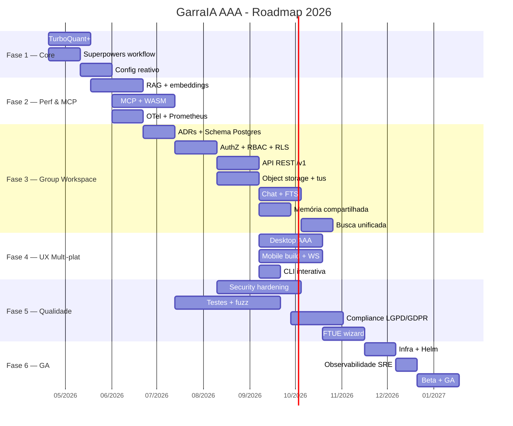

# GarraIA — ROADMAP AAA

> Roadmap unificado do ecossistema GarraIA (CLI, Gateway, Desktop, Mobile, Agents, Channels, Voice) rumo ao padrão **AAA**. Funde o plano de inferência local + workflows agenticos com a nova direção de produto **Group Workspace** (família/equipe multi-tenant) derivada de `deep-research-report.md`.
>
> **Última atualização:** 2026-09-01 (local America/New_York) — **release v0.3.5** (plan 0362 + Amendment do ADR 0015): **Garra Desktop para Linux** (`garraia-desktop-linux-x86_64.deb`/`.AppImage` via bundler Tauri, job best-effort `build-linux-desktop`; o `.deb` declara `Provides/Conflicts/Replaces: garraia` porque instala o sidecar em `/usr/bin/garraia`), **Garra Chat Bar** (barra flutuante `Ctrl+Space` que substitui o quick-chat e compartilha a sessão `parrot-desktop` com o papagaio), streaming de chunks no `/ws/parrot`, sprite do papagaio commitado + guarda `assert-ui-assets` no CI, migração argon2 0.6 / pbkdf2 0.13 / password-hash 0.6.1 (GAR-669 slice 3). Anterior (2026-08-31): **release v0.3.4** (plan 0361 + ADR 0015): primeira release a exercitar a matriz do plan 0359 (archives, MSI/NSIS, `install.ps1`) e a estrear **pacotes Linux `.deb`/`.rpm` (nfpm) + AppImage x86_64 (appimagetool)** no job best-effort `package-linux`, **binário nativo Windows ARM64** (`garraia-windows-aarch64.exe` + `.zip`, job `build-windows-aarch64`) com `garra update` e `install.ps1` resolvendo o asset novo, suíte `tests/install_ps1/platform.ps1` e casos mixed de checksum nos dois instaladores. Restam DMG notarizado e AppImage aarch64 (§4.1). Ainda em 2026-08-30: plan 0360 / ADR 0014 — `garra agents setup|status|link|rollback|web` (front-end do AgentDeck) + shim Anthropic-compatible `POST /v1/messages` para o Claude Code apontar para o gateway. Anterior (2026-08-18): cleanup total do repo (0 issues, 0 PRs, só `main`): releases **v0.3.1** e **v0.3.2** (5 binários — `garraia-linux-aarch64` pela primeira vez; cross da git + sqlx→rustls, PR #846); fix crítico LGPD no `POST /v1/me/anonymize` (plan 0354, PR #843 — retornava 500 desde junho) + job CI `auth-integration` rodando a matriz RLS em todo PR; deps consolidadas incl. wasmtime 47 (PR #844; depois 48 + MSRV 1.95 no PR #865, 2026-08-28); timeouts e2e/playwright + grupo dependabot wasmtime + Cross.toml (PR #842); h2 0.4.16 (RUSTSEC-2026-0258). **Linear descontinuado — planejamento interno migrou para o tracker interno; trigger de issues da garra-routine desativado.** Anterior (2026-05-24): docs/backlog sync: `TODO.md` criado como fila operacional obrigatória, GAR-493/ADR 0011 ✅ **Done** via PR [#492](https://github.com/michelbr84/GarraRUST/pull/492) (`95618d3`), `plans/README.md` sincronizado, e checklist GAR-603 reconciliada com evidência já presente em `Dockerfile`, `router.rs` e `docs/deployment-runpod.md`; smoke Docker/Runpod real permanece pendente. GarraMaxPower sincronizado: GAR-498 Skills MVP ✅ **Done** (PR [#488](https://github.com/michelbr84/GarraRUST/pull/488) `c65e099`), GAR-499 Agent Team MVP ✅ **Done** (PR [#490](https://github.com/michelbr84/GarraRUST/pull/490) `7e45ec5`). GAR-695 health run 23 docs ✅ **Done** via PRs [#493](https://github.com/michelbr84/GarraRUST/pull/493) / [#494](https://github.com/michelbr84/GarraRUST/pull/494). Anterior: GAR-679 SSE rate-limit per user ✅ **Done** (plan 0163); GAR-680 Audit-log of SSE chat subscriptions ✅ **Done** (PR [#463](https://github.com/michelbr84/GarraRUST/pull/463) `a972947`); GAR-496 Repo workflow seguro ✅ **Done** (PR #455 `1b7f04c`); GAR-495 ✅ **Done** (PR #453 `e5a2a08`); GAR-669 Slice 2 + GAR-500 Auto Dream ✅; GAR-372 embeddings scaffoldado; ADR 0010 Accepted + `garraia-learning`.
> **Owner:** @michelbr84
> **Tracking:** tracker interno desde 2026-08-18 (histórico no Linear, time `GAR` — IDs preservados neste doc)
> **Branch base:** `main`

---

## 0. North Star

> **"Garra é o sistema nervoso de IA da sua família, do seu estúdio e da sua empresa — local-first, privado por padrão, multi-canal, e com agentes que colaboram entre si."**

### Pilares

1. **Local-first & Privado por padrão** — inferência, memória e arquivos rodam na máquina do usuário, sincronização opcional.
2. **Multi-tenant real** — separação rígida entre memória pessoal, de grupo e de chat (novo Group Workspace).
3. **Multi-canal unificado** — Telegram, Discord, Slack, WhatsApp, iMessage, Mobile, Desktop, CLI, Web, todos compartilhando o mesmo runtime de agentes.
4. **Agentico por dentro** — sub-agentes com TDD, worktrees, safety gates e orquestração via GarraMaxPower nativo.
5. **Compliance first** — LGPD (art. 46-49) e GDPR (art. 25, 32, 33) tratados como requisito funcional, não afterthought.
6. **Observável e tunável** — OpenTelemetry + Prometheus + traces por request desde o dia 1 das fases novas.

### Critérios globais de "AAA-ready"

- `cargo check --workspace` e `cargo clippy --workspace -- -D warnings` **verdes**.
- Cobertura de testes ≥ 70% em crates de domínio (`garraia-agents`, `garraia-db`, `garraia-security`, `garraia-workspace`).
- Zero `unwrap()` fora de testes; zero SQL por concatenação; zero secrets em logs.
- Changelog por release, migrations forward-only, feature flags por tenant/grupo.
- Runbooks de incidente + backup/restore testados trimestralmente.

---

## 1. Baseline honesto (onde estamos em 2026-04-13)

**O que já existe e compila:**

- Workspace Cargo com 16 crates, Axum 0.8, Tauri v2 scaffold, Flutter mobile scaffold.
- `garraia-gateway`: HTTP + WS, admin API, MCP registry, bootstrap de canais/providers/tools.
- `garraia-agents`: providers OpenAI, OpenRouter, Anthropic, Ollama, `AgentRuntime` com tools.
- `garraia-db`: SQLite via rusqlite (sessions, messages, memory, chat_sync, mobile_users).
- `garraia-security`: `CredentialVault` AES-256-GCM + PBKDF2 (parcial).
- `garraia-channels`: adapters Telegram/Discord/Slack/WhatsApp/iMessage.
- `garraia-voice`: STT Whisper (dual endpoint) + TTS (Chatterbox/ElevenLabs/Kokoro stubs).
- Mobile (Flutter): auth JWT + chat + mascote — roda no emulator Android.
- Desktop (Tauri v2): overlay do papagaio + bandeja + hotkeys + notificações/diálogos nativos + Chat Bar (`Ctrl+Space`, v0.3.5), com a CLI como sidecar. Instaladores Windows MSI/NSIS (job best-effort `build-windows-installer`, desde 2026-08-30) e Linux `.deb`/AppImage x86_64 (job `build-linux-desktop`, v0.3.5 em 2026-09-01). Sem assinatura de codigo (SmartScreen avisa), sem DMG, e com `tauri-plugin-updater` ligado mas inerte (nenhum workflow publica `latest.json`) -- ver `docs/releasing.md`.

**O que ainda é stub, frágil ou ausente (snapshot 2026-04-13 — mantido como
registro histórico; a verificação empírica de 2026-05-18 abaixo classifica
cada item ao seu estado atual):**

- Sem Postgres (toda persistência é SQLite single-file — bloqueia multi-tenant real).
- Sem object storage (arquivos grandes, anexos, versionamento).
- Sem modelo de grupo/membros/RBAC — hoje é mono-usuário por instalação.
- Sem embeddings locais nem busca vetorial.
- Sem OpenTelemetry, sem métricas estruturadas.
- CredentialVault ainda não é **fonte única** de secrets do gateway (parcialmente wired).
- Mobile build Android com gradle/SDK desatualizados em alguns caminhos.
- Desktop UI sem micro-interações; apenas WebView básico.
- MCP servers não rodam em sandbox WASM.
- Sem wizard de onboarding; `.env.example` ainda é o caminho oficial.
- Cobertura de testes: baixa nos crates de domínio; quase zero em integração.

Esse baseline definiu o que as fases seguintes precisavam mover.

### 1.1. Verificação empírica do baseline §1 (2026-05-18)

Auditoria item-a-item contra `main@cfda7ad`. Cada linha do baseline §1 acima
mapeada ao seu estado atual com pointer de evidência. Quando o status é
**✅ Done**, a linha §1 correspondente é **histórica**, não um TODO ativo.

| # | Reivindicação §1 | Status hoje | Evidência |
|---|---|---|---|
| 1 | Sem Postgres (só SQLite) | ✅ **Done** | `crates/garraia-workspace/migrations/` tem 33 migrations, 37 tabelas (32 sob FORCE RLS), roles BYPASSRLS dedicados (`garraia_login` / `garraia_signup`) + role de app `garraia_app` sujeito a FORCE RLS. ADR 0003 Accepted 2026-04-13. |
| 2 | Sem object storage | ✅ **Done** | `crates/garraia-storage/{local_fs,s3_compat}.rs` (GAR-394) + tus 1.0 ledger em `tus_uploads` (migration 014, GAR-395 mergeado em `96f5c03`). ADR 0004 Accepted. |
| 3 | Sem grupos/membros/RBAC | ✅ **Done** | Migrations 001 (users/groups), 002 (63 role_permissions + RBAC table-driven), 011-013, 018 (RLS FORCE em groups+members). Matriz de 81 cenários cross-tenant (GAR-392). |
| 4 | Sem embeddings locais nem busca vetorial | ⚠️ **Parcial → scaffold em 2026-05-18** | Trait surface + types entregues hoje via PR #396 (GAR-372, plan 0145). `PgVectorStore` real sobre `sqlx` contra `memory_embeddings` (migration 005 já tem `vector(768)` + HNSW cosine) é o próximo slice. Modelo real (mxbai) também é slice futuro. |
| 5 | Sem OpenTelemetry, sem métricas | ✅ **Done (baseline)** | `crates/garraia-telemetry/src/{config,layers,metrics,tracer,redact}.rs` — GAR-384, feature-gated, PII-safe via `redact.rs`. |
| 6 | CredentialVault não é fonte única | ⚠️ **Parcial** | Leitura de secrets centralizada em 2026-05-17 (plan 0046): valores lidos só em `garraia-config::auth` + `garraia-telemetry::config` (leituras presence-only em `settings_handler`/`diagnostics_handler`/`check.rs`). O CredentialVault **final** (GAR-410: fonte única do gateway + rotação + master key argon2id) segue adiado — o gateway ainda não consome o cofre e `garraia-security` não tem rotação. Ver §5.1 e `TODO.md`. |
| 7 | Mobile Android com Gradle/SDK desatualizados | ✅ **Done** | `app/build.gradle.kts` usa `flutter.compileSdkVersion`/`minSdkVersion` (delegado ao Flutter SDK); gradle 8.14, AGP 8.11.1, Java 17 (source/target/jvmTarget); AndroidX habilitado. `applicationId` + `namespace` migrados de `com.example.garraia_mobile` (template default Flutter) para `org.garraia.mobile` em 2026-05-18 (reverse-DNS de `garraia.org`, alinhado ao binário CLI `garraia` e ao `install.sh`). |
| 8 | Desktop UI apenas WebView básico | ⚠️ **Parcial** | Web Console "Garra Glass" (ADR 0009, 10 PRs #330-341, 2026-05-14) entregue como `webchat.html` servido pelo gateway — Dashboard, Chat, Providers, Channels, Sessions, Settings (schema-driven dry-run), Diagnostics (12 checks), Logs, Themes/Skins. O **shell desktop Tauri** (`crates/garraia-desktop/src-tauri/`) hoje tem UI própria: overlay do papagaio (`index.html`), bandeja com 9 itens (`tray.rs`), hotkeys `Alt+G`/`Ctrl+Space` (`hotkey.rs`), notificações + diálogos nativos (`commands.rs`) e a Chat Bar (`chat_bar.rs`, v0.3.5). Pendente: assinatura de código, auto-updater alimentado, DMG, always-on-top no Wayland. |
| 9 | MCP em sandbox WASM | ✅ **Done (baseline)** | `crates/garraia-plugins/src/{loader,manifest,runtime,sdk,traits}.rs` em `wasmtime 48.0.1` (44.0.1 fechou o RUSTSEC no PR #108; 47→48 + MSRV 1.95 no PR #865, 2026-08-28). Features avançadas (capability tokens, resource limits per-plugin) na Fase 2.2. |
| 10 | Sem wizard, `.env.example` é caminho oficial | ✅ **Done** | `crates/garraia-cli/src/wizard/` + subcomando `garraia init` (PR #348, plan 0126) + `curl \| sh` installer wizard (PR #350, plan 0127). Cobre Linux/macOS x86_64+aarch64 via `curl \| sh` e Windows via `irm \| iex` (`install.ps1`, 2026-08-30). O MSI do desktop e publicado a parte, best-effort. |
| 11 | Cobertura de testes baixa | 🔁 **Em curso** | Mutation testing 90.78% killed em `garraia-auth` (GAR-436 + PR #94). AI Quality Ratchet PR-1 em report-only (plan 0064, `scripts/quality/`). Coverage job em CI (`Coverage (cargo-llvm-cov)`) ativo. Sub-issues Q6 restantes ainda fechando mutation gaps (GAR-505 fechou em 2026-05-04); `cargo-mutants` semanal verde desde 2026-08-24. |

**Sumário:** dos 11 itens listados em §1 como "stub, frágil ou ausente" em
2026-04-13, **7 estão ✅ Done** em `main`, **3 estão ⚠️ Parciais** (embeddings com
scaffold real entregue 2026-05-18, falta `PgVectorStore` + modelo real;
CredentialVault final — GAR-410; Desktop Tauri — UI própria entregue, faltam
assinatura/updater/DMG), e **1 está 🔁 em curso** (cobertura de
testes, sem fim explícito — Quality Ratchet é o sistema permanente).

A lista original em §1 acima é mantida como registro histórico do estado em
2026-04-13. Para o que ainda precisa mover, ver §1.5 (sprint roll-up) e as
seções de fase ao longo deste documento.

---

## 1.5. Atualização 2026-05-17 — Sprint roll-up Maio 2026 (Q9 admin refactor, Q11 tasks modularize, Web Console, onboarding zero-friction, security sweeps)

> Esta seção é um snapshot incremental sobre o §1 acima: NÃO substitui o
> baseline original, apenas reporta o que mudou. Cobre os sprints **2026-04-30**
> (Green Security Baseline original) até **2026-05-17** (entrega contínua).
>
> **Anterior:** §1.5 (2026-05-01) cobria GAR-486 + GAR-491 + GAR-490. Esses
> três fecharam em 2026-05-04 (GAR-490 via PR #112, GAR-491 via PR #109,
> umbrella GAR-486 closed) — Green Security Baseline ✅ Done.

### Sprint **Green Security Baseline 2026-04-30** (umbrella GAR-486)

Sub-issues 1-3 ✅ done implicitamente em `main@7fc838b`. Sub-issues 4-5 fechadas em 2026-05-04 (ver "Status do umbrella" abaixo).

| PR | Commit | Conteúdo |
|----|--------|----------|
| [#104](https://github.com/michelbr84/GarraRUST/pull/104) (A) | `eccfb85` | Secret cleanup + `.gitleaksignore` + pre-commit gitleaks hook + runbook |
| [#105](https://github.com/michelbr84/GarraRUST/pull/105) (B) | `e35ecd7` | `jsonwebtoken 9 → 10` com backend `rust_crypto` + `getrandom::fill` direto (substituiu/fechou Dependabot PR #103) |
| [#106](https://github.com/michelbr84/GarraRUST/pull/106) (C) | `895b6ee` | CodeQL **advanced setup** (`.github/workflows/codeql.yml` + `.github/codeql-config.yml`) excluindo `garraia-desktop` (Tauri) |
| [#107](https://github.com/michelbr84/GarraRUST/pull/107) (D) | `09d805c` | `docs/security/dependabot-status.md` — alert-to-rationale index com Linear ownership map |
| [#108](https://github.com/michelbr84/GarraRUST/pull/108) (E) | `7fc838b` | `wasmtime 44.0.0 → 44.0.1` lockfile-only fix-forward (fecha [GHSA-p8xm-42r7-89xg](https://github.com/advisories/GHSA-p8xm-42r7-89xg)) |

**Métricas do sprint** (verificadas empiricamente em 2026-05-01 via
`gh api`):

- Secret-scanning alerts: 1 → **0** (alert #1 resolved/revoked 2026-04-30T15:55:45Z)
- Dependabot alerts: **20 → 7** — todos os 7 residuais com Linear ownership em [`docs/security/dependabot-status.md`](docs/security/dependabot-status.md)
- CodeQL total open: **90** (medição da Phase 0 desta sessão, advanced setup já em main) → **84** após os 6 dismissals do GAR-491. O description original do GAR-486 mencionava "~90 → 71" como projeção do efeito do `paths-ignore`, mas a medição direta via `gh api ... code-scanning/alerts | length` retornou 90 alertas open antes de qualquer triagem ativa nesta sessão. Triagem ativa só começou via GAR-491 (Wave 2) e levou o total para 84. GAR-490 (Wave 1) ataca os 16 path-injection + 8 sql-injection restantes na sessão futura.
- GitHub-native CodeQL default setup: `configured` → `not-configured` (advanced setup é canonical)
- `continue-on-error: true` em workflows: 4 removidos no Lote 2 (PR #64, GAR-438) + 1 no Lote 4 (PR sobre Playwright `data-testid`); o último (RUSTSEC) virou gate bloqueante no plan 0053 (GAR-453) — hoje **0** `continue-on-error` ativos nos workflows (jobs best-effort da release usam `needs` fora do `if`)

### CodeQL triage (registro histórico da sessão de 2026-05-01 — fechado em 2026-05-04)

Sub-issues 4 e 5 de GAR-486 (estado em 2026-05-01; ambas mergeadas em 2026-05-04):

- **GAR-491 — CodeQL Wave 2 (fixtures + suppression convention)** — sub-issue 5/5, ✅ mergeada em 2026-05-01 via PR [#109](https://github.com/michelbr84/GarraRUST/pull/109). Estabelece a convenção de suppression para Rust CodeQL via REST API dismissal + ledger versionado em [`docs/security/codeql-suppressions.md`](docs/security/codeql-suppressions.md) + [`docs/security/codeql-suppressions.json`](docs/security/codeql-suppressions.json) + script [`scripts/security/codeql-reapply-dismissals.sh`](scripts/security/codeql-reapply-dismissals.sh) com fail-closed validation (rule_id/path/line). 6 alertas em escopo, 21 deferidos para `GAR-491.1`.
- **GAR-490 — CodeQL Wave 1 (production paths)** — sub-issue 4/5, ✅ mergeada em 2026-05-04 via PR #112 (o experimento `SELECT set_config(...)` abaixo virou o padrão em `rest_v1/groups.rs`). 16 path-injection (`skills_handler.rs`, `skins_handler.rs`) + 8 sql-injection (`rest_v1/groups.rs`, `rest_v1/invites.rs`). Plano de ataque: helper `validate_skill_name` em handlers + integração de `garraia_storage::sanitise_key` em `skins_handler.rs` (single-segment) + experimento `SELECT set_config('app.current_user_id', $1, true)` substituindo `SET LOCAL ... format!()` antes de qualquer dismissal.

**Decisão central documentada**: Rust CodeQL ainda **não suporta** comentários inline `// codeql[rule]: ...` em 2026 ([github/codeql#21638](https://github.com/github/codeql/issues/21637) aberto). `paths-ignore` global não serve porque os testes do GarraRUST são INLINE (`#[cfg(test)] mod tests {}`) dentro de produção. Mecanismo escolhido: ledger versionado + REST dismissal por alerta + script fail-closed. **Sem fallback global**: se a empirical proof falhar, abort + nova decisão (sem `query-filters: exclude` por rule-id). Ver [`docs/security/codeql-suppressions.md`](docs/security/codeql-suppressions.md) §3-§6.

### Quality gates Q6 — status atual

- **GAR-436 (mutation testing baseline)** ✅ — `cargo-mutants` pilot em `garraia-auth`. Run inicial 85% killed (19 missed). PR [#94](https://github.com/michelbr84/GarraRUST/pull/94) appended run `25116031135`: **85.04% → 90.78% killed (+5.74 p.p.)**.
- **GAR-463 Q6.1** ✅ — kill 5 critical mutation bypasses em `garraia-auth/src/hashing.rs` + `lib.rs` (PR #92).
- **GAR-468 Q6.6** ✅ — kill 3 Debug-redaction mutation bypasses em `garraia-auth` (PR [#96](https://github.com/michelbr84/GarraRUST/pull/96)). **Memória local**: fila Q6 (`project_next_session_q6_queue`) consumida — 6.1/6.3/6.5/6.6/6.7/6.8 fechadas.
- **GAR-469 Q6.7** ✅ — `mutants.yml` timeout bumped 90 → 150 min (PR #93).
- **GAR-481 Q6.8** ✅ — workflows migrated to **Node 24** (`actions/{checkout,setup-node,upload-artifact,download-artifact,cache}` v4 → latest, deprecation pre-announce 2026-Q3) (PR [#95](https://github.com/michelbr84/GarraRUST/pull/95)).

### CI infrastructure

- **GAR-438 (Lote 2)** ✅ (PR [#64](https://github.com/michelbr84/GarraRUST/pull/64), `1828625`) — fix `e2e` + `playwright` jobs que tentavam executar `./target/release/garraia-gateway` (binário inexistente — `garraia-gateway` é biblioteca). Substituído por `cargo build --bin garraia --release` + `services: postgres:16.8-alpine` + envs de auth via `::add-mask::`. 4 de 7 `continue-on-error: true` removidos.
- **GAR-443 (Lote 4)** ✅ — Playwright admin specs migrados para `getByTestId(...)` ancorados em `data-testid` estáveis (`admin.html`). Convenção: especificações Playwright do admin DEVEM preferir `data-testid` em vez de `placeholder*=` ou `getByRole(button,{name})`.
- **GitHub Actions annotations follow-up (2026-05-03)** — CI voltou a ficar verde após PR [#113](https://github.com/michelbr84/GarraRUST/pull/113), mas os jobs `Analyze (javascript-typescript)` e `Analyze (rust)` ainda emitem 2 annotations não-bloqueantes: (a) `github/codeql-action/init@v3` + `analyze@v3` rodam em Node.js 20 (forced switch 2026-06-02, removido em 2026-09-16) — escopo expandido em GAR-482 (Q6.9 third-party Node 24 readiness); (b) CodeQL Action v3 será deprecated em dezembro de 2026 — rastreado em GAR-502 (chore migrate v3 → v4). **Resolvido:** `codeql.yml` já roda `codeql-action/init@v4` + `analyze@v4` (GAR-502 ✅). Manutenção preventiva de CI/runtime, **não** alerta CodeQL real (esses ficam em GAR-490 / GAR-491) e **não** bloqueia o merge verde atual.
- **CARGO_BIN_EXE_garraia removal** (GAR-503) ✅ — fallback dead-code removido de `crates/garraia-cli/tests/migrate_workspace_integration.rs` (plan [`0060`](plans/0060-gar-503-cargo-bin-exe-cleanup.md), PR [#132](https://github.com/michelbr84/GarraRUST/pull/132) `750fb50`, 2026-05-05). `git grep CARGO_BIN_EXE_garraia` agora retorna 0 hits.
- **Benchmark evidence run** (GAR-504) — primeira execução real de `benches/agent-framework-comparison/run.sh --all` em droplet DigitalOcean 1 vCPU / 1 GB para repor a tabela do `README.md` (PR [#117](https://github.com/michelbr84/GarraRUST/pull/117) §"Open follow-ups"). **Parcial**: o run em VM x86_64 está versionado em `results/2026-08-28-vm/` e alimenta a tabela do README; o run de referência no droplet 1 vCPU / 1 GB segue pendente.
- **Mutation Testing 2026-05-04 missed mutants** (GAR-505) ✅ — triagem dos 6 NEW missed mutants em `jwt.rs` / `storage_redacted.rs` / `app_pool.rs` + 3 timeouts (run [25307117776](https://github.com/michelbr84/GarraRUST/actions/runs/25307117776)) entregue via PR [#119](https://github.com/michelbr84/GarraRUST/pull/119) / PR [#120](https://github.com/michelbr84/GarraRUST/pull/120), 2026-05-04. Sub-issue de GAR-436.
- **AI Quality Ratchet PR-1** (epic novo, plan [`0064`](plans/0064-quality-ratchet-pr1.md), 2026-05-05) — scaffold do sistema de catraca de qualidade. PR-1 entrega `.quality/{baseline,README,thresholds}`, `scripts/quality/{collect-metrics.sh, compare.py, freeze-baseline.py, parse-{llvm-cov,cargo-audit,clippy}.py + tests/}`, `.github/workflows/quality-ratchet.yml` em modo report-only via flag `compare.py --mode report-only` (zero `continue-on-error`), `.claude/commands/quality-babysit.md` em modo manual-only, e `CODEOWNERS` como camada inicial de visibilidade. **Out of scope deste PR**: duplicação (PR-3), promoção a bloqueante (PR-4 com aprovação explícita), branch protection (sempre com aprovação explícita). Plan-mãe com filosofia + 5 ajustes do owner: `~/.claude/plans/voc-est-no-projeto-buzzing-volcano.md` (não versionado). ✅ mergeado; sem issue (tracker interno).

### Status do umbrella GAR-486

✅ **Done** (2026-05-04). Fechado após GAR-490 (PR [#112](https://github.com/michelbr84/GarraRUST/pull/112), 2026-05-04) e GAR-491 (PR [#109](https://github.com/michelbr84/GarraRUST/pull/109), 2026-05-01) mergearem.

### Auto-update pipeline (`garraia update`) — entrega `v0.2.1` (2026-05-14)

`garraia update` retornava `404 Not Found` em todas as instalações desde
o lançamento do comando porque o repo só tinha **prereleases** (`v0.1.0-beta`,
`v0.1.0-beta.1`, `v0.2.0-beta`), e `GET /repos/{owner}/{repo}/releases/latest`
ignora prereleases por design ([GitHub REST docs](https://docs.github.com/rest/releases/releases)).
A nota original do triagem está registrada no
[`CHANGELOG.md`](CHANGELOG.md#021---2026-05-14) (o arquivo `release.md` avulso
foi absorvido pelo changelog).

Três mismatches estruturais entre [`release.yml`](.github/workflows/release.yml)
e [`crates/garraia-cli/src/update.rs`](crates/garraia-cli/src/update.rs)
foram corrigidos no mesmo PR:

| # | Mismatch | Antes | Depois |
|---|---------|-------|--------|
| 1 | Todas as releases marcadas `prerelease: true` | `v0.2.0-beta` (prerelease) | Tag `v0.2.1` produz release **não-prerelease** automaticamente (gate `contains(alpha|beta|rc)`) |
| 2 | Sufixo ARM64 errado | `garraia-{linux,macos}-arm64` | `garraia-{linux,macos}-aarch64` (alinha com `std::env::consts::ARCH` que `update.rs:43-50` consome) |
| 3 | Só `SHA256SUMS` agregado | Falhava no `release is missing checksum file` | `SHA256SUMS` **mais** `<asset>.sha256` per-asset (loop sha256sum + glob `release/*.sha256` no `files:` da action) |

Workspace version bumped `0.2.0 → 0.2.1` em `Cargo.toml`, `crates/garraia-desktop/src-tauri/Cargo.toml` e `tauri.conf.json` para fechar o gap de versão sem reuso de tag. Linear: GAR-619 (criada nesta sessão).

### Sprint **Web Console Garra Glass** (2026-05-14) — `webchat.html` redesenhado de ponta-a-ponta

10 PRs sequenciais (#330–#341) entregando o Web Console multi-page completo com design system "Garra Glass" (ADR 0009, plan 0116). Stack: HTML + CSS custom properties `--garra-*` + JS vanilla, zero CDN para Bootstrap/AdminLTE/Animate.css — todos os ícones SVG inline. Páginas: Dashboard, Chat, Providers & Models, Channels, Sessions, Settings Registry (schema-driven dry-run), Diagnostics (12 checks), Logs (filter/search/export), Themes & Skins (4 presets). Novos endpoints REST (todos `/api/*`, auth-free, secret-free via `configured: bool` em vez de `value`): `/api/health` (Dashboard schema com `version`, `uptime_secs`, `active_sessions`, `provider`, `model`, `channels`, `warnings`, back-compat `checks`), `/api/capabilities`, `/api/channels`, `POST /api/providers/test`, `PATCH /api/providers/default`, `/api/settings/{schema,effective}`, `PATCH /api/settings` (validate + audit + dry-run; persistência TOML em plan 0121a), `/api/diagnostics`. Plans: 0116a, 0116b, 0117–0123. Issues (histórico Linear): GAR-607, GAR-612…GAR-618, GAR-623.

### Sprint **Onboarding zero-friction** (2026-05-14..15)

- **PR-A — `garraia init` env-aware bootstrap** (plan 0126, PR #348 `6a2279e`, 2026-05-14): subcomando `garraia init` que detecta config existente, oferece wizard interativo + flags `--yes`/`--non-interactive` para CI, materializa `config.yml` no diretório de config (estratégias FirstWrite/Backup/MergeUpdate em `wizard/config_writer.rs`).
- **PR-B — `curl \| sh` installer wizard** (plan 0127, PR #350 `bfddf78`, 2026-05-15): `install.sh` ganhou bootstrap wizard de uma linha (`curl -fsSL https://garraia.org/install.sh | sh`) que detecta plataforma, baixa binário correto, roda `garraia init` interativo (ou pula com `GARRAIA_SKIP_INIT=1`), depois `exec garraia start`. Cobre Linux/macOS x86_64 + aarch64.

### Sprint **Q9 admin/handlers.rs modularização** (2026-05-15..16, 6 PRs)

`crates/garraia-gateway/src/admin/handlers.rs` foi de **3300 → ~1270 LOC** via extração em 6 módulos focados, zero behavior change:

| Slice | Plan | Issue | PR | Módulo extraído | LOC |
|---|---|---|---|---|---|
| Q9.b | 0128 | GAR-470 | [#349](https://github.com/michelbr84/GarraRUST/pull/349) `eacbf9b` | `admin/providers.rs` | 3240→2900 (−340) |
| Q9.c | 0129 | GAR-471 | [#354](https://github.com/michelbr84/GarraRUST/pull/354) `17f68d0` | `admin/mcp.rs` | 2900→2550 (−350) |
| Q9.d | 0130 | GAR-472 | [#358](https://github.com/michelbr84/GarraRUST/pull/358) `1555b70` | `admin/mcp_templates.rs` | 2550→2326 (−224) |
| Q9.e | 0131 | GAR-473 | [#360](https://github.com/michelbr84/GarraRUST/pull/360) `b862b72` | `admin/observability.rs` | 2326→2103 (−223) |
| Q9.g | 0132 | GAR-474 | [#362](https://github.com/michelbr84/GarraRUST/pull/362) `4c97276` | `admin/users.rs` | 2103→1738 (−365) |
| Q9.f | 0133 | GAR-475 | [#363](https://github.com/michelbr84/GarraRUST/pull/363) `4ab6821` | `admin/secrets.rs` | 1738→~1270 (−468), `@security-auditor` approval required |

### Sprint **Q11 `rest_v1/tasks` modularização** (2026-05-17, 7 PRs) ✅ COMPLETA

Continuação do padrão Q9 agora em `crates/garraia-gateway/src/rest_v1/tasks.rs` (anteriormente monólito de 4236 LOC). Issue Linear: GAR-635 ✅ Done (2026-05-17T18:47Z). `tasks/mod.rs` final: ~1537 LOC (−63% vs baseline).

| Slice | Plan | Issue | PR | Módulo extraído |
|---|---|---|---|---|
| Q11.a | 0135 | GAR-635 | [#368](https://github.com/michelbr84/GarraRUST/pull/368) `c01bbd9` | `rest_v1/tasks/task_lists.rs` |
| Q11.b | 0136 | GAR-635 | [#370](https://github.com/michelbr84/GarraRUST/pull/370) `8872026` | `rest_v1/tasks/comments.rs` |
| Q11.c | 0137 | GAR-635 | [#371](https://github.com/michelbr84/GarraRUST/pull/371) `efb295c` | `rest_v1/tasks/assignees.rs` |
| Q11.d | — | GAR-635 | [#372](https://github.com/michelbr84/GarraRUST/pull/372) `62036a8` | `rest_v1/tasks/labels.rs` |
| Q11.e | — | GAR-653 | [#376](https://github.com/michelbr84/GarraRUST/pull/376) `1be73cd` | `rest_v1/tasks/subscriptions.rs` |
| Q11.f | — | GAR-655 | [#386](https://github.com/michelbr84/GarraRUST/pull/386) `a82ef2b` | `rest_v1/tasks/activity.rs` |
| Q11.g | — | GAR-658 | [#388](https://github.com/michelbr84/GarraRUST/pull/388) `e04fc2c` | `rest_v1/tasks/attachments.rs` |

### Security & dependency sweeps Maio 2026

| Sweep | Plan | PR | Conteúdo |
|---|---|---|---|
| Q6.3 sessions TTL boundary mutants | 0112 | [#312](https://github.com/michelbr84/GarraRUST/pull/312) `5197581` | GAR-465 — kill 6 missed mutants em `session_store.rs` |
| Q6.6.b Debug-redaction mutants | 0114 | [#317](https://github.com/michelbr84/GarraRUST/pull/317) `fc138f3` | GAR-483 — Debug redaction tests em `SignupPool` + `AppPool` |
| aws-actions/configure-aws-credentials v4→v6 | 0113 | [#313](https://github.com/michelbr84/GarraRUST/pull/313) `4374623` | GAR-601 — Node 20 deprecation pre-empt |
| `metrics` 0.24.5 (yanked) → 0.24.6 | 0124 | [#336](https://github.com/michelbr84/GarraRUST/pull/336) `adbe00a` | GAR-620 |
| Patch-and-minor batch May 13 | 0111 | [#309](https://github.com/michelbr84/GarraRUST/pull/309) `c9196ac` | GAR-600 — 17 deps (tokio, axum, hyper, tower-http, jsonwebtoken, uuid) |
| `lru` advisory cleanup | 0108 | [#299](https://github.com/michelbr84/GarraRUST/pull/299) `7996dc4` | GAR-593 — drop stale RUSTSEC-2026-0002 |
| h2/rustls/zerocopy/aws-lc-rs/reqwest security sweep | n/a | [#366](https://github.com/michelbr84/GarraRUST/pull/366) `02bd9de` | 2026-05-16 |
| RUSTSEC-2024-0384 (instant) advisory ignore drop | n/a | [#356](https://github.com/michelbr84/GarraRUST/pull/356) `8051d97` | 2026-05-15 — stale ignore removed |
| `tokio` 1.52.3 unblock via `nix` 0.31.3 + `process-wrap` 9.1.0 | 0134 | [#367](https://github.com/michelbr84/GarraRUST/pull/367) `40ee126` | GAR-634 |
| `axum-server` 0.7→0.8 — closes RUSTSEC-2025-0134 | n/a | [#378](https://github.com/michelbr84/GarraRUST/pull/378) `1eb5c4b` | 2026-05-17 |
| `daemonize` 0.5 → `nix` syscalls — closes RUSTSEC-2025-0069 | n/a | [#382](https://github.com/michelbr84/GarraRUST/pull/382) `a5daf34` | GAR-656 |
| RLS FORCE em `groups` + `group_members` | 0106 | [#294](https://github.com/michelbr84/GarraRUST/pull/294) `36b2b72` | GAR-589 — fixes `get_group` SET LOCAL FIXME |
| Messages PATCH/DELETE (RBAC sender-only + admin override) | 0107 | [#300](https://github.com/michelbr84/GarraRUST/pull/300) `3c843e4` | GAR-592 |

### Sprint **Garra Learning Agent — épico criado** (2026-05-17, esta sessão)

Nova iniciativa estratégica §1.4 + ADR 0010 Proposed + plan 0138 + épico Linear `GAR-641` com 10 sub-issues criados (ver §1.4 e ADR para detalhes). Sem implementação ainda — apenas planejamento + arquitetura *(superado em 2026-05-20: 9/10 sub-issues Done, ver §1.4)*.

### Sprint **Garra Learning Agent — scaffold GAR-642** (2026-05-18)

Primeira implementação real do Learning Agent epic. Plan [0144](plans/0144-gar-642-learning-agent-scaffold.md):

- ADR 0010 promovido **Proposed → Accepted**.
- Novo crate `crates/garraia-learning/` adicionado ao workspace (19 → 20 crates ativos; 22 hoje).
- `safety.rs` **funcional**: 5 SafetyDenial variants + 17 unit tests verdes (DangerousCommand, CriticalPath, ScoreTooLow, AntiFlapDeprecated, PiiDetected).
- 8 módulos stub: miner, generator, registry, retriever, evaluator, updater, versioning, skill_override — todos retornam `Err(Error::Other("... não implementado"))`.
- Issue: GAR-642 ✅ Done.

### `garraia update` / CLI helpers / Runpod compatibility

- **GAR-603 Runpod Load Balancer Serverless compat** ⚠️ Parcial — código/docs via PR [#327](https://github.com/michelbr84/GarraRUST/pull/327) `cdebe9a`, 2026-05-13: container HTTP server mode + `GET /ping` health + `PORT`/`HOST` env honor; `PORT_HEALTH` documentado como igual a `PORT` até haver listener separado. Smoke Docker local e smoke público Runpod ainda pendentes — ver §6.1.1 e `TODO.md`.
- **GAR-604 DM creation via `POST /v1/groups/{id}/chats`** ✅ — PR [#324](https://github.com/michelbr84/GarraRUST/pull/324) `4ce9d75`, 2026-05-14.
- **GAR-605 CodeQL `actions` language matrix re-add** ✅ — PR [#323](https://github.com/michelbr84/GarraRUST/pull/323) `f6698c7`, 2026-05-14. Fecha 17 alertas Medium stale.
- **CI concurrency cancel-superseded** ✅ — PR [#311](https://github.com/michelbr84/GarraRUST/pull/311) `10f637b` + PR [#316](https://github.com/michelbr84/GarraRUST/pull/316) `f57af85`. Canonical `group: workflow-prNum||ref` + `cancel-in-progress`.

---

## 2. Estrutura do roadmap

O roadmap está dividido em **7 fases + trilhas contínuas**. Cada fase tem:

- **Objetivo** (uma frase)
- **Entregáveis** (checklist executável)
- **Critérios de aceite** (verificáveis)
- **Dependências** (fases/entregáveis prévios)
- **Estimativa** (semanas: baixa / provável / alta)
- **Épicos** (tracker interno; IDs `GAR-xxx` são histórico do Linear) quando aplicável

Fases 1-2 são **fundação técnica**. Fase 3 é o **salto de produto** (Group Workspace). Fase 4 é **experiência**. Fase 5 é **qualidade/compliance**. Fase 6 é **lançamento**. Fase 7 é **pós-GA**. Trilhas contínuas cortam todas as fases.

---

## Fase 1 — Fundações de Core & Inferência (6-9 semanas)

**Objetivo:** fechar as lacunas do motor local e do runtime para que as fases 2-3 possam construir em terreno firme.

### 1.1 TurboQuant+ — Inferência local otimizada

- [ ] Benchmark dos providers locais atuais (Ollama, llama.cpp) em latência/tokens-por-segundo em `benches/inference.rs` (Criterion).
- [x] **KV Cache compression** para sessões longas: `LlamaCppProvider` expõe `cache_type_k`/`cache_type_v` via `extra` do provider (q8_0/q4_0/f16 + turbo2/3/4 do TurboQuant+), passados como `--cache-type-k/-v` ao `llama.cpp` (`crates/garraia-agents/src/llama_cpp.rs`); stack local em `docker-compose.turboquant.yml` + `scripts/build-turboquant-llama.sh`. *(A opção não se chama `kv_quant`; o compose monta `docs/deployment/config.turboquant.yml`, que não existe no repo — follow-up em `TODO.md`.)*
- [ ] **PagedAttention / Continuous Batching**: decisão registrada — [ADR 0001](docs/adr/0001-local-inference-backend.md) Accepted (2026-04-21) escolhe `mistral.rs` como backend default com Ollama como fallback; a implementação do backend `mistral.rs` ainda não começou (sem dependência no `Cargo.lock`).
- [ ] **Backends paralelos**: detectar CUDA/MPS/Vulkan em runtime e passar flags apropriadas.
- [ ] **Quantização**: suporte a modelos Q4_K_M, Q5_K_M, Q8_0 com auto-seleção por VRAM disponível.

**Critério de aceite:**

- Latência p95 ≤ 80% da baseline em sessões ≥ 32k tokens.
- `garraia-cli bench` roda comparação local vs cloud e emite relatório em markdown.

### 1.2 Superpowers Workflow & Auto-Dev

- [ ] `.claude/superpowers-config.md` expandido com perfis de projeto (backend-rust, mobile-flutter, docs-only).
- [ ] **TDD com sub-agentes**: skill `/tdd-loop` chama `@code-reviewer` para validar cada ciclo Red-Green-Refactor.
- [ ] **Git worktrees automatizados**: script `scripts/worktree-experiment.sh` cria branch + worktree + ambiente isolado; integração com Superpowers já existente.
- [ ] **Orquestrador mestre-escravo**: `team-coordinator` pode delegar tarefas para `garraia-agents` localmente (dogfooding) — útil para CI.

**Critério de aceite:**

- Um bug real do backlog é corrigido end-to-end via `/fix-issue` sem intervenção manual além de approve/merge.

#### 1.2.1 GarraMaxPower — modo agente avançado nativo do Garra

> Adaptação **nativa** das ideias de ClaudeMaxPower/Superpowers para o runtime do Garra. **Não é** copiar `.claude/` literalmente nem rodar `scripts/setup.sh` do ClaudeMaxPower — é trazer as primitivas (capability prompt, workflow brainstorm→spec→plan→execute→review→finish, skills, agent team, safety gates, handoff/Auto Dream, validações locais) para dentro do binário `garra` e dos crates do workspace, com superfície pequena, versionada e executável.

**Objetivo:**

Dar ao Garra um modo agente avançado de primeira-classe acionável por `garra max-power` (ou equivalente) que orquestra brainstorm → spec → plan → execute → review → finish usando os providers/canais/tools que o gateway já expõe, com safety gates contra comandos destrutivos e memória persistente entre sessões.

**Escopo do MVP:**

- Comando `garra max-power` (no `garraia-cli`) que ativa o modo, imprime banner e roteia para a próxima ação certa.
- **Capability prompt** nativo (não importado do `.claude/`) montado em runtime a partir do que o `AgentRuntime` realmente expõe (providers, tools, canais, MCP servers ativos).
- Workflow `brainstorm → spec → plan → execute → review → finish` como máquina de estados explícita (entregue em `garraia-cli/src/team.rs` — `TeamPhase`/`AgentTeam` — sem crate novo), com gate obrigatório no `spec` antes de qualquer escrita de código.
- **Repo workflow seguro** para GitHub: clonar/branch/PR via `gh`/`git` com checagens de "branch atual não é `main`" e "tree limpo antes de force operations".
- **Safety gates de bash** centralizados (uma única função que valida antes de spawnar): bloqueia `rm -rf /`, `rm -rf ~`, fork bombs, `git push --force` em `main`, escrita em `.env`/credenciais.
- 3-5 **skills MVP** nativas (não markdown solto): `brainstorm`, `write-spec`, `write-plan`, `pre-commit`, `verify` — registradas no `garraia-skills` registry.
- **Agent team MVP**: orquestrador + 2 sub-agentes (revisor + executor) — entregue como pipeline síncrono via canais `mpsc` tipados (`team.rs`), sem depender do plugin Superpowers do Claude Code; execução provider-backed via `AgentRuntime` real é follow-up (ver `TODO.md`).
- **Handoff / Auto Dream**: arquivo `.garra-estado.md` local (gitignored — handoff, não versionado) com último spec, último plan, último review, próxima ação — lido no início da próxima sessão.
- `garra verify` — validação local idempotente: `cargo fmt --check`, `cargo clippy --workspace -- -D warnings`, `cargo test --workspace`, `flutter analyze` (se presente), `gitleaks` (se presente). Sai com exit code 0 (ok) / 2 (step falhou).

**Fora de escopo (explícito):**

- Não copiar/sincronizar `.claude/`, `cmp-skills/`, `superpowers-bridge.md` ou qualquer arquivo do harness do Claude Code para dentro do runtime do Garra.
- Não rodar `scripts/setup.sh` do ClaudeMaxPower como parte do bootstrap do Garra.
- Não escrever tokens/credenciais em config local — qualquer secret continua via `CredentialVault` ou env, conforme regra absoluta §6 do `CLAUDE.md`.
- Não reescrever `garraia-agents` para isso. GarraMaxPower **consome** o runtime existente; não substitui.
- Não criar dependência hard de Claude Code, Anthropic SDK ou qualquer provider específico — o capability prompt é provider-agnóstico.
- Não tentar reproduzir 100% das skills do plugin Superpowers em uma única tacada. MVP = 3-5 skills.

**Entregáveis:**

1. ADR `docs/adr/0011-garra-max-power.md` — decisão arquitetural, escopo, alternativas avaliadas.
2. Subseção §1.2.1 deste ROADMAP (este documento).
3. Subcomando `garra max-power` no `garraia-cli` (esqueleto + roteamento, sem implementação dos passos pesados).
4. Máquina de estados do workflow — entregue em `garraia-cli/src/{max_power,team}.rs` (sem crate `garraia-maxpower`).
5. Função `safety_gate(cmd: &str) -> Result<()>` em `garraia-tools` ou `garraia-common`, com testes unitários cobrindo a denylist mínima.
6. Skills MVP em `garraia-skills` (registry-driven, não arquivos markdown soltos).
7. `garra verify` em `garraia-cli` com pipeline Rust+Flutter+gitleaks.
8. `.garra-estado.md` schema documentado + leitor/escritor.
9. Issues filhas (épico GarraMaxPower abaixo; IDs `GAR-xxx` históricos do Linear, tracker interno hoje) referenciadas neste documento.

**Critérios de aceite:**

- `garra max-power --help` imprime o pipeline e os entry points alternativos sem panic.
- `garra max-power --goal "fix bug X"` roteia para `systematic-debugging` com rationale visível.
- Tentativa de executar `rm -rf /` ou `git push --force origin main` via tool/agent é bloqueada pela safety gate com erro determinístico (testado).
- `garra verify` em `main` limpo retorna exit 0 e relatório markdown; em árvore com clippy warning retorna exit ≠ 0.
- Workflow brainstorm→spec→plan→execute em um bug real do backlog termina com PR aberto + review pelo agent team, sem intervenção manual além de approve.
- `cargo check --workspace` e `cargo clippy --workspace -- -D warnings` permanecem verdes.
- ADR 0011 está em `Accepted` antes do merge da última issue filha.

**Riscos:**

- **Escopo creep:** virar uma reescrita do `garraia-agents`. Mitigação: fora-de-escopo explícito acima; cada issue filha é pequena e fecha sozinha.
- **Acoplamento ao Claude Code:** capability prompt acabar dependente de campos específicos do Anthropic SDK. Mitigação: prompt provider-agnóstico, testado contra OpenAI + OpenRouter + Ollama mínimo.
- **Safety gate falso-negativo:** denylist incompleta deixa passar comando destrutivo. Mitigação: testes unitários table-driven + revisão por `@security-auditor` antes de merge.
- **Drift com ClaudeMaxPower upstream:** as ideias evoluem fora do nosso repo. Mitigação: ADR registra qual *snapshot* das ideias foi adaptado; updates futuros viram issues separadas.
- **Memória/Auto Dream PII-leak:** `.garra-estado.md` versionado com prompt do usuário pode vazar dados. Mitigação: schema com allow-list de campos; nada de message bodies por padrão.
- **CI overhead:** `garra verify` em CI pode ficar lento. Mitigação: passos paralelos + cache; budget documentado por etapa.

**Issues filhas do épico GAR-492 (histórico Linear; tracker interno hoje):**

- ~~`GarraMaxPower roadmap + ADR` (GAR-493) — esta seção + ADR 0011 (umbrella já registra; issue filha amarra commits).~~ ✅ Done (PR #492 `95618d3`)
- ~~`/max-power MVP` (GAR-494) — subcomando `garra max-power` esqueleto + roteamento + banner.~~ ✅ Done (PR #431 `8a9a915`)
- ~~`Capability prompt nativo` (GAR-495) — gerador provider-agnóstico em runtime, testado contra ≥ 3 providers.~~ ✅ Done (PR #453 `e5a2a08`)
- ~~`Repo workflow seguro` (GAR-496) — wrappers `gh`/`git` com pré-checagens; cobertura de "main protegida" e "tree limpo".~~ ✅ Done (PR #455 `1b7f04c`)
- ~~`Safety gates para bash` (GAR-497) — `safety_gate(cmd)` + denylist + testes + integração com tools.~~ ✅ Done (PR #437 `f2ab1d9`)
- ~~`Skills MVP` (GAR-498) — 3-5 skills nativas via registry `garraia-skills`.~~ ✅ Done (PR #488 `c65e099`)
- ~~`Agent team MVP` (GAR-499) — orquestrador + 2 sub-agentes, dogfooded em um bug real.~~ ✅ Done (PR #490 `7e45ec5`) *(pipeline entregue; o dogfood em bug real segue pendente — §7 / `TODO.md`)*
- ~~`Auto Dream / handoff` (GAR-500) — schema `.garra-estado.md` + reader/writer + redaction.~~ ✅ Done (PR #445 `f1fb596`)
- ~~`garra verify` (GAR-501) — pipeline local idempotente, exit-codes sysexits, relatório markdown.~~ ✅ Done (PR #441 `ca9f1fa2`)

**Estimativa:** 3 / 5 / 8 semanas, em paralelo a 1.2 e 1.3.

### 1.3 Config & Runtime Wiring unificado

- [x] **Schema único** de config em `garraia-config` com `serde` + `validator` ✅; fontes reais: `<config_dir>/config.yml` (fallback `config.toml`) > `mcp.json` > env > CLI flags, com `config_dir` = `$GARRAIA_CONFIG_DIR` → `~/.config/garraia` (→ `~/.garraia` legado).
- [ ] **Reactive config**: endpoint SSE `GET /v1/admin/config/stream` emite eventos ao alterar config via Web UI/CLI; `AppState` reage sem restart.
- [ ] **Provider hot-reload**: alterar API keys ou endpoints propaga para `AgentRuntime` em < 500ms. *(Parcial: `ConfigWatcher` (notify) recarrega `config.yml` ao vivo para a maioria das settings; providers e canais ainda só no boot.)*
- [x] **Dry-run validation**: `garraia config check [--json] [--strict]` valida config sem iniciar o servidor — plan 0035 / GAR-379 slice 1 ✅ (+ `PATCH /api/settings` em dry-run no Web Console).

**Critério de aceite:**

- Teste de integração altera `models.default` via PATCH admin e verifica que a próxima chamada de chat usa o novo modelo sem reiniciar processo.

### 1.4 Garra Learning Agent / Self-Improving Operations Manual

> **Auto-aprendizado operacional (não treina pesos do modelo).** O Garra observa
> execuções reais, captura padrões bem-sucedidos como skills versionadas, propõe
> atualizações quando encontra melhorias/falhas, valida via CI antes de promover,
> e permite rollback. Equivalente conceitual ao **Hermes Agent** mas com
> arquitetura própria focada em segurança, auditabilidade, CI-first e controle
> humano. Constrói **sobre** o crate `garraia-skills` existente (parser/scanner/
> installer já estabelecidos), adicionando os 4 loops novos (Mine, Use+Evaluate,
> Auto-Update, Promote-to-Manual).
>
> **Decisão arquitetural completa:** [`docs/adr/0010-garra-learning-agent.md`](docs/adr/0010-garra-learning-agent.md) (Accepted em 2026-05-17, via PR #393 / plan 0144).

**Objetivo:**

Transformar o Garra de "ferramenta que executa" em "ferramenta que aprende a
executar melhor" — sem nunca regredir, sem nunca rodar comando perigoso
aprendido, sem nunca promover skill não-validada.

**Fronteira semântica rígida** (CLAUDE.md + ADR 0010):

| Tipo | Crate | Persistência |
|---|---|---|
| **Memória** (facts sobre usuário/grupo) | `garraia-workspace::memory_items` | Postgres, RLS-scoped |
| **Skill** (procedimento operacional) | `garraia-learning::registry` (sobre `garraia-skills`) | Markdown+YAML em disco, git-tracked |
| **Log de execução** (o que aconteceu) | `garraia-telemetry::traces` | Spans OTLP + Prometheus |
| **Manual distribuível** (skill pública instalável) | `garraia-skills::installer` | Tarball assinado |

**Sub-componentes (10):**

1. **Skill Miner** (`garraia-learning::miner`) — lê session logs (opt-in `~/.garra/sessions/<id>.json`), detecta padrões repetíveis (≥3 ocorrências em contextos similares), emite candidates em `~/.garra/skills/_candidates/`.
2. **Skill Generator** (`garraia-learning::generator`) — LLM-assisted skill drafting com prompt provider-agnóstico (provider injetado via trait `SkillDraftProvider`, sem default embutido); gera Markdown + YAML frontmatter compatível com `SkillFrontmatter` do crate `garraia-skills`.
3. **Skill Registry** (`garraia-learning::registry`) — wrapper sobre `garraia-skills`, dual-scope: global (`~/.garra/skills/`, compartilhado entre projetos) + por-projeto (`.garra/skills/`, versionado no repo). Lock-file em `_locks/` para concorrência.
4. **Skill Retriever** (`garraia-learning::retriever`) — embedding match via `garraia-embeddings` (Fase 2.1 prereq) + filtro por escopo + score mínimo. Skill encontrada vira contexto adicional no prompt do `AgentRuntime`. Hoje `retriever::retrieve` é um stub que retorna erro (sem fallback por tag/scope) — GAR-646 aguarda a Fase 2.1.
5. **Skill Evaluator** (`garraia-learning::evaluator`) — mede sucesso via sinais objetivos: exit codes, `cargo test` pass count, `gh pr checks` após skill aplicada, diffs (linhas/arquivos tocados), logs (presença de `ERROR`/`panic`), latência. Atualiza score (EMA exponencial). Skills com score < 0.3 marcadas `deprecated` (não removidas — preserva histórico).
6. **Skill Auto-Updater** (`garraia-learning::updater`) — quando Evaluator detecta falha ou melhoria, gera diff (skill v2), cria branch `learning/skill-X-vN-vN+1`, submete PR via `gh`. Nunca auto-merge; promoção só via Safety Gate + Human Override.
7. **Git-backed Versioning** (`garraia-learning::versioning`) — cada skill é arquivo git-tracked em `.garra/skills/`; histórico = `git log` do arquivo; diff = `git diff`; rollback = `git revert`. Score histórico em `.garra/skills/_history/<skill-name>.json` (append-only).
8. **Safety Gate** (`garraia-learning::safety`) — denylist própria em `garraia-learning::safety` (não reusa `garraia_common::safety_gate` do §1.2.1) + extensões: (a) denylist hard-coded de comandos destrutivos aprendidos (`rm -rf /`, `git push --force`, `DROP TABLE`); (b) paths críticos (`garraia-auth/`, `garraia-security/`, `.github/workflows/`, `deny.toml`) exigem `@security-auditor` + `@code-reviewer` approval; (c) score < threshold não promove; (d) anti-flap (3 falhas consecutivas → deprecated); (e) PII redaction antes do LLM (regex própria de email/path/token).
9. **Human Override** (`garraia-learning::override`) — Web UI entregue (`/learning` + `/api/learning/*`: approve/reject/lock/rollback/delete); o CLI `garra skills {show,lock,unlock,approve,reject,delete,rollback}` e o módulo `skill_override` ainda são stubs (só `list|install|remove` existem). Estados: `candidate → proposed → approved → promoted → deprecated → locked`. Editar manualmente vira skill `authored` (protege contra auto-update).
10. **Web UI for Skills and Learning Logs** (`garraia-gateway::web_console::skills`) — aba "Skills" no Web Console Garra Glass (ADR 0009): lista global + por-projeto, score, last_used, promoted_at; detalhe com markdown render + history git + diffs entre versões + score timeline (chart) + logs de execução + botões Rollback/Lock/Delete. Aba "Learning Logs" mostra sessões observadas + candidates pendentes + scores recentes.

**Critérios de aceite:**

- [x] Crate `garraia-learning` compila com `cargo check -p garraia-learning` (membro do workspace consumido por `garraia-gateway`).
- [ ] `garra skills mine --from session-log.json` cria candidate em `~/.garra/skills/_candidates/` sem intervenção manual. *(O Miner existe em `miner.rs`; o subcomando CLI ainda não.)*
- [ ] `garra skills list` recupera skill relevante (top-1 por embedding + scope-match) e injeta como contexto no prompt do `AgentRuntime`. *(Retriever é stub — GAR-646.)*
- [x] Evaluator propõe atualização quando vê falha ou caminho melhor — abre PR via `gh`, nunca auto-merge (GAR-647 + GAR-648: `propose_update_with_runner`, `auto_merge_guard`).
- [x] Tentativa de promover skill contendo `rm -rf /` (test fixture) é bloqueada com `SafetyDenial::DangerousCommand` (GAR-649).
- [x] Tentativa de promover skill que altera `crates/garraia-auth/src/lib.rs` (test fixture) exige label `security-audit-passed`, senão `SafetyDenial::CriticalPath` (GAR-649).
- [ ] Toda mudança de skill tem diff (`git diff`), versão (semver no frontmatter), motivo (PR body), evidência (test/CI link) e rollback (`git revert`) acessíveis via CLI e Web UI. *(Parcial: Web UI ✅ via `/api/learning/skills/{name}/rollback` + `versioning::history`; CLI ⏳.)*
- [ ] Separação clara entre memória/skill/log/manual (tabela acima) documentada em CLAUDE.md + README do crate + ADR 0010. *(Parcial: CLAUDE.md ✅ + ADR 0010 ✅; README do crate ainda não existe.)*
- [x] Hermes Agent mencionado **apenas** como referência conceitual; busca por importações de código do Hermes em `Cargo.lock` retorna zero.
- [ ] Sistema seguro contra: aprendizado errado (Safety Gate denylist + Evaluator threshold), comandos perigosos (hard denylist), acúmulo de lixo (TTL 90d para candidates não-promovidos). *(Parcial: denylist + threshold ✅; TTL 90d de candidates não implementado.)*

**Não-fazer (escopo explícito):**

- Não treinar pesos do modelo. Skills são prompts/scripts versionados.
- Não copiar código do Hermes Agent. Hermes = referência conceitual.
- Não bypass do Safety Gate por flag de "modo dev". Hard wall.
- Não promover skill sem human-in-the-loop em paths sensíveis.
- Não substituir `garraia-skills` nem `garraia-workspace memory` — Learning Agent **integra**; não duplica.

**Issues filhas do épico `GAR-641`** (histórico Linear, tracker interno hoje; criadas 2026-05-17, label `epic:learning-agent`) — **9/10 Done ✅ 2026-05-20** (GAR-646 Retriever segue stub até a Fase 2.1):

- `GAR-642` **Learning Agent Architecture** (High, label `adr-needed`) — ADR 0010 → Accepted + scaffold + integração com `AgentRuntime`.
- `GAR-643` **Skill Miner** (Medium)
- `GAR-644` **Skill Generator** (Medium)
- `GAR-645` **Skill Registry** (High)
- `GAR-646` **Skill Retriever** (Medium, depende de Fase 2.1) — ⏳ stub (`retriever.rs` retorna erro)
- `GAR-647` **Skill Evaluator** (High)
- `GAR-648` **Skill Auto-Updater** (Medium)
- `GAR-649` **Skill Safety Gates** (Urgent — hard wall)
- `GAR-650` **Skill Versioning/Rollback** (Medium)
- `GAR-651` **Web UI for Skills and Learning Logs** (Medium, depende de ADR 0009) ✅ Done — PR #443 (`21a13f1`) 2026-05-20

**Plan-mãe:** [`plans/0138-gar-learning-agent-epic.md`](plans/0138-gar-learning-agent-epic.md)

**Estimativa:**

- MVP (Miner + Generator + Registry + Safety Gate básico): 3 / 5 / 7 semanas.
- Completo (10 componentes): 4 / 7 / 12 semanas (depende de `garraia-embeddings` Fase 2.1 + Web Console pronto).

**Riscos:** Sobreposição com `garraia-skills` (mitigação: ADR 0010 §"Topologia"); skill perigosa aprendida (Safety Gate hard wall + paths críticos exigem aprovação humana); custo LLM (default `openrouter/free`, batch); PII em skills aprendidas (redaction antes do LLM); concorrência entre sessões (lock-file).

**Estimativa fase 1:** 6 / 8 / 12 semanas (TurboQuant+ / Superpowers / GarraMaxPower / Config) + 4 / 7 / 12 semanas (Learning Agent, paralelo).
**Épicos sugeridos:** `GAR-TURBO-1`, `GAR-SUPERPOWERS-1`, `GAR-CONFIG-1`, `GAR-641`.

---

## Fase 2 — Performance, Memória de Longo Prazo & MCP Ecosystem (8-12 semanas)

**Objetivo:** dar a Garra memória vetorial local veloz, plugins sandboxed e telemetria zero-latency.

### 2.1 Memória de longo prazo & RAG local

- [ ] **Embeddings locais**: crate `garraia-embeddings` scaffoldado (traits `EmbeddingProvider`/`VectorStore` + `DeterministicProvider`, plan 0145, 2026-05-18); o provider real (`MxbaiProvider` via candle, ADR 0001/0002) e o `PgVectorStore` seguem pendentes. Hoje os embeddings reais vêm de `garraia-agents` (`OllamaEmbeddingProvider` nomic-embed-text / OpenAI `text-embedding-3-small`) para a memória SQLite.
- [x] **Vector store**: [ADR 0002](docs/adr/0002-vector-store.md) Accepted (2026-04-21) — **pgvector** como store primário (migration 005); LanceDB documentado apenas como opção futura para edge/offline.
- [x] **Schema**: `memory_embeddings` (`vector(768)`, PK `(memory_item_id, model)`) + índice HNSW cosine — migration 005 / GAR-389 ✅
- [ ] **RAG pipeline**: `garraia-agents` ganha `RetrievalTool` que faz ANN search + re-rank por BM25 (via `tantivy`) + injeção em prompt.
- [ ] **Governance**: TTL + sensitivity (`public|group|private|secret`) na migration 005 e filtrados em `/v1/memory` ✅; audit de escrita/pin/deleção ✅; auditoria de **leitura** ainda pendente.

**Critério de aceite:**

- Chat consulta "o que eu disse sobre X semana passada?" e recupera top-5 memórias do próprio usuário em < 200ms p95.

### 2.2 MCP + Plugins WASM

- [x] **MCP servers expandidos**: registro dinâmico via admin API (`POST /admin/api/mcp`, `DELETE`, `/restart`) + `spawn_health_monitor` a cada 30s ✅
- [ ] **WASM sandbox**: `wasmtime` 48 + WASI p1 integrados em `garraia-plugins` com ABI de export própria (`plugin_execute`) ✅; interface WIT / component model (`wit-bindgen`) ainda pendente.
- [ ] **Capabilities-based**: `Permissions { network, filesystem, filesystem_read_paths, filesystem_write_paths, env_vars }` deny-by-default em `manifest.rs` ✅; `llm:call` ainda não existe.
- [ ] **Self-authoring tools**: sub-agentes podem gerar plugins WASM via template e testá-los no sandbox antes de registrar.
- [ ] **Plugin registry local**: `<config_dir>/plugins/` (`~/.config/garraia/plugins/`) via `PluginRegistry::from_dir` ✅; assinatura ed25519 do manifesto pendente.

**Critério de aceite:**

- Um plugin de exemplo (`fetch-rss`) é gerado por sub-agente, compilado para WASM, assinado, carregado e executado sem escapar do sandbox (teste com `proptest`).

### 2.3 Zero-latency streaming & Telemetria

**Status:** ✅ baseline entregue em 2026-04-13 via GAR-384 (commit `84c4753`). Crate `garraia-telemetry` em produção atrás de feature flag `telemetry` (default on). Follow-ups: GAR-411 (TLS docs, cardinality, idempotência) pendente; GAR-412 (/metrics auth não-loopback) ✅ entregue via plan 0024 (`metrics_auth.rs`).

- [ ] **Tokio tuning**: buffers enxutos em WebSocket handlers; `tokio-tungstenite` com `flush_interval` configurável.
- [x] **OpenTelemetry**: crate `garraia-telemetry` com `tracing-opentelemetry` 0.33 + `opentelemetry-otlp` 0.32 (gRPC; 0.26 → 0.32 no plan 0252), fail-soft init, sampler `TraceIdRatioBased`, guard RAII com shutdown em Drop. ✅
- [x] **Prometheus**: `/metrics` baseline com 4 métricas (`requests_total`, `http_latency_seconds`, `errors_total`, `active_sessions`) via `metrics-exporter-prometheus 0.18` (métricas com prefixo `garraia_`), bind default `127.0.0.1:9464`. ✅ (métricas adicionais por subsistema ficam como issue futuro)
- [x] **Trace correlation**: `request_id` via `tower-http::SetRequestIdLayer` + propagate layer; `#[tracing::instrument]` em `AgentRuntime::process_message*` (skip_all, has_user_id boolean para LGPD) e `SessionStore::append_message*`/`load_recent_messages`. ✅
- [x] **PII safety**: `http_trace_layer()` exclui headers dos spans por default; `redact.rs` com header allowlist; unit tests em `redact.rs` como regression guard. ✅
- [x] **Infra local**: `ops/compose.otel.yml` (Jaeger 1.60 + Prometheus v2.54 + Grafana 11.2) com provisioning de datasources. ✅
- [ ] **Dashboards**: templates Grafana em `ops/grafana/provisioning/dashboards/` para latência, errors, inference p95, fila de jobs. (só o provider `garraia.yml` existe; nenhum dashboard JSON ainda)

**Critério de aceite:**

- [x] Uma requisição de chat gera trace com spans `http.request` → `agent.run` (process_message_impl) → `db.persist` (append_message) — todos correlacionados via `x-request-id`. ✅

**Estimativa fase 2:** 8 / 10 / 14 semanas.
**Épicos sugeridos:** `GAR-RAG-1`, `GAR-WASM-1`, `GAR-OTEL-1`.

---

## Fase 3 — Group Workspace (família/equipe multi-tenant) — **NOVO** (12-20 semanas)

**Objetivo:** transformar Garra de mono-usuário em **workspace compartilhado** com arquivos, chats e memória IA escopados por grupo, conforme `deep-research-report.md`.

**Status (2026-04-15):** 🟢 **Epic GAR-391 FECHADO — Fase 3.3 completa.** Plan 0014 (GAR-391d, app-layer cross-group authz matrix via HTTP) entregue em `a688497` / PR #17: 15-case table-driven matrix sobre `GET /v1/me`, `POST /v1/groups`, `GET /v1/groups/{id}` × {alice, bob, eve} com fixture `seed_user_without_group`. Revisões `security-auditor` + `code-reviewer` APPROVE. Rule 10 do `CLAUDE.md` satisfeita para os 3 endpoints tenant-scoped existentes. Histórico da Fase 3.3: ADR 0003 + ADR 0005 (com Amendment 2026-04-13) accepted; `garraia-workspace` com **10 migrations**; `garraia-auth` com `Principal` extractor (Axum) + `RequirePermission` struct method + `Role`/`Action` enums tipados + `fn can()` central (110-case test) + `SignupPool` newtype + `signup_user` free function + `RedactedStorageError` wrapper + `AuthConfig` em `garraia-config` + 4 endpoints `/v1/auth/{login,refresh,logout,signup}` wired no `AppState` real + métricas Prometheus baseline + **migration 010** fechando os 3 structural gaps (Gap A `GRANT SELECT ON sessions`, Gap B `garraia_signup NOLOGIN BYPASSRLS`, Gap C `GRANT SELECT ON group_members`) + **GAR-392 RLS matrix** (plan 0013, 81 cenários). ADRs 0004 (storage), 0006 (search) e 0008 (docs collab) foram aceitas em 2026-04-21.

> Esta é a fase de maior valor de produto e a de maior risco de segurança. Tudo aqui nasce com "privacidade por padrão" e testes de autorização.

### 3.1 Decisões arquiteturais (ADRs obrigatórios antes de codar)

- [x] [`docs/adr/0003-database-for-workspace.md`](docs/adr/0003-database-for-workspace.md) — **Postgres 16 + pgvector + pg_trgm** escolhido com benchmark empírico no PoC `benches/database-poc/` (removido em 2026-08-16 após estabilização; números preservados no ADR 0003). SQLite mantido para dev/CLI single-user. Entregue em 2026-04-13 via GAR-373. ✅
- [x] [`docs/adr/0004-object-storage.md`](docs/adr/0004-object-storage.md) — S3 compatível (MinIO default self-host; suporte R2/S3/GCS/Azure). Versionamento obrigatório. Accepted 2026-04-21 (GAR-374). ✅
- [x] [`docs/adr/0005-identity-provider.md`](docs/adr/0005-identity-provider.md) — **`garraia_login` BYPASSRLS dedicated role + Argon2id RFC 9106 + HS256 JWT v1 + lazy upgrade dual-verify PBKDF2→Argon2id** escolhidos. Resolve o hard blocker do login flow sob RLS documentado em GAR-408. Trait `IdentityProvider` shape congelada para futuros adapters OIDC. Entregue em 2026-04-13 via GAR-375. ✅
- [x] [`docs/adr/0006-search-strategy.md`](docs/adr/0006-search-strategy.md) — Postgres FTS (tsvector) como start, Tantivy como evolução, Meilisearch como opção externa. Accepted 2026-04-21 (GAR-376). ✅

### 3.2 Domínio & Schema

Crate `garraia-workspace` ✅ **schema da Fase 3** entregue em 2026-04-13/14 via 8 migrations sequenciais (hoje são 33 migrations / 37 tabelas / 32 sob FORCE RLS): 001 (GAR-407, users/groups/sessions/api_keys), 002 (GAR-386, RBAC + audit_events + single-owner index), 004 (GAR-388, chats + messages com `tsvector` GIN + compound FK), 005 (GAR-389, memory_items + memory_embeddings com pgvector HNSW cosine), 006 (GAR-390, tasks Tier 1 Notion-like com RLS embedded), 007 (GAR-408, FORCE RLS em 10 tabelas com NULLIF fail-closed + prova empírica via ownership transfer panic-safe), 008 (GAR-391a, `garraia_login NOLOGIN BYPASSRLS` dedicated role + 4 GRANTs exatos do ADR 0005) e 009 (GAR-391b prereq, `user_identities.hash_upgraded_at`). Smoke test testcontainers `pgvector/pgvector:pg16` cobre todas as migrations em ~10-13s wall. PII-safe `Workspace` handle via `#[instrument(skip(config))]` + custom `Debug` redacting `database_url`. Migration 003 (GAR-387: folders/files/file_versions, plan 0033) entregue após o ADR 0004. Plans: [`plans/0003`](plans/0003-gar-407-workspace-schema-bootstrap.md) → [`plans/0010`](plans/0010-gar-391a-garraia-auth-crate-skeleton.md) → [`plans/0011.5`](plans/0011.5-gar-391b-migration-009-hash-upgraded-at.md).

**Tabelas (Postgres + SQLx migrations):**

- [x] `users` (`id`, `email citext`, `display_name`, `status`, `legacy_sqlite_id`, `created_at`, `updated_at`) — migration 001 ✅
- [x] `user_identities` (`id`, `user_id`, `provider`, `provider_sub`, `password_hash`, `created_at`) — OIDC-ready, migration 001 ✅
- [x] `sessions` (`id`, `user_id`, `refresh_token_hash UNIQUE`, `device_id`, `expires_at`, `revoked_at`, `created_at`) — migration 001 ✅
- [x] `api_keys` (`id`, `user_id`, `label`, `key_hash UNIQUE`, `scopes jsonb`, `created_at`, `revoked_at`, `last_used_at`) — Argon2id pinned, migration 001 ✅
- [x] `groups` (`id`, `name`, `type`, `created_by`, `settings jsonb`, `created_at`, `updated_at`) — migration 001 ✅
- [x] `group_members` (`group_id`, `user_id`, `role`, `status`, `joined_at`, `invited_by`) — migration 001 ✅
- [x] `group_invites` (`id`, `group_id`, `invited_email citext`, `proposed_role`, `token_hash UNIQUE`, `expires_at`, `created_by`, `created_at`, `accepted_at`, `accepted_by`, `revoked_at`, `revoked_by`) — migration 001 + 024 (`revoked_*`, plan 0257) + 025 (`declined_*`, plan 0258) ✅
- [x] `roles`, `permissions`, `role_permissions` — migration 002 ✅ (5 roles + 22 permissions + 63 role_permissions, seed estático)
- [x] `audit_events` (`id`, `group_id`, `actor_user_id`, `actor_label`, `action`, `resource_type`, `resource_id`, `ip`, `user_agent`, `metadata`, `created_at`) — NO FK intencional, sobrevive CASCADE para LGPD art. 8 §5 / GDPR art. 17(1), migration 002 ✅
- [x] `group_members_single_owner_idx` — partial unique index `WHERE role = 'owner'` (fecha GAR-414 M1), migration 002 ✅
- [x] `chats` (`id`, `group_id`, `type` — channel/dm/thread, `name`, `topic`, `created_by`, `settings jsonb`, `archived_at`, `UNIQUE (id, group_id)`) — migration 004 ✅
- [x] `chat_members` (composite PK `(chat_id, user_id)`, `role` chat-local, `last_read_at`, `muted`) — migration 004 ✅
- [x] `messages` (`id`, `chat_id`, **`group_id` denormalizado**, `sender_user_id`, `sender_label`, `body` CHECK len 1..100k, **`body_tsv tsvector GENERATED STORED + GIN`**, `reply_to_id ON DELETE SET NULL`, `thread_id` plain uuid, `deleted_at` soft-delete, **compound FK `(chat_id, group_id) → chats(id, group_id)`**) — migration 004 ✅
- [x] `message_threads` (`id`, `chat_id`, `root_message_id UNIQUE`, `title`, `resolved_at`) — migration 004 ✅
- [x] `message_attachments` (M:N join, `message_id + file_id`, FORCE RLS via `message_attachments_through_messages` policy) — migration 020, GAR-697 (plan 0179) + GAR-700 (plan 0182). ✅
- [x] `folders` (`id`, `group_id`, `parent_id`, `name`, `deleted_at`) — migration 003 (GAR-387, plan 0033), FORCE RLS ✅
- [x] `files`, `file_versions` — migration 003, FORCE RLS ✅ (`file_shares` não existe em nenhuma migration — pendente)
- [x] `memory_items` (`id`, `scope_type` CHECK user/group/chat, `scope_id` sem FK, **`group_id` NULL-able** para user-scope, `created_by ON DELETE SET NULL` + `created_by_label` cache, `kind` CHECK 6 valores, `content` CHECK 10k, `sensitivity` CHECK 4 níveis + partial index em secret, `source_chat_id/source_message_id ON DELETE SET NULL`, `ttl_expires_at` CHECK future) — migration 005 ✅
- [x] `memory_embeddings` (`memory_item_id` FK CASCADE, `model` CHECK 256, `embedding vector(768)`, PK `(memory_item_id, model)`, **HNSW `vector_cosine_ops`** index) — migration 005 ✅
- [x] **Row-Level Security (FORCE) em 10 tabelas tenant-scoped** (`messages`, `chats`, `chat_members`, `message_threads`, `memory_items`, `memory_embeddings`, `audit_events`, `sessions`, `api_keys`, `user_identities`) com 3 classes de policies (direct / JOIN / dual) + `NULLIF(current_setting(...), '')::uuid` fail-closed + role `garraia_app` NOLOGIN + `ALTER DEFAULT PRIVILEGES` forward-compat + 8 cenários de smoke test incluindo **prova empírica de FORCE** via ownership transfer para role não-superuser (com `scopeguard::defer!` panic-safe) — migration 007 ✅. **Impacto em GAR-391:** login flow precisa de role BYPASSRLS ou SECURITY DEFINER para ler `user_identities.password_hash` (hard blocker documentado no README).

**Critério de aceite do schema:**

- Migrations forward-only aplicam do zero em < 30s.
- `EXPLAIN ANALYZE` nas queries críticas (list messages, list files, memory ANN) < 50ms p95 com 1M de linhas.

### 3.3 Runtime Scopes & RBAC

Novo crate: `garraia-auth` (separado de `garraia-security`).

**Status (2026-04-15):** 🟢 **Fase 3.3 completa** — 391a (skeleton), 391b (`verify_credential` real + dual-verify + JWT), 391c (extractor Axum + `RequirePermission` + wiring) e 391d/GAR-392 (suites cross-group authz) entregues; ver o status da Fase 3 acima. [ADR 0005](docs/adr/0005-identity-provider.md) accepted; trait shape congelada.

- [x] **Skeleton (GAR-391a):** crate `garraia-auth` + `IdentityProvider` trait + `InternalProvider` stub + `LoginPool` newtype com `static_assertions::assert_not_impl_all!(LoginPool: Clone)` + migration 008 + smoke tests (3 unit + 3 integration). ✅
- [x] `struct Principal { user_id, group_id, role: Option<Role> }` — typed `Role` enum shipped in 391c; `Principal` implements `FromRequestParts` with JWT verify + optional group membership lookup. ✅
- [x] **`verify_credential` real (GAR-391b):** Argon2id (RFC 9106 first recommendation `m=64MiB, t=3, p=4`) + PBKDF2 dual-verify + lazy upgrade transacional + `SELECT ... FOR NO KEY UPDATE OF ui` + constant-time anti-enumeration via `DUMMY_HASH` gerado em build.rs + `audit_events` em todos os terminais + JWT HS256 access token (15min, algorithm-confusion guards) + endpoint `POST /v1/auth/login` (default-on; a feature `auth-v1` foi removida em 391c) retornando 401 byte-identical em todos os modos de falha. 32 testes verdes (16 unit + 13 integration garraia-auth + 3 endpoint integration garraia-gateway). ✅
- [x] **Refresh tokens + `SessionStore::issue` no endpoint (GAR-391c):** migration 010 adiciona `GRANT SELECT ON sessions TO garraia_login` (Gap A); `POST /v1/auth/refresh` (rotação default ON) + `POST /v1/auth/logout` (idempotente, 204 sempre) shipped default-on. ✅
- [x] **`create_identity` real + signup endpoint (GAR-391c):** `garraia_signup NOLOGIN BYPASSRLS` role + `SignupPool` newtype análogo ao `LoginPool` + `signup_user` free function + `POST /v1/auth/signup` endpoint (201 + tokens em sucesso, 409 em duplicate email). Gap B fechado. ✅
- [x] **`Principal` extractor + `RequirePermission` (GAR-391c):** `Principal` implementa `FromRequestParts` (Bearer JWT verify + optional `X-Group-Id` membership lookup via Gap C `GRANT SELECT ON group_members`); `RequirePermission` é struct method `check()` + free function `require_permission()` (NOT `FromRequestParts` por const-generic limitation do Axum). ✅
- [x] `fn can(principal: &Principal, action: Action) -> bool` central — 22-action enum, 5-role enum, 110-case table-driven test (`can_matrix_matches_seed`) cobrindo as 63 rows seedadas em migration 002. ✅
- [x] Papéis: `Owner`, `Admin`, `Member`, `Guest`, `Child` — `Role` enum tipado com tier numérico (100/80/50/20/10) batendo com `roles` seed. ✅
- [x] **Capabilities (22 variants):** `files.*`, `chats.*`, `memory.*`, `tasks.*`, `docs.*`, `members.manage`, `group.{settings,delete}`, `export.{self,group}` — `Action` enum mapeado via `fn can()`. ✅
- [ ] `enum Scope { User(Uuid), Group(Uuid), Chat(Uuid) }` com regra de resolução `Chat > Group > User`. *(Parcial: `Scope { User, Group, Chat }` tipado existe em `garraia-embeddings::Scope` e no `ValidatedScopeType` da busca; a regra de resolução ainda não.)*
- [x] **Defense-in-depth**: Postgres RLS (`CREATE POLICY`) em `messages`, `chats`, `chat_members`, `message_threads`, `memory_items`, `memory_embeddings`, `audit_events`, `sessions`, `api_keys`, `user_identities`, `task_lists`, `tasks`, `task_assignees`, `task_labels`, `task_label_assignments`, `task_comments`, `task_subscriptions`, `task_activity` — hoje 32 tabelas com FORCE RLS + NULLIF fail-closed (migrations 003, 006, 007, 014, 017, 018, 020-022, 026-029); só `users`, `roles`, `permissions`, `role_permissions` e `group_invites` ficam fora. ✅
- [x] **FORCE RLS em `groups` + `group_members`** — migration 018, plan 0106 / GAR-589, merged 2026-05-12 via PR #294 (`36b2b72`). `groups_member_access` + `group_members_visible` policies; fixes `get_group` FIXME (missing SET LOCAL) e `list_members` (missing `app.current_group_id`). ✅
- [x] **Identity provider decision:** [ADR 0005](docs/adr/0005-identity-provider.md) — BYPASSRLS dedicated role (`garraia_login` NOLOGIN BYPASSRLS) + Argon2id (m=64MiB, t=3, p=4) + HS256 JWT + PBKDF2→Argon2id lazy upgrade dual-verify + `IdentityProvider` trait shape congelada. ✅
- [ ] **Guardrails Child/Dependent**: sem export, sem share externo, content filter aplicado pré-LLM.

**Critério de aceite:**

- Suites de authz com > 100 cenários ✅: `crates/garraia-auth/tests/rls_matrix.rs` (81 casos RLS), `crates/garraia-gateway/tests/authz_http_matrix.rs` (50 casos HTTP) e a tabela de 110 pares em `can.rs`.
- Teste específico: usuário do grupo A **não** consegue listar, ler, buscar, nem aparecer em auditoria do grupo B mesmo tentando IDs diretos.

### 3.4 API REST `/v1` (OpenAPI documented)

Contrato versionado. OpenAPI gerada com `utoipa` 5 e servida em `GET /v1/openapi.json` + Swagger UI em `/docs` ✅.

**Grupos**

- [x] `GET /v1/groups` — plan 0105 / GAR-580, implementado 2026-05-12 (Florida)
- [x] `POST /v1/groups` — plan 0016 M4, entregue 2026-04-14
- [x] `GET /v1/groups/{group_id}` — plan 0016 M4, entregue 2026-04-14
- [x] `PATCH /v1/groups/{group_id}` — plan 0017, entregue 2026-04-16
- [x] `POST /v1/groups/{group_id}/invites` — plan 0018, entregue 2026-04-16
- [x] `POST /v1/groups/{group_id}/members/{user_id}/setRole` — plan 0020, entregue 2026-04-20 (path com barra, não dois-pontos — limitação Axum 0.8 / matchit)
- [x] `DELETE /v1/groups/{group_id}/members/{user_id}` — plan 0020, entregue 2026-04-20
- [x] `GET /v1/groups/{group_id}/members` — plan 0097 / GAR-574, implementado 2026-05-11 (Florida)
- [x] `GET /v1/groups/{group_id}/members/{user_id}` (fetch single group member) — plan 0286 / GAR-823 ✅
- [x] `GET /v1/groups/{group_id}/invites` — plan 0097 / GAR-574, implementado 2026-05-11 (Florida)
- [x] `GET /v1/groups/{group_id}/invites/{invite_id}` — plan 0257 / GAR-780 ✅
- [x] `DELETE /v1/groups/{group_id}/invites/{invite_id}` (revoke) — plan 0257 / GAR-780 ✅
- [x] `DELETE /v1/groups/{group_id}` (owner-only soft-delete; sets `archived_at`; idempotent 204; `GroupArchived` audit; migration 031) — plan 0346 / GAR-890 ✅
- [x] `POST /v1/invites/{token}/accept` — aceite por token (plan 0019) ✅
- [x] `GET /v1/me` — plan 0015 (skeleton Fase 3.4), entregue 2026-04-14
- [x] `PATCH /v1/me` (display_name self-update) — plan 0110 / GAR-599 ✅
- [x] `GET /v1/me/chats` — caller-scoped chat membership inbox (cursor-paginated, type filter) — plan 0245 / GAR-765 ✅
- [x] `GET /v1/me/files` — caller-scoped uploaded-files inbox (cursor-paginated, optional folder filter) — plan 0246 / GAR-767 ✅
- [x] `GET /v1/me/memory` — caller-scoped personal memory inbox (cursor-paginated, optional kind filter) — plan 0249 / GAR-770 ✅
- [x] `GET /v1/me/tasks` — caller-scoped task assignment inbox (cursor-paginated) — plan 0243 / GAR-763 ✅
- [x] `GET /v1/me/mentions` — caller-scoped @mention inbox (cursor-paginated) — plan 0244 / GAR-764 ✅
- [x] `GET /v1/me/invites` — caller-scoped pending group invites inbox (cursor-paginated) — plan 0255 / GAR-777 ✅
- [x] `POST /v1/me/invites/{invite_id}/decline` — invitee-side explicit decline; `declined_at`+`declined_by` (migration 025); `InviteDeclined` audit event; re-invite enabled — plan 0258 / GAR-783 ✅
- [x] `POST /v1/me/invites/{invite_id}/accept` — invitee-side authenticated accept (UUID-based, no raw token); atomically sets `accepted_at`+`accepted_by`, inserts `group_members`, emits `InviteAccepted` audit event — plan 0263 / GAR-794 ✅
- [x] `GET /v1/me/reactions` — caller-scoped emoji-reactions inbox (cursor-paginated, grouped by message with `ARRAY_AGG` emojis) — plan 0260 / GAR-788 ✅
- [x] `GET /v1/me/threads` — caller-scoped thread participation inbox (cursor-paginated, `include_resolved` filter; creator vs participant role) — plan 0261 / GAR-790 ✅
- [x] `GET /v1/me/sessions` — list caller's active sessions (cursor-paginated; `expires_at`, `created_at`, `user_agent`) — plan 0327 / GAR-866 ✅ merged PR #742 (`fc5d996`)
- [x] `DELETE /v1/me/sessions/{session_id}` — revoke single session by ID — plan 0327 / GAR-866 ✅ merged PR #742 (`fc5d996`)
- [x] `DELETE /v1/me/sessions` — bulk-revoke all active sessions ("sign out from all devices"); `SessionsAllRevoked` audit event — plan 0328 / GAR-869 ✅ merged PR #747 (`ed38d1a`)
- [x] `POST /v1/me/api-keys` — create API key (`gai_<base64url>`, Argon2id hash stored, raw key returned once); `ApiKeyCreated` audit — plan 0331 / GAR-871 ✅
- [x] `GET /v1/me/api-keys` — cursor-paginated list of caller's API keys (active + revoked history; key hash never returned) — plan 0331 / GAR-871 ✅
- [x] `GET /v1/me/api-keys/{key_id}` — single API key metadata — plan 0331 / GAR-871 ✅
- [x] `DELETE /v1/me/api-keys/{key_id}` — soft-revoke (`revoked_at = now()`), idempotent 204; `ApiKeyRevoked` audit — plan 0331 / GAR-871 ✅
- [x] `PATCH /v1/me/api-keys/{key_id}` — update label and/or scopes of an active API key; 409 if revoked; `ApiKeyUpdated` audit — plan 0334 / GAR-874 ✅
- [x] `PATCH /v1/me/password` — change own password: verify current + Argon2id re-hash via `LoginPool` BYPASSRLS; dual-verify PBKDF2 legacy; anti-enumeration 403; `PasswordChanged` audit — plan 0335 / GAR-876 ✅
- [x] `GET /v1/me/audit` — cursor-paginated personal audit trail (login, logout, signup, password.changed, api_key.*, session.* events); keyset `(created_at DESC, id DESC)`; `action` filter; no PII fields — plan 0340 / GAR-881 ✅
- [x] `DELETE /v1/me` — self-service account soft-deletion (LGPD art. 18 / GDPR art. 17); sets `users.status = 'deleted'`, revokes all active sessions atomically, emits `account.self_deleted` audit event; 409 if already deleted; hard delete deferred to Fase 5.3 retention worker — plan 0343 / GAR-884 ✅
- [x] `GET /v1/me/export` — LGPD art. 20 / GDPR arts. 15 & 20 right to data portability; JSON export of profile, sessions, api_keys (metadata only), audit_events, group_memberships; `Content-Disposition: attachment`; `AccountDataExported` audit — plan 0344 / GAR-885 ✅
- [x] `POST /v1/me/anonymize` — LGPD art. 12 / GDPR art. 4(5) right to anonymization; replaces `login` with `anon-{hex}@garraanon.local` via `LoginPool` BYPASSRLS, sets `users.status = 'anonymized'` + `display_name = 'Usuário Anônimo'`, revokes all sessions atomically; 409 if already anonymized/deleted; `AccountAnonymized` audit — plan 0345 / GAR-888 ✅

**Chats**

- [x] `POST /v1/groups/{group_id}/chats` — plan 0054 / GAR-506, implementado 2026-05-04 (Florida)
- [x] `GET /v1/groups/{group_id}/chats` — plan 0054 / GAR-506, implementado 2026-05-04 (Florida)
- [x] `GET` / `PATCH` / `DELETE /v1/chats/{chat_id}` — plan 0076 ✅
- [x] `GET` / `POST /v1/chats/{chat_id}/members` + `DELETE /v1/chats/{chat_id}/members/{user_id}` ✅
- [x] `POST /v1/chats/{chat_id}/messages` — plan 0055 / GAR-507, implementado 2026-05-05 (Florida)
- [x] `GET /v1/chats/{chat_id}/messages?cursor=...` — plan 0055 / GAR-507, implementado 2026-05-05 (Florida)
- [x] `POST /v1/messages/{message_id}/threads` — plan 0058 / GAR-509, implementado 2026-05-05 (Florida)
- [x] `PATCH /v1/messages/{message_id}` (edit body, sender-only) — plan 0107 / GAR-592, merged 2026-05-12 via PR #300 (`3c843e4`). ✅
- [x] `DELETE /v1/messages/{message_id}` (soft-delete; admin override) — plan 0107 / GAR-592, merged 2026-05-12 via PR #300 (`3c843e4`). ✅
- [x] `GET /v1/messages/{message_id}` — plan 0109 / GAR-595, merged 2026-05-13 via PR #305 (`e8cc44d`). ✅
- [x] `GET /v1/messages/{message_id}/threads` — plan 0109 / GAR-595, merged 2026-05-13 via PR #305 (`e8cc44d`). ✅
- [x] SSE `GET /v1/chats/{chat_id}/stream` (broadcast cap-64, backpressure via `stream.lagged`) — plan 0162, merged 2026-05-21 via PR #459. Design: SSE escolhido em vez de WebSocket — canal de chat é server→client apenas; cross-tenant isolation via FORCE RLS + `WHERE group_id = $caller_group_id`.
  - [x] **Follow-up F-3** (GAR-679): SSE rate-limit per user/group sobre `/v1/chats/{id}/stream` — DoS hardening. `MAX_SSE_PER_USER = 5`; 6th connection → 429 + `Retry-After: 60`; `SseSlotGuard` RAII + `ChatStreamGuard` decrement. Plan 0163, merged 2026-05-21.
  - [x] **Follow-up F-4** (GAR-680): audit-log das subscriptions SSE (`chat.subscribed` no handler dentro da tx pré-commit + `chat.unsubscribed` via `tokio::spawn` no `Drop` do `ChatStreamGuard`); `subscriber_count` em metadata, PII-safe. Cobertura: 24 unit tests verdes (3 audit_workspace + 21 chats) + cenário S5 em `rest_v1_chats_sse.rs` (integration, CI). Merged 2026-05-21 via PR [#463](https://github.com/michelbr84/GarraRUST/pull/463) (`a972947`). ✅
- [x] `POST /v1/messages/{message_id}/attachments` — attach file to message → 201, plan 0182 / GAR-700. ✅
- [x] `GET /v1/messages/{message_id}/attachments?cursor=...` — list attachments (cursor-paginated) → 200, plan 0182 / GAR-700. ✅
- [x] `DELETE /v1/messages/{message_id}/attachments/{file_id}` — detach file (idempotent) → 204, plan 0182 / GAR-700. ✅ Done.
- [x] `GET /v1/chats/{chat_id}/threads?after=<uuid>&limit=<n>&include_resolved=<bool>` — cursor-paginated list of threads in a chat, plan 0225 / GAR-740, 2026-05-29 (Florida).
- [x] `GET /v1/threads/{thread_id}` — fetch single thread detail (id, chat_id, root_message_id, title, created_by, resolved_at, created_at) — plan 0265 / GAR-798 ✅
- [x] `POST /v1/threads/{thread_id}/messages` — post a reply into an existing thread — plan 0276 / GAR-811 ✅
- [x] `GET /v1/threads/{thread_id}/messages` — list replies in a thread directly by thread_id — plan 0279 / GAR-814 ✅

**Arquivos**

- [x] `POST /v1/groups/{group_id}/files` (direct upload, v1 created atomically) — plan 0099 / GAR-577, implementado 2026-05-11 (Florida)
- [ ] `POST /v1/groups/{group_id}/files:initUpload` (presigned URL + multipart)
- [ ] `POST /v1/groups/{group_id}/files:completeUpload`
- [x] `GET /v1/groups/{group_id}/files?folder_id=...` + `GET /v1/groups/{group_id}/folders` ✅ PR #235 GAR-555
- [x] `POST /v1/groups/{group_id}/folders` + `PATCH` / `DELETE /v1/groups/{group_id}/folders/{folder_id}` — plans 0091/0092 ✅
- [x] `GET /v1/groups/{group_id}/files/{file_id}` + `GET /v1/groups/{group_id}/folders/{folder_id}` (single resource read) — plan 0090 / GAR-559, implementado 2026-05-09 (Florida) ✅ PR #242 (`4adcb02`)
- [x] `PATCH /v1/groups/{group_id}/files/{file_id}` (rename) — plan 0089 / GAR-557, implementado 2026-05-09 (Florida) ✅ PR #238 (`9255515`)
- [x] `GET /v1/files/{file_id}/download` (streaming bytes via ObjectStore) — plan 0093 / GAR-564, implementado 2026-05-10 (Florida) ✅ PR #250 (`b2de161`)
- [x] `POST /v1/groups/{group_id}/files/{file_id}/versions` (new content version, direct upload) — plan 0094 / GAR-567, implementado 2026-05-10 (Florida)
- [x] `GET /v1/groups/{group_id}/files/{file_id}/versions` (list content versions, cursor-paginated) — plan 0095 / GAR-569, implementado 2026-05-10 (Florida) ✅ PR #253 (`0cc9a85`)
- [x] `GET /v1/groups/{group_id}/files/{file_id}/versions/{version}` (fetch single file version by number) — plan 0283 / GAR-820 ✅
- [x] `DELETE /v1/files/{file_id}` (soft delete + lixeira) ✅ PR #235 GAR-555
- [x] Suporte a **tus** (resumable upload) como alternativa — plan 0041-0047 / GAR-395 ✅ PR #62 (`96f5c03`)

**Memória**

- [x] `GET /v1/memory?scope_type=group&scope_id=...` — plan 0062 / GAR-514, implementado 2026-05-05 (Florida)
- [x] `POST /v1/memory` — plan 0062 / GAR-514, implementado 2026-05-05 (Florida)
- [x] `DELETE /v1/memory/{id}` — plan 0062 / GAR-514, implementado 2026-05-05 (Florida)
- [x] `POST /v1/memory/{id}/pin` — plan 0072 / GAR-526, implementado 2026-05-06 (Florida)
- [x] `POST /v1/memory/{id}/unpin` — plan 0072 / GAR-526, implementado 2026-05-06 (Florida)
- [x] `GET /v1/memory/{id}` — plan 0074 / GAR-528, implementado 2026-05-06 (Florida)
- [x] `PATCH /v1/memory/{id}` — plan 0074 / GAR-528, implementado 2026-05-06 (Florida)

**Busca unificada**

- [x] `GET /v1/search?q=...&scope_type=group&scope_id=<uuid>&types=messages,memory` — plan 0084 / GAR-549, implementado 2026-05-08 (Florida). Slice 1: messages (body_tsv GIN) + memory_items (runtime tsvector). Files deferred.
- [x] `GET /v1/search?...&scope_type=chat&scope_id=<chat_uuid>` + `scope_type=user&scope_id=<user_uuid>` — plan 0085 / GAR-551, implementado 2026-05-08 (Florida). Slice 2 lifts the slice-1 group-only restriction; user-scope rejects `types=messages` (no user-scoped messages exist).
- [x] `GET /v1/search?...&from_date=<iso8601>&to_date=<iso8601>&author_id=<uuid>` — plan 0086 / GAR-552, implementado 2026-05-09 (Florida). Slice 3: date-range filters on `created_at` (messages + memory); `author_id` filters `messages.sender_user_id` (rejected for user scope).
- [x] `GET /v1/search?...&has_attachment=true|false` — plan 0179 / GAR-697, implementado 2026-05-25 (Florida). Slice 4: EXISTS-equality filter on `message_attachments` (migration 020); requires `types` to include `messages`; `None` = no filter.
- [x] `GET /v1/search?...&types=files` — plan 0185 / GAR-703, implementado 2026-05-25 (Florida). Slice 5: `files.name` FTS via `to_tsvector('simple', name)` (no new migration); group scope only; result `type: "file"`, `excerpt` = name, `kind` = mime_type.
- [x] `GET /v1/search?...&types=tasks` — plan 0192 / GAR-707, implementado 2026-05-26 (Florida). Slice 6: `tasks.title || ' ' || coalesce(tasks.description_md, '')` FTS via `to_tsvector('simple', ...)` (no new migration); group scope only; deleted tasks excluded; `from_date`/`to_date`/`author_id` filters supported; result `type: "task"`, `excerpt` = title, `kind` = status.
- [x] `GET /v1/search?...&types=task_comments` — plan 0193 / GAR-710, implementado 2026-05-26 (Florida). Slice 7: `task_comments.body_md` FTS via `to_tsvector('simple', body_md)` (no new migration); JOIN `task_comments → tasks` for `group_id`; group scope only; deleted comments excluded; `from_date`/`to_date`/`author_id` filters supported; result `type: "task_comment"`, `excerpt` = body_md, `sender_user_id` = author_user_id.
- [x] `GET /v1/search?...&sort_by=relevance|created_at_desc|created_at_asc` — plan 0195 / GAR-713, implementado 2026-05-26 (Florida). Slice 8: optional `sort_by` parameter; `relevance` (default, `score DESC, created_at DESC, id DESC`), `created_at_desc`, `created_at_asc`; no SQL change — applied on Rust merge; no breaking change.
- [x] `GET /v1/search?...&types=folders` — plan 0199 / GAR-716, implementado 2026-05-26 (Florida). Slice 9: `folders.name` FTS via `to_tsvector('simple', name)` (no new migration); group scope only; deleted folders excluded; result `type: "folder"`, `excerpt` = name, `sender_user_id` = `created_by`, `kind` = null.
- [x] `GET /v1/search?...&types=chats` — plan 0200 / GAR-718, implementado 2026-05-27 (Florida). Slice 10: `chats.name || ' ' || coalesce(chats.topic, '')` FTS via `to_tsvector('simple', ...)` (no new migration); group scope only; archived chats excluded; result `type: "chat"`, `excerpt` = name, `sender_user_id` = `created_by`, `kind` = type ('channel','dm','thread'), `chat_id` = null.
- [x] `GET /v1/search?...&types=task_lists` — plan 0208 / GAR-721, implementado 2026-05-27 (Florida). Slice 11: `task_lists.name || ' ' || coalesce(task_lists.description, '')` FTS via `to_tsvector('simple', ...)` (no new migration); group scope only; archived lists excluded; result `type: "task_list"`, `excerpt` = name, `sender_user_id` = `created_by`, `kind` = type ('list'/'board'/'calendar').
- [x] `GET /v1/search?...&types=threads` — plan 0211 / GAR-726, implementado 2026-05-28 (Florida). Slice 12: `message_threads.title` FTS via `to_tsvector('simple', title)` (no new migration); JOIN through `chats` for group_id (RLS `message_threads_through_chats`); `title IS NOT NULL` guard; group scope only; result `type: "thread"`, `excerpt` = title, `sender_user_id` = `created_by`, `chat_id` = chat_id, `kind` = null.
- [x] `GET /v1/search?...&types=users` — plan 0214 / GAR-730, implementado 2026-05-28 (Florida). Slice 13: `users.display_name` FTS via `to_tsvector('simple', display_name)` (no new migration); JOIN through `group_members` for group isolation; `status = 'active'` guard; email excluded from FTS (PII safety); group scope only; result `type: "user"`, `excerpt` = display_name, `sender_user_id` = user's own id, `chat_id` = null, `kind` = null.
- [x] `GET /v1/search?...&types=groups` — plan 0215 / GAR-733, implementado 2026-05-28 (Florida). Slice 14: `groups.name` FTS via `to_tsvector('simple', name)` (no new migration); user scope only (FORCE RLS migration 018 enforces membership via `app.current_user_id` — no explicit SQL filter needed); result `type: "group"`, `excerpt` = name, `group_id` = group's own id, `sender_user_id` = `created_by`, `kind` = type ('family'/'team'/'personal').
- [x] `GET /v1/search?...&types=labels` — plan 0219 / GAR-737, implementado 2026-05-29 (Florida). Slice 15: `task_labels.name` FTS via `to_tsvector('simple', name)` (no new migration); group scope only (FORCE RLS `task_labels_group_isolation` migration 006 + explicit `AND group_id = $2`); result `type: "label"`, `excerpt` = name, `kind` = color (`#RRGGBB`), `sender_user_id` = `created_by` (nullable), `chat_id` = null.
- [x] `GET /v1/search?...&types=doc_pages` + `types=doc_blocks` — plan 0317 / GAR-856. Slices 16-17: `doc_pages.title` e `doc_blocks.content_jsonb::text` via `to_tsvector('simple', ...)` em runtime (sem índice GIN); group scope only.

**Auditoria**

- [x] `GET /v1/groups/{group_id}/audit?cursor=...` — plan 0070 / GAR-522, implementado 2026-05-05 (Florida)

**Erros:** todos os erros seguem **RFC 9457 Problem Details**.

**Critério de aceite:**

- [x] Spec OpenAPI gerada (`utoipa` 5) e servida em `GET /v1/openapi.json` + Swagger UI em `/docs`.
- [ ] Contract tests via `schemathesis` ou `dredd` rodam em CI.

### 3.5 Object storage & uploads

Novo crate: `garraia-storage`.

- [x] Abstração `trait ObjectStore` com impls `LocalFs` e `S3Compatible` (via `aws-sdk-s3`, feature `storage-s3`; MinIO via `endpoint_url` + path-style, não impl separada) — plans 0037/0038 / GAR-394 ✅
- [x] **Presigned URLs** (PUT/GET) com TTL em [30s, 900s] — só no `S3Compatible` (`LocalFs` responde unsupported) ✅
- [ ] **Multipart upload** nativo do S3 para arquivos > 16 MiB.
- [x] **tus 1.0** server implementation para clientes mobile — `POST`/`OPTIONS /v1/uploads`, `HEAD`/`PATCH`/`DELETE /v1/uploads/{id}`, migrations 014 + 032 (plans 0041/0044/0047 / GAR-395, PR #62) ✅
- [ ] **Versionamento**: `file_versions` por update + soft delete (`deleted_at`) ✅ (migration 003, plans 0094/0095); lixeira com retenção configurável / purge worker ainda pendente.
- [ ] **Criptografia em repouso**: SSE-S3 obrigatório em todo `put` do `S3Compatible` ✅ (ADR 0004 §Security); SSE-KMS e chave local via `CredentialVault` para `LocalFs` pendentes.
- [ ] **Antivírus opcional**: hook para ClamAV (feature flag `av-clamav`).

**Critério de aceite:**

- Upload de 2 GiB via mobile em rede instável completa via tus resumable.
- Download só responde com URL válida se `principal.can(FilesRead)` passar.

### 3.6 Chat compartilhado

- [x] Canais por grupo + DMs intra-grupo.
- [x] Threads (entidade dedicada, não só `parent_id`) — plan 0227 / GAR-745 — `PATCH /v1/threads/{id}` + `PATCH /v1/chats/{id}/members/{uid}` mergeados via branch `routine/202605291819-chats-slice7-thread-member-patch`.
- [x] `GET /v1/chats/{chat_id}/members/{user_id}` (fetch single chat member) — plan 0325 / GAR-864 ✅
- [x] Reações — `POST/DELETE/GET /v1/messages/{id}/reactions` — plan 0231 / GAR-747.
- [x] Typing indicator — `POST /v1/chats/{chat_id}/typing` (ephemeral SSE broadcast, no DB write) — plan 0233 / GAR-752.
- [x] Menções (`@user`, `@channel`) — migration 022 `message_mentions` + `mentions: Vec<Uuid>` em `POST /v1/chats/{id}/messages` + `GET /v1/me/mentions` (cursor-paginated inbox) — plan 0237 / GAR-755.
- [x] Anexos via `message_attachments` → `files` — plan 0182 / GAR-700. ✅
- [x] **Bot Garra no chat**: agente pode ser invocado por `/garra <prompt>` e responde respeitando o scope do chat. *(plan 0240, GAR-759)*
- [x] `GET /v1/me/chats` — caller-scoped chat membership inbox (cursor-paginated, type filter) — plan 0245 / GAR-765.
- [x] **Busca**: Postgres FTS (`tsvector`) com índice GIN; migração para Tantivy quando > 10M mensagens — slices 1-17 (planos 0084-0086, 0179, 0185, 0192-0195, 0199-0200, 0208, 0211, 0214-0215, 0219, 0317), GAR-549..GAR-856, todos ✅.

**Critério de aceite:**

- Dois usuários conversam via SSE stream (decisão em 3.4: canal server→client) com latência < 100ms intra-LAN.
- Busca full-text retorna top-20 em < 150ms p95 com 1M de mensagens.

### 3.7 Memória IA compartilhada

- [x] **Três níveis** rigorosamente separados: `user` (personal), `group`, `chat` — `memory_items.scope_type` (migration 005) + filtro em `/v1/memory` + `Scope` tipado ✅ (isolamento no retrieval ainda sem teste dedicado — ver critério abaixo).
- [ ] **UI de memória** (web + mobile): ver, editar, fixar, expirar, excluir. *(Parcial: Web Console gerencia memória; editar/fixar/excluir via `PATCH`/`DELETE /v1/memory/{id}` + `pin`/`unpin`; mobile pendente.)*
- [ ] **Políticas**: retenção por grupo, sensitivity por item, TTL. *(Parcial: `sensitivity` (4 níveis) + `ttl_expires_at` por item na migration 005 ✅; retenção por grupo pendente.)*
- [ ] **Auditoria**: toda leitura/escrita/deleção de memória gera `audit_events`. *(Parcial: criação/edição/pin/deleção emitem `memory.*` ✅; leitura ainda não.)*
- [ ] **Consentimento**: ao salvar memória derivada de chat, mostrar prompt "Salvar para: só eu / grupo / este chat".
- [ ] **LGPD direitos do titular**: export JSON + delete por user_id dentro de um grupo. *(Parcial: `GET /v1/me/export` (JSON), `DELETE /v1/me` e `POST /v1/me/anonymize` ✅ — o export ainda não inclui `memory_items`/tasks/mensagens; delete de memória por user_id dentro de um grupo pendente.)*

**Critério de aceite:**

- Memória pessoal do usuário A **nunca** aparece em retrieval do grupo mesmo com query idêntica.
- Export LGPD de um usuário gera um arquivo (hoje JSON só com perfil/sessões/keys/audit/memberships) com todos os dados em < 30s.

### 3.8 Tasks & Docs (Notion-like) — módulo de acompanhamento

**Objetivo:** transformar o Group Workspace em sistema de trabalho real da família/equipe — tarefas, páginas colaborativas e, no futuro, databases com automações dirigidas por agentes Garra. Entrega em **3 tiers** com gates de adoção entre eles.

#### Tier 1 — Tasks (MVP)

Módulo dentro de `garraia-workspace`. Schema entregue via migration 006 com **RLS FORCE embutido desde o dia zero** (sem retrofit via 007+).

**Schema (Postgres migrations):**

- [x] `task_lists` (`id`, `group_id`, `name`, `type` = `list|board|calendar`, `description`, `created_by ON DELETE SET NULL`, `created_by_label` cache, `settings jsonb`, `archived_at`, `UNIQUE (id, group_id)`) — migration 006 ✅
- [x] `tasks` (`id`, `list_id`, **`group_id` denormalizado**, `parent_task_id` self-FK CASCADE, `title`, `description_md` CHECK 50k, `status` CHECK 6 valores, `priority` CHECK 5 valores, `due_at`, `started_at`, `completed_at`, `estimated_minutes`, `recurrence_rrule` com CHECK charset, `created_by ON DELETE SET NULL`, `created_by_label` cache, `deleted_at` soft-delete, **compound FK `(list_id, group_id) → task_lists(id, group_id)`**) — migration 006 ✅
- [x] `task_assignees` (PK composta `(task_id, user_id)`, `assigned_at`, `assigned_by ON DELETE SET NULL`) — migration 006 ✅
- [x] `task_labels` (`id`, `group_id`, `name`, `color` hex CHECK, `created_by ON DELETE SET NULL` + `created_by_label` cache, `UNIQUE (group_id, name)`) — migration 006 ✅
- [x] `task_label_assignments` (PK composta `(task_id, label_id)`, `assigned_at`) — migration 006 ✅
- [x] `task_comments` (`id`, `task_id` CASCADE, `author_user_id ON DELETE SET NULL` + `author_label` cache, `body_md` CHECK 50k, `edited_at`, `deleted_at`) — migration 006 ✅
- [x] `task_attachments` (PK composta `(task_id, file_id)`, `group_id` denorm, `attached_by ON DELETE SET NULL`, `attached_by_label` cache, `attached_at`) — migration 017, FORCE RLS via JOIN tasks, plan 0096 / GAR-572 ✅
- [x] `task_subscriptions` (PK composta `(task_id, user_id)` CASCADE, `subscribed_at`, `muted`) — migration 006 ✅
- [x] `task_activity` (`id`, `task_id` CASCADE, **`group_id` denormalizado**, `actor_user_id` plain uuid sem FK, `actor_label` cache, `kind` CHECK 13 valores (12 em 006 + `moved` em 016), `payload jsonb`) — migration 006 ✅
- [x] Status enum: `backlog|todo|in_progress|review|done|canceled` — migration 006 ✅
- [x] Priority enum: `none|low|medium|high|urgent` — migration 006 ✅
- [x] Índices críticos: `(list_id, status)`, `(group_id, status)`, `(due_at) WHERE deleted_at IS NULL AND due_at IS NOT NULL`, `(parent_task_id)` partial, `(group_id, completed_at DESC) WHERE status = 'done'` — migration 006 ✅
- [x] **RLS FORCE embutido na migration 006** com 2 classes: direct (`task_lists`, `tasks`, `task_labels`, `task_activity` via group_id denormalizado + NULLIF) e JOIN (`task_assignees`, `task_label_assignments`, `task_comments`, `task_subscriptions` via recursive subquery em tasks). 8 cenários de smoke test cobrindo cascade, compound FK, enum CHECK, RLS positive + cross-group. ✅

**API REST `/v1`:**

- [x] `POST /v1/groups/{group_id}/task-lists` — plan 0066 / GAR-516 ✅
- [x] `GET /v1/groups/{group_id}/task-lists` — plan 0066 / GAR-516 ✅
- [x] `GET /v1/groups/{group_id}/task-lists/{list_id}` — plan 0110 / GAR-599 ✅
- [x] `PATCH /v1/groups/{group_id}/task-lists/{list_id}` — plan 0066 / GAR-516 ✅
- [x] `DELETE /v1/groups/{group_id}/task-lists/{list_id}` (archive, idempotente) — plan 0066 / GAR-516 ✅
- [x] `POST /v1/groups/{group_id}/task-lists/{list_id}/tasks` — plan 0066 / GAR-516 ✅
- [x] `GET /v1/groups/{group_id}/task-lists/{list_id}/tasks?status=...&cursor=...` — plan 0066 / GAR-516 ✅
- [x] `GET /v1/groups/{group_id}/tasks/{task_id}` — plan 0068 / GAR-518 ✅
- [x] `PATCH /v1/groups/{group_id}/tasks/{task_id}` (status, priority, title, due_at) — plan 0068 / GAR-518 ✅
- [x] `DELETE /v1/groups/{group_id}/tasks/{task_id}` (soft delete) — plan 0068 / GAR-518 ✅
- [x] `POST /v1/groups/{group_id}/tasks/{task_id}/comments` — plan 0069 / GAR-520 ✅
- [x] `GET /v1/groups/{group_id}/tasks/{task_id}/comments?cursor=...` — plan 0069 / GAR-520 ✅
- [x] `GET /v1/groups/{group_id}/tasks/{task_id}/comments/{comment_id}` — fetch single comment (no existence leak for deleted/cross-tenant) — plan 0269 / GAR-806 ✅
- [x] `DELETE /v1/groups/{group_id}/tasks/{task_id}/comments/{comment_id}` — plan 0069 / GAR-520 ✅
- [x] `PATCH /v1/groups/{group_id}/tasks/{task_id}/comments/{comment_id}` (edit body, sender-only) — plan 0264 / GAR-795 ✅
- [x] `POST /v1/groups/{group_id}/tasks/{task_id}/assignees` — plan 0077 / GAR-533 ✅
- [x] `GET /v1/groups/{group_id}/tasks/{task_id}/assignees` — plan 0077 / GAR-533 ✅
- [x] `DELETE /v1/groups/{group_id}/tasks/{task_id}/assignees/{user_id}` — plan 0077 / GAR-533 ✅
- [x] `POST /v1/groups/{group_id}/task-labels` — plan 0078 / GAR-536 ✅
- [x] `GET /v1/groups/{group_id}/task-labels` — plan 0078 / GAR-536 ✅
- [x] `GET /v1/groups/{group_id}/task-labels/{label_id}` — fetch single label — plan 0267 / GAR-802 ✅
- [x] `DELETE /v1/groups/{group_id}/task-labels/{label_id}` — plan 0078 / GAR-536 ✅
- [x] `PATCH /v1/groups/{group_id}/task-labels/{label_id}` — plan 0266 / GAR-800 ✅
- [x] `POST /v1/groups/{group_id}/tasks/{task_id}/labels` — plan 0078 / GAR-536 ✅
- [x] `GET /v1/groups/{group_id}/tasks/{task_id}/labels` — list labels assigned to a task — plan 0271 / GAR-808 ✅
- [x] `DELETE /v1/groups/{group_id}/tasks/{task_id}/labels/{label_id}` — plan 0078 / GAR-536 ✅
- [x] `POST /v1/groups/{group_id}/tasks/{task_id}/subscriptions` — plan 0079 / GAR-539 ✅
- [x] `GET /v1/groups/{group_id}/tasks/{task_id}/subscriptions` — plan 0079 / GAR-539 ✅
- [x] `DELETE /v1/groups/{group_id}/tasks/{task_id}/subscriptions` — plan 0079 / GAR-539 ✅
- [x] `PATCH /v1/groups/{group_id}/tasks/{task_id}/subscriptions` (update muted flag) — plan 0288 / GAR-827 ✅
- [x] `GET /v1/groups/{group_id}/tasks/{task_id}/activity?cursor=...` — plan 0080 / GAR-541 ✅
- [x] `POST /v1/groups/{group_id}/tasks/{task_id}/attachments` — plan 0096 / GAR-572 ✅
- [x] `GET /v1/groups/{group_id}/tasks/{task_id}/attachments` — plan 0096 / GAR-572 ✅
- [x] `DELETE /v1/groups/{group_id}/tasks/{task_id}/attachments/{file_id}` — plan 0096 / GAR-572 ✅
- [x] `POST /v1/groups/{group_id}/tasks/{task_id}/move` — plan 0082 / GAR-544 ✅ (path scheme amendado de `:move` para `/move` por limitação Axum 0.8 / matchit; reordenar dentro da lista deferido — coluna `position` ainda não existe)
- [x] `parent_task_id` em `CreateTaskRequest` — plan 0083 / GAR-546, implementado 2026-05-08 (Florida). Depth limit = 1 (grandchild → 400).
- [x] `GET /v1/groups/{group_id}/tasks/{task_id}/subtasks?cursor=&limit=&status=` — plan 0083 / GAR-546, implementado 2026-05-08 (Florida)
- [ ] WebSocket `/v1/groups/{group_id}/task-lists/{list_id}/stream` para updates em tempo real (kanban colaborativo)

**RBAC:**

- [x] Capabilities `tasks.read`, `tasks.write`, `tasks.assign`, `tasks.delete` — migration 002 + `Action` enum ✅ (`tasks.admin` não existe; remover ou tratar como futuro).
- [x] Mapeamento padrão (seed da migration 002): Owner/Admin → read+write+assign+delete; Member → read+write (**sem** assign); Guest → read; Child → read+write. *(Diverge do desenho original — Member sem assign, Guest sem comment — revisar se a intenção mudou.)*
- [x] Auditoria: toda mudança de status/assignee/due_at gera `task_activity` (plan 0080 / GAR-541 ✅); `audit_events` já emitidos para lists/tasks/comments/assignees/labels (`audit_workspace.rs`); fan-out de notificações segue em GAR-397.

**Integração com memória IA & agentes:**

- [ ] Agente Garra é tratável como *assignee* (user virtual por grupo): `POST /v1/tasks/{id}:delegateToAgent`.
- [ ] Comentário `@garra faça X` no task dispara execução do agente com scope `Chat(task_thread)`.
- [ ] Memória de grupo indexa tasks abertos para responder "o que está pendente da família?".
- [x] Recorrência: `recurrence_rrule` (RFC 5545) — motor em `garraia-workspace::recurrence` + `tasks_recurrence_worker` (migration 033, plan 0355). Nota: a coluna vive em `tasks`, não em `task_lists.settings_jsonb` como este item dizia.

**Notificações:**

- [ ] Fan-out para canais via `garraia-channels`: mention em task → Telegram/Discord/mobile push.
- [ ] Daily digest por grupo (configurável): "seus 5 tasks de hoje".
- [ ] Lembretes por `due_at` com janelas (1d/1h/now).

**UI (Desktop + Mobile + Web):**

- [ ] Vista **List** (default), **Board** (kanban drag-and-drop), **Calendar** (due_at), **My Tasks** (cross-list do usuário).
- [ ] Quick-add com parser natural: "comprar pão amanhã 9h @maria #casa !high" → task tipado.
- [ ] Filtros persistentes por view.

**Critério de aceite Tier 1:**

- Família cria lista "Casa", adiciona 20 tasks, dois membros editam simultaneamente em WebSocket sem conflito.
- Mention `@garra` em um comentário executa agente e posta resposta como novo comentário respeitando scope do task.
- RBAC: usuário de grupo A não vê, lista, nem recebe notificação de task do grupo B (teste automatizado).
- Export LGPD inclui todos os tasks/comments/activity do usuário.

#### Tier 2 — Docs (páginas colaborativas)

**Schema:**

- [x] `doc_pages` (`id`, `group_id`, `parent_page_id`, `title`, `icon`, `cover_file_id`, `created_by`, `created_at`, `updated_at`, `archived_at`) — migration 026, plan 0297 / GAR-835
- [x] `doc_blocks` (`id`, `page_id`, `parent_block_id`, `position`, `type`, `content_jsonb`, `created_at`, `updated_at`) — tipos: `heading|paragraph|todo|bullet|numbered|code|quote|callout|divider|file_embed|task_embed|chat_embed|image` — migration 027, plan 0304 / GAR-840
- [x] `doc_page_versions` (`id`, `page_id`, `snapshot_jsonb`, `created_by`, `created_at`) — migration 028, plan 0307 / GAR-845
- [x] `doc_page_mentions` (`page_id`, `mentioned_user_id`, `group_id`, `created_at`) — migration 029, plan 0318 / GAR-858

**API:**

- [x] `POST /v1/groups/{group_id}/doc-pages` — plan 0297 / GAR-835
- [x] `GET /v1/groups/{group_id}/doc-pages?parent=...` — plan 0297 / GAR-835
- [x] `GET /v1/doc-pages/{page_id}` — plan 0299 / GAR-837
- [x] `PATCH /v1/doc-pages/{page_id}` — plan 0299 / GAR-837
- [x] `DELETE /v1/doc-pages/{page_id}` (soft-delete) — plan 0299 / GAR-837
- [x] `POST /v1/doc-pages/{page_id}/blocks` — plan 0304 / GAR-840
- [x] `GET /v1/doc-pages/{page_id}/blocks` — plan 0304 / GAR-840
- [x] `GET /v1/doc-blocks/{block_id}` — plan 0314 / GAR-853
- [x] `PATCH /v1/doc-blocks/{block_id}` — plan 0304 / GAR-840
- [x] `DELETE /v1/doc-blocks/{block_id}` — plan 0304 / GAR-840
- [x] `POST /v1/doc-pages/{page_id}/duplicate` — plan 0309 / GAR-847
- [x] `GET /v1/doc-pages/{page_id}/versions` — plan 0307 / GAR-845
- [x] `POST /v1/doc-pages/{page_id}/versions` (snapshot) — plan 0307 / GAR-845
- [x] `GET /v1/doc-pages/{page_id}/versions/{version_id}` — plan 0307 / GAR-845
- [x] `POST /v1/doc-pages/{page_id}/versions/{version_id}/restore` — plan 0312 / GAR-850
- [x] `POST /v1/doc-pages/{page_id}/mentions` — add @mention (201/200 idempotent) — plan 0318 / GAR-858
- [x] `GET /v1/doc-pages/{page_id}/mentions` — list mentions (cursor-paginated) — plan 0318 / GAR-858
- [x] `DELETE /v1/doc-pages/{page_id}/mentions/{user_id}` — remove mention (204 idempotent) — plan 0318 / GAR-858
- [x] `GET /v1/me/doc-page-mentions` — caller @mention inbox for doc pages (cursor-paginated) — plan 0318 / GAR-858
- [x] `GET /v1/me/doc-pages` — caller-authored doc pages inbox (cursor-paginated) — plan 0322 / GAR-860

**Colaboração em tempo real:**

- [ ] CRDT via `y-crdt` — decisão tomada em [`docs/adr/0008-doc-collaboration.md`](docs/adr/0008-doc-collaboration.md) (Accepted 2026-04-21: single-editor agora, `y-crdt` acionado por gatilho); implementação pendente.
- [ ] WebSocket `/v1/doc-pages/{id}/stream` com awareness (cursor/selection).
- [ ] Modo offline com merge no reconnect.

**Embeds (o diferencial IA):**

- [ ] Embed de **task** renderiza card ao vivo (status muda na página).
- [ ] Embed de **file** renderiza preview.
- [ ] Embed de **chat query** (`/garra resuma as compras do mês`) roda ao abrir a página, com cache + invalidação.
- [ ] Slash command `/garra` gera bloco de conteúdo assistido por agente (scope = grupo).

**Busca:**

- [x] Busca em `doc_blocks.content_jsonb` via `to_tsvector` em runtime (slice 17, plan 0317) — sem coluna tsvector/índice GIN ainda.
- [x] Busca unificada passa a cobrir `messages + files + memory + tasks + docs`.

**Critério de aceite Tier 2:**

- Dois usuários editam a mesma página simultaneamente sem perder input.
- Página com 500 blocos abre em < 500ms p95.
- Embed de task atualiza em < 1s quando o task muda de status.

#### Tier 3 — Databases + Automations (pós-GA)

- [ ] **Database views**: table/board/calendar/timeline/gallery sobre qualquer coleção (tasks, docs, custom).
- [ ] **Typed properties**: text, number, select, multi-select, date, user, file, relation, rollup, formula.
- [ ] **Custom databases** (`db_schemas`, `db_rows`, `db_cells`) — dados do usuário tipados.
- [ ] **Automations**: "quando task muda para `done` então comentar no chat X e criar task de review".
- [ ] **Agente como executor de automação**: steps podem ser prompts Garra com scope delimitado.
- [ ] **Templates de workspace**: "Família", "Projeto de obra", "Estúdio de criação", "OKRs de equipe".

**Gate de entrada para Tier 3:** adoção do Tier 1 ≥ 60% dos grupos ativos e Tier 2 ≥ 30%.

**Estimativa Fase 3.8:**

- Tier 1: 3 / 5 / 7 semanas
- Tier 2: 4 / 6 / 10 semanas
- Tier 3: 6 / 10 / 16 semanas (pós-GA)

**Épicos sugeridos:** `GAR-WS-TASKS` (Tier 1), `GAR-WS-DOCS` (Tier 2), `GAR-WS-DB` (Tier 3).

### 3.9 Busca unificada

- [x] Endpoint `/v1/search` retorna resultados heterogêneos ordenados por relevância — slices 1-17 completos, 14 tipos (messages, memory, files, tasks, task_comments, folders, chats, task_lists, threads, users, groups, labels, doc_pages, doc_blocks).
- [x] Filtros: `scope` ✅ (slices 1+2), `types` ✅ (slices 1+2), `from_date` ✅ (slice 3 / GAR-552), `author` ✅ (slice 3 / GAR-552), `has_attachment` ✅ (slice 4 / GAR-697 / plan 0179), `to_date` ✅ (slice 3), `sort_by` ✅ (slice 8 / GAR-713).
- [ ] **Híbrido**: BM25 + ANN vetorial + re-rank.

**Critério de aceite:**

- Query "contrato setembro" retorna mensagem + PDF + memória relevantes — todos filtrados por RBAC.

**Estimativa fase 3:** 12 / 16 / 22 semanas.
**Épicos sugeridos:** `GAR-WS-SCHEMA`, `GAR-WS-AUTHZ`, `GAR-WS-API`, `GAR-WS-STORAGE`, `GAR-WS-CHAT`, `GAR-WS-MEMORY`, `GAR-WS-TASKS`, `GAR-WS-DOCS`, `GAR-WS-DB`, `GAR-WS-SEARCH`.

---

## Fase 4 — Experiência Multi-Plataforma AAA (8-12 semanas)

**Objetivo:** consolidar Garra como a melhor UI open-source de IA multi-tenant.

### 4.1 Garra Desktop (Tauri v2 — Win/Mac/Linux)

- [x] **Stack web**: decidido em [ADR 0007](docs/adr/0007-desktop-frontend.md) (Accepted 2026-04-21) — fica **HTML + JS vanilla**; migração para **SolidJS** só se o gatilho S1 do ADR disparar (SvelteKit descartado).
- [ ] **Design system**: tokens `--garra-*` + glassmorphism entregues no Web Console (`webchat.html`, ADR 0009) ✅; ainda não aplicados à UI do desktop (`crates/garraia-desktop/ui/`) e sem `ops/design-tokens/`.
- [ ] **Micro-interações**: transições 120Hz via `motion.dev` ou `svelte-motion`.
- [ ] **Bridge Rust ↔ TS**: comandos Tauri typed via `specta` ou `tauri-bindgen`.
- [ ] **Offline-first**: cache local de chats/arquivos recentes via IndexedDB.
- [ ] **Workspaces**: seletor de grupo no topo; switch rápido com `Ctrl+K`.
- [x] **Instaladores -- Windows**: `install.ps1` (`irm | iex`) + MSI/NSIS via Tauri, entregues em 2026-08-30 (primeira release com os assets: v0.3.4, 2026-08-31). Ambos **sem assinatura de codigo** -- o certificado OV/EV para remover o aviso do SmartScreen segue em aberto.
- [x] **Instaladores -- Linux**: `.deb` + `.rpm` (nfpm) e AppImage x86_64 (appimagetool), entregues em 2026-08-31 no job best-effort `package-linux` (ADR 0015, plan 0361). Sem assinatura GPG/repositorio apt-dnf hospedado.
- [x] **Windows ARM64 nativo**: `garraia-windows-aarch64.exe` + `.zip` best-effort (job `build-windows-aarch64`), com `garra update` e `install.ps1` resolvendo o asset — entregue em 2026-08-31 (plan 0361).
- [x] **Garra Desktop -- Linux**: `.deb` + AppImage x86_64 do app desktop via bundler Tauri (`scripts/build-desktop-linux.sh`, job best-effort `build-linux-desktop`), entregues em 2026-09-01 na v0.3.5 (plan 0362, Amendment do ADR 0015). O `.deb` declara `Provides/Conflicts/Replaces: garraia` porque instala o sidecar em `/usr/bin/garraia`.
- [ ] **Instaladores -- restantes**: DMG (Mac, notarizado — exige segredos Apple do mantenedor); AppImage aarch64 (`--runtime-file` + segundo pin de runtime).
- [x] **Archives**: entregues para todas as plataformas em 2026-08-30 (`.tar.gz` / `.zip`), aditivos aos binarios crus que o `garra update` consome; `garraia-windows-aarch64.zip` juntou-se em 2026-08-31.
- [ ] **Auto-updater do desktop**: `tauri-plugin-updater` ligado (`check_for_updates`/`install_update` na bandeja) mas inerte — sem chave de assinatura e nenhum workflow publica `latest.json` (`docs/releasing.md` §Débito conhecido).

**Critério de aceite:**

- Lighthouse score ≥ 95 no webview de produção.
- Abrir app → primeiro pixel < 800ms em SSD médio.

### 4.2 Garra Mobile (Flutter — Android & iOS)

- [x] **Fix build Android**: gradle 8.14, AGP 8.11.1, Java 17; `compileSdk` delegado ao Flutter SDK (`flutter.compileSdkVersion`) ✅
- [ ] **iOS target**: `flutter create --platforms ios`, ajustes CocoaPods, assinatura dev.
- [ ] **WebSocket seguro** (wss) para chat em tempo real; fallback REST. *(Parcial: cliente wss em `sync_service.dart`; fallback REST pendente.)*
- [ ] **Upload retomável**: integrar `tus_client` para arquivos grandes.
- [ ] **Grupo switcher** com cache de membership.
- [ ] **Tiny-LLMs locais** (fase posterior): avaliar `llama.cpp` via FFI ou ONNX Mobile para modelos ≤ 1B em dispositivos NPU.
- [ ] **Push notifications**: FCM (Android) + APNs (iOS) para menções e mensagens.
- [ ] **Mascote**: substituir placeholders por animações Rive (4 estados: idle/thinking/talking/happy).

**Critério de aceite:**

- APK release assina e instala em Android 14 sem warnings.
- IPA ad-hoc roda em iPhone físico via TestFlight interno.

### 4.3 Garra CLI

- [ ] `garraia-cli chat` interativo com streaming ✅ (`garra chat`, spinner de atividade, `Ctrl+C` cancela o turno — PR #884); markdown renderer ainda pendente.
- [ ] `garraia-cli workspace` (list/create/join/invite).
- [ ] `garraia-cli files upload/download/ls`.
- [ ] `garraia-cli bench` (baseline inference).
- [ ] Autocomplete para bash/zsh/fish/pwsh.
- [ ] `garra memory` (list/search/forget) — hoje a memória só é gerenciada pelo Web Console e pela API do gateway (README §Memory).

### 4.4 Canais restantes (wiring no gateway)

Os adapters existem em `garraia-channels` (features desligadas por default) mas não são instanciados pelo bootstrap do gateway (`crates/garraia-gateway/src/bootstrap/`):

- [ ] Google Chat
- [ ] Microsoft Teams
- [ ] Matrix
- [ ] LINE
- [ ] IRC
- [ ] Signal

### 4.5 Garra Mobile Local (Termux → nativo)

Trilho distinto do 4.2 (que é o app Flutter **cliente** do gateway). Aqui o
core Rust **executa no próprio aparelho**, local-first, com LLM opcional na
nuvem ou na LAN. Estratégia e gerações v0-v3 definidas em
[ADR 0016](docs/adr/0016-mobile-termux-local-first.md). Alvo Android é
**bionic dinâmico** (`aarch64-linux-android` via NDK/cargo-ndk) — musl
estático proibido (quebra DNS).

- [x] **v0 — Fase 0 (release v0.3.6)**: asset `garraia-android-aarch64` (job
  best-effort `build-android-arm64` no `release.yml`, openssl vendido);
  branch Termux no `install.sh` (`$TERMUX_VERSION` / `$PREFIX` *com.termux*
  → default `$PREFIX/bin`, skip do preflight glibc, notice de phantom
  process killer); `garra update` resolve o asset no Android
  (`("android", "aarch64")`); suíte `tests/install_sh/detect_platform.sh`;
  `garra doctor` (sysexits 0/2/65, `--json`/`--strict`, probe SSRF-vetado
  dos daemons locais); provider `llamacpp` keyless wired no CLI e no
  bootstrap do gateway. ✅ 2026-09-02
- [ ] **v0 follow-up**: usuário validando fim-a-fim em aparelho real
  (Termux → installer → `garraia doctor` → `garraia chat` na cloud/LAN) —
  pré-requisito para a v1.
- [ ] **v1 — Companion Kotlin/Compose**: app novo (decisão do dono) com
  `com.termux.permission.RUN_COMMAND` + `<queries>` com.termux, setup
  guiado de `allow-external-apps=true`, stdout/exit via
  `RUN_COMMAND_PENDING_INTENT` (cap 100KB), detecção do fork Play do Termux
  com degradação avisada, foreground service "Always On".
- [ ] **v2 — Híbrido JNI**: core como `cdylib` no APK (NDK); capabilities
  migram do Termux para APIs Android; F-Droid (runtime com opt-in) ou Play
  (jniLibs embutidos — nunca download de executável).
- [ ] **v3 — Nativo**: sem Termux; capabilities 100% Android (CameraX,
  LocationManager, NotificationManager); descoberta LAN sob as permissões
  de cada API level (`NEARBY_WIFI_DEVICES` hoje; `ACCESS_LOCAL_NETWORK`
  blocked-by-default p/ targetSdk 37+ ~2027) — URL manual como UX primária.

**Estimativa fase 4:** 8 / 10 / 14 semanas.
**Épicos sugeridos:** `GAR-DESK-AAA`, `GAR-MOB-BUILD`, `GAR-MOB-WS`, `GAR-CLI-CHAT`.

---

## Fase 5 — Qualidade, Segurança, Compliance & Polishing (6-10 semanas, paralelo às fases 3-4)

### 5.1 Security & Vaults

- [ ] **CredentialVault final (GAR-410)**: única fonte de secrets do gateway; rotação de chaves; master key via `argon2id`. *(Parcial: leitura de secrets centralizada em `garraia-config::auth` — plan 0046; o gateway ainda não consome o cofre e não há rotação. Adiado — ver `TODO.md`.)* Fecha GAR-291 (criptografia de tokens MCP, ✅ Done 2026-03-04) ampliando para todos os secrets do gateway.
- [ ] **TLS 1.3 obrigatório** em todas as superfícies públicas via `rustls`. *(Parcial: TLS via `rustls` disponível atrás da feature `tls` do gateway (`axum-server`); obrigatoriedade e passthrough da feature no binário `garraia` pendentes.)*
- [x] **Argon2id** para senhas de usuários — `garraia-auth` (RFC 9106, argon2 0.6) + lazy upgrade PBKDF2→Argon2id dos `mobile_users` legados (plan 0036) ✅
- [x] **Rate limiting** por IP + por user_id + por API key via `governor`/`tower-governor` (`rate_limiter.rs`, GAR-426) + limite de SSE por usuário (GAR-679) ✅
- [ ] **CSRF + CORS** hardening no Gateway. *(Parcial: CSRF no admin via `require_csrf` ✅; `CorsLayer` ainda não.)*
- [ ] **Headers de segurança**: CSP, X-Content-Type-Options e Referrer-Policy aplicados globalmente (`admin/middleware.rs`) ✅; HSTS pendente.
- [x] **Secrets scanning** no CI via `gitleaks` — job `Secret Scan (gitleaks)` no `ci.yml` + hook pre-commit + `garra verify` ✅
- [x] **Threat model** documentado em [`docs/security/threat-model.md`](docs/security/threat-model.md) (STRIDE por componente; Draft v1 2026-04-21, revisão trimestral) ✅
- [ ] **Pentest interno** com checklist OWASP ASVS L2.
- [ ] **Auth por padrão na API local** — `gateway.api_key` / `session_tokens_required` são opt-in hoje (README §Security).
- [ ] **Cofre como default do wizard** — `garra init` grava chaves em `config.yml` (0600) por padrão; o cofre é opção.

### 5.2 Testes & Continuous Fuzzing

- [ ] Cobertura ≥ 70% em `garraia-agents`, `garraia-db`, `garraia-security`, `garraia-auth`, `garraia-workspace`.
- [ ] **Integration tests** com testcontainers (Postgres, MinIO) em CI. *(Parcial 2026-08-18: job `auth-integration` roda os 16 binários de integração do garraia-auth — matriz RLS incluída — contra pgvector/pg16 em todo PR; MinIO segue gated por feature.)*
- [ ] **Property tests** (`proptest`) em parsers, scopes, RBAC.
- [ ] **Fuzzing contínuo** via `cargo-fuzz` nos parsers de MCP, config e protocolos de canais.
- [ ] **Mutation testing** (`cargo-mutants`) — `mutants.yml` roda **semanal** (segundas 05:00 UTC) em `garraia-auth`; verde desde 2026-08-24 após o fix do seed no plan 0354. Expandir a outros crates pendente.
- [ ] **Load testing**: `k6` ou `vegeta` com cenários de 1k concurrent users.
- [ ] **Chaos testing**: matar DB/storage e validar degradação graciosa.

### 5.3 Compliance LGPD / GDPR

- [x] **DPIA** (Data Protection Impact Assessment) em [`docs/compliance/dpia.md`](docs/compliance/dpia.md) — Draft v1 (2026-04-21), revisão legal externa pendente antes do GA.
- [ ] **Privacy policy** + **Terms of Service** em PT-BR e EN.
- [x] **Records of Processing Activities (RoPA)** documentados — `docs/compliance/dpia.md` §6 (Draft v1).
- [ ] **Data subject rights**: endpoints de export e delete (art. 18 LGPD / art. 15/17 GDPR). *(Export entregue — GAR-885/plan 0344; anonymize entregue e CORRIGIDO em 2026-08-18 — plan 0354, retornava 500 desde junho; soft-delete de conta entregue — `DELETE /v1/me`, GAR-884; hard delete / retention worker pendente.)*
- [ ] **Retention policies** configuráveis por grupo.
- [x] **Incident response runbook**: [`docs/compliance/incident-response.md`](docs/compliance/incident-response.md) — fluxo ANPD / autoridades UE em ≤ 72h (Draft v1, tabletop pendente).
- [ ] **Data minimization**: revisão de todos os logs para garantir que não vaze PII. *(Parcial: `RedactingWriter` + `garraia-telemetry::redact` no lugar; revisão site a site pendente.)*
- [ ] **Child protection**: modo Child/Dependent com content filter.

### 5.4 UX inicial impecável

- [ ] **First-run wizard** (Desktop + Gateway web admin). *(Parcial: o wizard CLI `garra init` + `install.sh`/`install.ps1` já detectam GPU/Ollama, escolhem cloud vs local e oferecem o cofre; faltam wizard no Desktop/web admin, detecção de Docker/llama.cpp e convite de grupo.)*:
  - Detecção automática de Docker, Ollama, llama.cpp local.
  - Escolha entre "tudo local" / "hybrid" / "cloud".
  - Setup do CredentialVault (master password).
  - Convite para criar primeiro grupo.
- [ ] **Sample data**: grupo "Playground" com mensagens, arquivos e memória de exemplo.
- [ ] **Onboarding tour** com `shepherd.js` ou equivalente no Desktop.
- [ ] **Empty states** ilustrados em toda a UI.
- [x] **Web Console redesign "Garra Glass"** (plan 0116 + 0117-0123) ✅ entregue 2026-05-14.
      Stack: HTML + CSS (custom properties `--garra-*`) + JS vanilla, sem novas deps runtime
      (zero CDN para Bootstrap/AdminLTE/Animate.css — todos os ícones SVG inline). 9 páginas
      multi-page roteadas por hash: Dashboard, Chat, Providers & Models, Channels, Sessions,
      Settings Registry (schema-driven, dry-run), Diagnostics (12 checks), Logs (filter +
      search + export), Themes & Skins (4 presets). Novos endpoints Rust: `/api/health`
      (extended Dashboard schema), `/api/capabilities`, `/api/channels`, `/api/providers/test`,
      `/api/providers/default`, `/api/settings/{schema,effective}`, `PATCH /api/settings`
      (dry-run, audit), `/api/diagnostics`. ADR: `docs/adr/0009-web-console-design-system.md`.
      Plans: 0116a/0116b/0117-0123. PRs: #330, #331, #332, #333, #334, #335, #337, #338, #339, #340, #341.

**Estimativa fase 5:** 6 / 8 / 12 semanas (paralelo).
**Épicos sugeridos:** `GAR-SEC-HARDEN`, `GAR-TEST-COV`, `GAR-COMPLIANCE`, `GAR-UX-FTUE`.

---

## Fase 6 — Lançamento, Observabilidade SRE & GA (4-6 semanas)

### 6.1 Deploy & Infra

- [x] **Dockerfile multi-stage** (cargo-chef planner/builder + runtime `debian:trixie-slim`, binário único `garra`) ✅ — imagens separadas para workers/frontend não se aplicam.
- [ ] **Helm chart** `charts/garraia/` com: StatefulSet (Postgres), Deployment (gateway/workers), Ingress, HPA, Secrets, RBAC, Probes.
- [ ] **docker-compose** para dev local: Postgres (`docker-compose.postgres.yml`), Ollama (`docker-compose.ollama.yml`), OTel/Jaeger/Prometheus/Grafana (`ops/compose.otel.yml`) ✅; MinIO ainda ausente.
- [ ] **Terraform modules** (`infra/terraform/`) para AWS/GCP/Hetzner (opcional).

#### 6.1.1 Runpod Load Balancer Serverless compatibility (GAR-603)

> **Goal:** make GarraRUST/GarraIA deployable as a Runpod **Load Balancer Serverless** HTTP worker (not the queue-based serverless model — the container must run a real HTTP server, and Runpod routes traffic only to workers whose `GET /ping` on `PORT_HEALTH` returns 200).
>
> **Evidence:** observed during a Runpod test on 2026-05-13 against endpoint `k3d2h9xumk2r4o` (`https://k3d2h9xumk2r4o.api.runpod.ai`, internal port `3888`): build succeeded, worker reached `running`, but `GET /ping` returned `400 Bad Request` with `{"detail":"timed out waiting for worker"}`. Endpoint reachable; worker not yet healthy under the LB. Root cause not pinned — likely binding to `127.0.0.1`, missing `/ping`, REPL start command, or `PORT`/`PORT_HEALTH` not respected.
>
> **Status 2026-05-24:** static code/docs evidence is complete for the shipped container path (`Dockerfile` uses `garra start --host 0.0.0.0`; router exposes `GET /ping` and `GET /health`; `docs/deployment-runpod.md` documents endpoint settings, public URL and local smoke test). Not rerun in this session: local Docker smoke and public Runpod endpoint smoke.

**Scope**

- [x] HTTP server mode for containers (`garra start` via `Dockerfile` `ENTRYPOINT`/`CMD`).
- [x] Bind to `0.0.0.0` (not `127.0.0.1`) when running through the shipped container command.
- [x] `GET /ping` returns HTTP 200 fast (no DB/provider dependency) — router has stateless `ping()` returning `pong`.
- [x] `GET /health` returns useful lightweight health information — router has stateless `health()` returning `ok`; richer `/api/health` remains available.
- [x] Honor `PORT` and `HOST` env vars from the environment (`garra start` clap args).
- [ ] Separate `PORT_HEALTH` listener/env support when health port must differ from `PORT`; current docs require `PORT_HEALTH=PORT` because `/ping` is served by the main listener.
- [x] Dockerfile / start command launches HTTP server mode, **not** REPL/chat mode.
- [x] Local Docker verification recipe documented (`docker run -p 3888:3888 …` + `curl http://localhost:3888/ping`).
- [x] Runpod endpoint settings documented: `PORT=3888`, `PORT_HEALTH=3888`, exposed HTTP port `3888`.
- [x] Document that the public URL is `https://ENDPOINT_ID.api.runpod.ai/<route>` (no `:3888` suffix — the port is internal).
- [x] Document the difference between Runpod **queue-based** serverless and **Load Balancer** serverless.
- [x] No API keys / endpoint tokens / secrets in docs or logs (per `CLAUDE.md` §"Regras absolutas" 1 & 6); this session also ran a touched-doc secret-pattern scan.

**Acceptance**

- [ ] Local container responds to `GET /ping` with HTTP 200 (not rerun in this session; requires Docker).
- [ ] Local container responds to `GET /health` with useful status (not rerun in this session; requires Docker).
- [ ] App binds to `0.0.0.0:$PORT` in container mode (static evidence present; runtime smoke still pending).
- [ ] Runpod worker becomes healthy under Load Balancer Serverless.
- [ ] `GET https://<ENDPOINT_ID>.api.runpod.ai/ping` returns HTTP 200.
- [x] No REPL blocks the container start command (`Dockerfile` runs `garra start --host 0.0.0.0`).
- [x] CI remains green before merge (PR #327 merged 2026-05-13).

Related: GAR-333 (provisionar `api.garraia.org` com gateway cloud — em aberto no tracker interno) is the closest sibling and shares the cloud-deploy goal; GAR-603 narrows it to the Runpod LB Serverless surface.

### 6.2 Observabilidade em prod

- [ ] **SLOs definidos**: chat p95 < 500ms, upload success > 99%, auth < 100ms.
- [ ] **Error budget** tracking via Grafana.
- [ ] **On-call runbooks** para: DB down, storage down, inference provider down, auth leak suspeito.
- [ ] **Backup/DR**: Postgres PITR (WAL archiving), MinIO lifecycle + cross-region replication; teste de restore trimestral.

### 6.3 Release

- [x] **Semver** estrito; `CHANGELOG.md` por release — tags `vX.Y.Z` (v0.1.1 … v0.3.5) + seções por release ✅
- [ ] **Beta program** com feature flags por grupo.
- [ ] **Cutover gradual**: 1% → 10% → 50% → 100%.
- [ ] **Docs**: `https://docs.garraia.org`. *(Parcial: scaffold mdBook em `docs/book.toml` + `docs/src/`, e `wiki/` sincronizado com o GitHub Wiki via `wiki-sync.yml`; site hospedado pendente.)*
- [ ] **Marketing site**: landing + demo + pricing. *(Parcial: a landing `garraia.org` vive no repo `michelbr84/garraia-74c335d5` (Lovable) e serve os instaladores; demo/pricing pendentes.)*

**Estimativa fase 6:** 4 / 5 / 7 semanas.

---

## Fase 7 — Pós-GA & Evolução (contínuo)

- [ ] **Multi-região ativo/ativo** via CockroachDB ou Postgres com logical replication.
- [ ] **Federation** entre instâncias Garra (grupos cross-instance como Matrix).
- [ ] **Marketplace de agentes e plugins WASM** assinados.
- [ ] **Agentes proativos**: garra sugere ações antes de ser perguntada (respect privacy preferences).
- [ ] **Voice-first**: chamadas de voz full-duplex com STT+TTS local.
- [ ] **Vision**: multi-modal (imagens, PDFs) via providers compatíveis.
- [ ] **Enterprise features**: SAML, SCIM, audit export para SIEM, BYOK.

---

## Trilhas contínuas (cortam todas as fases)

### T1 — Documentação

- `docs/adr/` — todas as decisões arquiteturais.
- OpenAPI gerada em runtime (`GET /v1/openapi.json`, Swagger em `/docs`) + `docs/mobile-api-v1.yaml`; exemplos curl em `docs/`.
- Guias em `docs/installation.md`, `docs/deployment.md`, `docs/contributing.md` e no mdBook `docs/src/` — getting started, self-host, development.
- `CHANGELOG.md` sempre atualizado.
- **Escritor técnico**: `@doc-writer` roda em cada PR grande.

### T2 — Revisão de código

- `@code-reviewer` obrigatório em PRs que tocam `garraia-auth`, `garraia-workspace`, `garraia-security`.
- `@security-auditor` obrigatório em qualquer mudança de crypto, authz ou storage.

### T3 — CI/CD

- GitHub Actions (`ci.yml` + irmãos): `fmt`, `clippy -D warnings`, `test`, `coverage` (cargo-llvm-cov), `audit`, `deny`, `gitleaks`, `auth-integration` (matriz RLS), `msrv`, `e2e`, `playwright`, CodeQL, `quality-ratchet` (report-only), `mutants` (semanal). Sem fuzz smoke ainda.
- Release pipeline: tag → build → checksum (`SHA256SUMS` + `.sha256` por asset) → publish (GitHub Releases: binários, archives, `.deb`/`.rpm`/AppImage, MSI/NSIS, desktop Linux; imagem no GHCR via `deploy.yml`). Assinatura, crates.io e Docker Hub pendentes.

### T4 — Community

- `CONTRIBUTING.md` com guia de PR ✅ + `CODE_OF_CONDUCT.md` ✅; DCO ainda não.
- Issue templates ✅ (bug, feature, general, mcp, provider, telegram); vulnerabilidades via `SECURITY.md`, sem template de issue por design.
- Discord/Matrix público para contribuidores.

---

## 3. Risk register

| Risco | Probabilidade | Impacto | Mitigação |
|---|---|---|---|
| Vazamento cross-group (auth bug) | Média | **Crítico** | RBAC central + RLS Postgres + suite authz com 100+ cenários |
| Migração SQLite → Postgres quebra usuários existentes | Alta | Alto | Ferramenta de import `garraia-cli migrate` + dupla escrita temporária |
| Uploads grandes falham em mobile flaky | Alta | Médio | tus resumable + multipart S3 + retry backoff |
| Vector store local estoura memória | Média | Médio | lancedb com mmap + limite por grupo + eviction LRU |
| WASM plugin foge do sandbox | Baixa | **Crítico** | Capabilities default-deny + proptest + audit de wasmtime releases |
| Compliance LGPD inadequado | Média | **Crítico** | DPIA + legal review externo antes do GA |
| Complexidade de deploy afasta usuários self-host | Alta | Médio | docker-compose 1-comando + wizard de FTUE |
| Dependência de provider cloud degrada UX local | Média | Médio | Backends locais first-class (Ollama e llama.cpp hoje; `mistral.rs` como default planejado — ADR 0001) |

---

## 4. Mapeamento de issues (histórico Linear, GAR)

> **2026-08-18:** o workspace pago do Linear foi descontinuado. O planejamento
> interno migrou para o tracker interno; os IDs `GAR-xxx` abaixo e ao longo
> deste roadmap permanecem como **registro histórico** de entregas (imutáveis),
> e novos itens nascem no tracker interno. Este documento segue sendo a visão
> pública fase a fase.

**Como ler:** cada item marcado `[ ]` nas fases acima virava 1 issue (era assim no Linear; hoje, tracker interno). Épicos agrupam por entregável do roadmap.

### Projects por fase (histórico)

Os 7 projects abaixo existiram no time **GarraIA-RUST** (`GAR`) enquanto o Linear era a fonte de verdade da execução semana a semana (até 2026-08-18).

| Fase | Project |
|---|---|
| 1 — Core & Inferência | fase-1-core-and-inferencia |
| 2 — Performance, RAG & MCP | fase-2-performance-rag-and-mcp |
| 3 — Group Workspace | fase-3-group-workspace |
| 4 — UX Multi-Plataforma AAA | fase-4-ux-multi-plataforma-aaa |
| 5 — Qualidade, Segurança & Compliance | fase-5-qualidade-seguranca-and-compliance |
| 6 — Lançamento & SRE | fase-6-lancamento-and-sre |
| 7 — Pós-GA & Evolução | fase-7-pos-ga-and-evolucao |

### Bootstrap inicial de issues (2026-04-13)

Foram materializadas ~40 issues críticas (`GAR-371` a `GAR-410`) cobrindo: 8 ADRs, Config reativo, CredentialVault final, schema Postgres (migrations 001-007), RLS, `garraia-auth`, suite authz, API /v1/groups, `garraia-storage` + tus, Tasks API, threat model STRIDE, DPIA, export/delete LGPD, testcontainers, fuzz, fix Android build, first-run wizard, docker-compose dev. O restante dos `[ ]` deste roadmap vira issue sob demanda, conforme cada fase esquenta.

### Épicos (labels — histórico Linear)

| Épico | Fase | Título |
|---|---|---|
| `GAR-TURBO-1` | 1.1 | TurboQuant+: KV cache, batching, quantização |
| `GAR-SUPERPOWERS-1` | 1.2 | Superpowers: TDD subagentes, worktrees, orquestrador |
| `GAR-CONFIG-1` | 1.3 | Config & Runtime Wiring reativo |
| `GAR-RAG-1` | 2.1 | Embeddings locais + vector store + RAG |
| `GAR-WASM-1` | 2.2 | MCP + Plugins WASM sandboxed |
| `GAR-OTEL-1` | 2.3 | OpenTelemetry + Prometheus + dashboards |
| `GAR-WS-SCHEMA` | 3.2 | Postgres schema para Group Workspace |
| `GAR-WS-AUTHZ` | 3.3 | Scopes, Principal, RBAC, RLS |
| `GAR-WS-API` | 3.4 | API REST /v1 + OpenAPI |
| `GAR-WS-STORAGE` | 3.5 | Object storage + presigned + tus |
| `GAR-WS-CHAT` | 3.6 | Chat compartilhado + threads + FTS |
| `GAR-WS-MEMORY` | 3.7 | Memória compartilhada IA |
| `GAR-WS-TASKS` | 3.8 | Tasks (Notion-like Tier 1): listas, kanban, assignees, agent delegation |
| `GAR-WS-DOCS` | 3.8 | Docs colaborativos (Tier 2): blocks, CRDT, embeds IA |
| `GAR-WS-DB` | 3.8 | Databases + Automations (Tier 3, pós-GA) |
| `GAR-WS-SEARCH` | 3.9 | Busca unificada híbrida |
| `GAR-DESK-AAA` | 4.1 | Desktop Tauri AAA visual |
| `GAR-MOB-BUILD` | 4.2 | Fix Android + iOS target |
| `GAR-MOB-WS` | 4.2 | Mobile com workspaces + tus |
| `GAR-CLI-CHAT` | 4.3 | CLI interativa |
| `GAR-SEC-HARDEN` | 5.1 | Security hardening + vault final |
| `GAR-TEST-COV` | 5.2 | Cobertura + fuzz + chaos |
| `GAR-COMPLIANCE` | 5.3 | LGPD + GDPR + DPIA |
| `GAR-UX-FTUE` | 5.4 | First-time UX wizard |
| `GAR-INFRA-GA` | 6.1 | Helm + Terraform + Docker |
| `GAR-OBS-GA` | 6.2 | SLOs + runbooks + DR |
| `GAR-RELEASE-GA` | 6.3 | Beta → GA + docs |
| `GAR-641` | 1.4 | Garra Learning Agent / Self-Improving Operations Manual (sub: GAR-642 Architecture, GAR-643 Skill Miner, GAR-644 Skill Generator, GAR-645 Skill Registry, GAR-646 Skill Retriever, GAR-647 Skill Evaluator, GAR-648 Skill Auto-Updater, GAR-649 Skill Safety Gates, GAR-650 Skill Versioning/Rollback, GAR-651 Web UI) — **✅ 9/10 Done 2026-05-20** (GAR-646 Retriever segue stub) |

---

## 5. Timeline indicativo (Gantt — estimativa original de 2026-04, mantida como referência histórica)

```mermaid
gantt
  title GarraIA AAA - Roadmap 2026
  dateFormat  YYYY-MM-DD
  axisFormat  %m/%Y

  section Fase 1 — Core
  TurboQuant+                     :f11, 2026-04-20, 28d
  Superpowers workflow            :f12, 2026-04-20, 21d
  Config reativo                  :f13, after f12, 21d

  section Fase 2 — Perf & MCP
  RAG + embeddings                :f21, after f11, 35d
  MCP + WASM                      :f22, after f13, 42d
  OTel + Prometheus               :f23, after f13, 21d

  section Fase 3 — Group Workspace
  ADRs + Schema Postgres          :f31, after f21, 21d
  AuthZ + RBAC + RLS              :f32, after f31, 28d
  API REST /v1                    :f33, after f32, 28d
  Object storage + tus            :f34, after f32, 28d
  Chat + FTS                      :f35, after f33, 28d
  Memória compartilhada           :f36, after f33, 21d
  Busca unificada                 :f37, after f35, 21d

  section Fase 4 — UX Multi-plat
  Desktop AAA                     :f41, after f33, 42d
  Mobile build + WS               :f42, after f33, 42d
  CLI interativa                  :f43, after f33, 14d

  section Fase 5 — Qualidade
  Security hardening              :f51, after f32, 56d
  Testes + fuzz                   :f52, after f31, 70d
  Compliance LGPD/GDPR            :f53, after f36, 35d
  FTUE wizard                     :f54, after f41, 28d

  section Fase 6 — GA
  Infra + Helm                    :f61, after f54, 21d
  Observabilidade SRE             :f62, after f61, 14d
  Beta + GA                       :f63, after f62, 28d
```

**Janela estimada total:** ~10-14 meses de trabalho calendar (com 2-3 devs full-time em paralelo). Compressão possível com mais pessoas em trilhas paralelas (Fase 3 é o caminho crítico).

---

## 6. Princípios não-negociáveis

1. **Nunca** commitar secrets, `.env`, tokens ou chaves privadas.
2. **Nunca** `unwrap()` em código de produção (OK em testes).
3. **Nunca** SQL por concatenação — só `params!` (rusqlite) ou `sqlx::query!` (Postgres).
4. **Nunca** expor PII em logs — redact por default no layer de tracing.
5. **Nunca** force push em `main`; sempre PR + review + CI verde.
6. **Sempre** migrations forward-only.
7. **Sempre** ADR antes de decisão arquitetural irreversível.
8. **Sempre** testes de authz antes de merge em qualquer rota nova.
9. **Sempre** feature flag para rollout de mudança user-facing em beta.
10. **Sempre** runbook atualizado antes de GA de nova superfície.

---

## 7. Próximos passos imediatos (próxima sessão)

**Atualizado 2026-09-02** — sincronizado com `main` na v0.3.5 (auditoria docs↔código). Estado anterior desta seção (2026-05-24): `TODO.md` criado e esta seção sincronizada. GAR-493/ADR 0011 ✅ Done via PR #492 (`95618d3`). GAR-498 Skills MVP ✅ Done (PR #488, `c65e099`). GAR-499 Agent Team MVP ✅ Done (PR #490, `7e45ec5`). GAR-695 health run 23 docs ✅ Done (PRs #493/#494). GAR-603 Runpod checklist parcialmente reconciliada: implementação/docs estáticas marcadas, smoke Docker/Runpod real segue pendente. Anterior (2026-05-21): GAR-496 Repo workflow seguro ✅ Done (PR #455, `1b7f04c`); GAR-495 ✅ Done (PR #453, `e5a2a08`).

Quando retomar execução, priorizar **nesta ordem**:

1. ~~**Garra Learning Agent — Architecture (GAR-642)**~~ ✅ **Done** (2026-05-18, plan 0144, ADR 0010 Accepted, safety.rs funcional).

1. ~~**Garra Learning Agent — Skill Miner (GAR-643, 2/10)**~~ ✅ **Done** (2026-05-18, plan 0146, PR #400 `3bb473a`).

1. ~~**Garra Learning Agent — Skill Generator (GAR-644, 3/10)**~~ ✅ **Done** (2026-05-18, plan 0147, PR #402 `da65c63`). `SkillDraftProvider` trait + `generate()` + 21 unit tests.

1. ~~**Garra Learning Agent — Skill Registry (GAR-645, 4/10)**~~ ✅ **Done** (2026-05-18, plan 0148, PR #404 `b67d030`). `RegistryOptions` + lock-file + `list_skills/get_skill/promote/deprecate/list_candidates` + 18 unit tests.

1. ~~**Garra Learning Agent — Skill Evaluator (GAR-647, 5/10)**~~ ✅ **Done** (2026-05-18, plan 0149, PR #406 `a79321b`). `EvalSignals` + `EmaConfig` + `evaluate()` + anti-flap deprecation + 17 unit tests.

1. ~~**Garra Learning Agent — Skill Auto-Updater (GAR-648, 7/10)**~~ ✅ **Done** (2026-05-18, plan 0150, PR #409 `0000c883`). `ShellRunner` trait + `propose_update_with_runner` + `auto_merge_guard()` + idempotência + 24 unit tests. _(GAR-646 Skill Retriever bloqueado por Fase 2.1 embeddings — skip para depois.)_

1. ~~**Garra Learning Agent — Skill Safety Gates (GAR-649, 8/10)**~~ ✅ **Done** (2026-05-18). `SafetyIntent` + `gate_with_intent` (hard wall, ADR 0010 §"no dev-mode bypass") wirado em `registry::promote_with_intent` e `updater::propose_update_with_runner` ANTES de qualquer side-effect git/gh; denylist amplia para `DELETE..WHERE 1=1` / `chmod -R 777` / `sudo` / `.github/codeql-config.yml`; label `security-audit-passed` waiver ÚNICA para `CriticalPath` (não waive dangerous-command/score/PII/anti-flap); 132 unit tests verdes (11 novos cobrindo waiver semantics + call-sites).

2. ~~**Fase 1.2.1 GarraMaxPower — GAR-494 `garra max-power` skeleton**~~ ✅ **Done** (2026-05-19). Subcomando `garra max-power` esqueleto + roteamento + banner implementado via PR #431 (`8a9a915`). Histórico: GAR-495..GAR-501, GAR-498 e GAR-499 foram fechados em slices posteriores; GAR-493/ADR 0011 fechou a decisão arquitetural.

3. ~~**Fase 1.2.1 GarraMaxPower — GAR-497 Bash Safety Gates**~~ ✅ **Done** (2026-05-19). `safety_gate(cmd)` central denylist em `garraia-common` + integração com `bash_tool`. Denylist: `rm -rf /`, `rm -rf ~`, fork bombs, `dd if=… of=/dev/sd*`, `mkfs.*`, `git push --force` em `main`/`release/*`, escrita em `.env`/`*credentials*`, `curl … | bash`. 17 unit tests table-driven; mensagem de erro constant-time (sem vazar comando). Plan: `plans/0154-gar-497-bash-safety-gate.md`. Merged via PR #437 (`f2ab1d9`).

4. ~~**Fase 1.2.1 GarraMaxPower — GAR-501 `garra verify`**~~ ✅ **Done** (2026-05-19). Pipeline local idempotente com 5 steps: `cargo fmt --check`, `cargo clippy`, `cargo test`, `flutter analyze` (skip se ausente), `gitleaks detect` (skip se ausente). Saída `--json` com schema estável em `docs/maxpower/verify-schema.json`. Exit codes: 0 ok / 2 step-failed. 9 unit tests. Plan: `plans/0155-gar-501-garra-verify.md`. Merged via PR #441 (`ca9f1fa2`).

5. ~~**Garra Learning Agent — Web UI (GAR-651, 10/10)**~~ ✅ **Done** (2026-05-20). `GET /learning` Garra Glass page + REST namespace `/api/learning/*` (10 endpoints: list/detail/approve/reject/lock/rollback/delete skills + list logs/candidates/scores). 11 unit tests. Plan: `plans/0156-gar-651-learning-web-ui.md`. Merged via PR #443 (`21a13f1`). Epic **GAR-641 em 9/10** (GAR-646 Retriever é stub até a Fase 2.1).

5. ~~**Fase 1.2.1 GarraMaxPower — GAR-500 Auto Dream / handoff**~~ ✅ **Done** (2026-05-20, plan 0157, PR #445 `f1fb596`). `HandoffState` + `RedactedString` + `redact()` em `garraia-common`; `.garra-estado.md` TOML; 17 unit tests; 97.93% cobertura.

5. ~~**Fase 1.2.1 GarraMaxPower — GAR-495 Capability prompt nativo**~~ ✅ **Done** (2026-05-21). Provider-agnostic runtime capability snapshot para `garra max-power`. `build_snapshot(config)` + `render_prompt` + `render_summary`. 7 unit tests. Plan: `plans/0160-gar-495-capability-prompt.md`. Merged via PR #453 (`e5a2a08`). Sub-issue 2/N de GAR-492.

5. ~~**Fase 1.2.1 GarraMaxPower — GAR-496 Repo workflow seguro**~~ ✅ **Done** (2026-05-21). `GitRunner` trait + `ProcessRunner` + `RepoWorkflow<R>`: `current_branch`, `is_clean`, `create_branch`, `push_branch`, `open_pr`. `is_protected_branch` guards main/master/release/*. `preflight_summary()` wired into `garra max-power --goal`. `MockRunner` + 12 unit tests. Plan: `plans/0161-gar-496-repo-workflow.md`. Merged via PR #455 (`1b7f04c`). Sub-issue 3/N de GAR-492.

5. ~~**Fase 1.2.1 GarraMaxPower — GAR-498 Skills MVP**~~ ✅ **Done** (2026-05-23, plan 0171, PR #488 `c65e099`). `NativeSkillRegistry` em `garraia-skills` com built-ins `brainstorm`, `write-spec`, `write-plan`, `pre-commit`, `verify`; comandos produzidos passam por `garraia_common::safety_gate`.

5. ~~**Fase 1.2.1 GarraMaxPower — GAR-499 Agent team MVP**~~ ✅ **Done** (2026-05-23/24, plan 0175, PR #490 `7e45ec5`). `AgentTeam` com `OrchestratorAgent`, `ExecutorAgent` e `ReviewerAgent` via canais tipados, pipeline Brainstorm → Spec → Plan → Execute → Review → Finish, 13 unit tests.

5. **Fase 1.2.1 GarraMaxPower — follow-ups após ADR 0011 (GAR-492)** — manter próximos slices pequenos: execução async/provider-backed das native skills, dogfood em bug real com relatório de review, e expansão incremental do registry sem reescrever `garraia-agents`. Registrar follow-ups concretos em `TODO.md` até virarem itens do tracker interno.

5. ~~**Trilha T1 — criar `TODO.md` operacional**~~ ✅ **Done** (2026-05-24). O arquivo agora resume concluídos, parciais, adiados, decisões e próximos passos recomendados para a próxima sessão autônoma.

6. **Fase 2.1 RAG / embeddings (`GAR-372`)** — pré-requisito direto do Skill Retriever do Learning Agent (componente 4/10). O crate `garraia-embeddings` existe como scaffold (traits + `DeterministicProvider`, plan 0145); o Retriever ainda é um stub que retorna erro — `PgVectorStore` + `MxbaiProvider` + wiring em learning/agents são os próximos slices.

7. **Fase 3.5 — Object storage S3-compatible validation** — ADR 0004 + plans 0037/0038/0041/0044/0047 implementados; resta exercitar `feature = "storage-s3"` contra MinIO real em CI e contra S3/R2/GCS produção. Issue: GAR-374.

8. **Fase 5.1 — CredentialVault final** (GAR-410, adiado — ver `TODO.md`) — requisito de segurança pré-existente; bloqueia release público mas não o desenvolvimento da Fase 3/1.4. Fecha o escopo aberto pela GAR-291 (MCP tokens, ✅ Done).

9. **Fase 4.1 — Desktop follow-ups**: DMG notarizado, AppImage aarch64, chave de assinatura + `latest.json` do auto-updater (`docs/releasing.md`).

9. **Fase 4.5 — Garra Mobile Local (ADR 0016)**: v0 entregue na v0.3.6 (asset android + branch Termux no installer + `garra doctor` + `llamacpp`); validar fim-a-fim em aparelho real; então a v1 (companion Kotlin/Compose via RUN_COMMAND).

10. **Fase 5.1 — hardening pendente**: CORS, HSTS, auth por padrão na API local, passthrough da feature `tls` no binário `garraia`.

Trilhas paralelas disponíveis para um segundo dev/agente:
- **Fase 1.3 — Config reativo** (parcial: schema único + file-watch + `config check` entregues; SSE `/v1/admin/config/stream`, provider hot-reload e persistência do `PATCH /api/settings` pendentes).
- **Fase 4.2 — Mobile** (build Android já em gradle 8.14 / AGP 8.11.1 / Java 17; próximos: iOS target, fallback REST, `tus_client`, push).
- **Fase 3.4 — Endpoints restantes da API REST `/v1`**: embeds de tasks/files/chats (WebSocket stream ✅ entregue como SSE em PR #459; tus upload ✅ entregue GAR-395).

---

## 8. Referências

- `deep-research-report.md` — Arquitetura Group Workspace (base da Fase 3).
- `CLAUDE.md` — Convenções de código e protocolo de sessão.
- `.garra-estado.md` — handoff da sessão anterior gerado por `garra max-power` (gitignored; ausente em clone novo — use `TODO.md`).
- `docs/adr/` — 16 ADRs (0001-0016), todas Accepted; índice em `docs/adr/README.md`.
- OWASP ASVS L2, LGPD arts. 46-49, GDPR arts. 25/32/33, OpenTelemetry spec, RFC 9457 Problem Details, RFC 8446 TLS 1.3, RFC 9106 Argon2.
