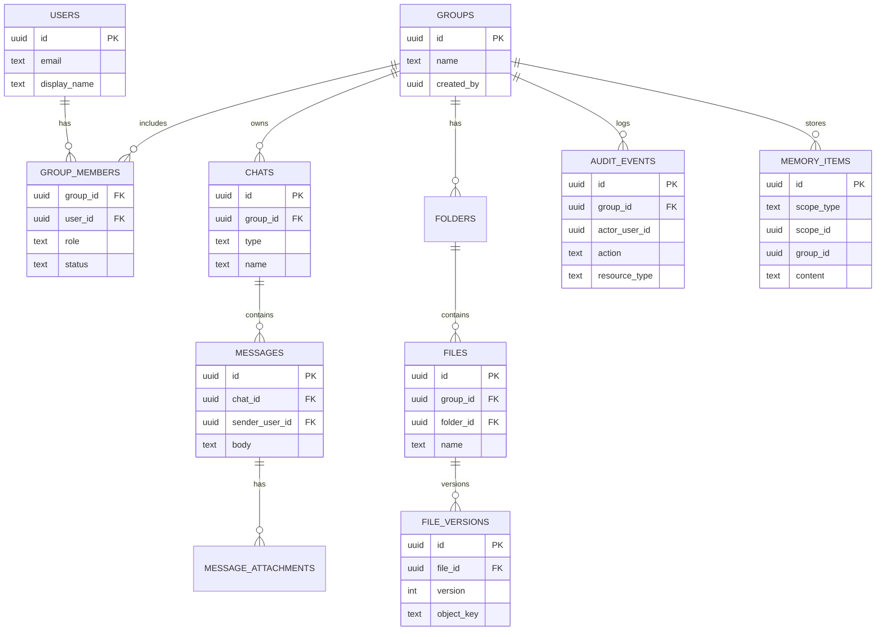
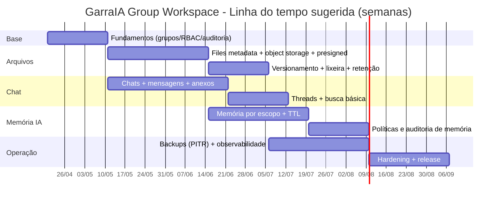

# GarraIA Group Workspace para Garra: arquitetura, requisitos e entrega de um Shared Workspace de Grupo/Família

## Resumo executivo

O **GarraIA Group Workspace** é um espaço compartilhado (família/equipe/grupo) que combina **arquivos**, **chats** e **memória de IA** sob um **modelo robusto de permissões**, de modo que múltiplos membros colaborem com contexto comum sem vazar dados entre pessoas/grupos e sem misturar “memória pessoal” com “memória do grupo”. A solução recomendada é um desenho “multi-tenant por grupo”, com **escopos de runtime** explícitos (*user*, *group*, *chat*), validações de autorização em camadas (API + banco com *defense-in-depth* quando aplicável), e armazenamento de arquivos em **object storage** (cloud ou self-host) com versionamento e trilha de auditoria. Para entrega consistente e observável, é recomendado instrumentar com **telemetria padrão (OpenTelemetry)** e métricas *Prometheus-style*. citeturn1search3turn1search0turn1search2turn1search5turn1search19turn15search7

Do ponto de vista de segurança e privacidade, o recurso precisa nascer com “**privacidade por padrão**” e segregação de dados: a própria lei brasileira (LGPD) define dado pessoal e princípios (finalidade/necessidade/segurança) e exige **medidas técnicas e administrativas** para proteção (arts. 46–49). Além disso, a **ANPD** publica guias e orientações práticas sobre incidentes e segurança para agentes de tratamento. No cenário europeu, diretrizes e materiais oficiais reforçam requisitos de segurança e notificação de incidentes, e fontes oficiais da União Europeia descrevem o dever de notificar autoridade supervisora em até 72h quando houver risco. citeturn11view0turn13search1turn13search0turn12search7turn12search18

Recomendação de stack para implementação (backend): **Rust** com runtime assíncrono (Tokio), framework HTTP (Axum), acesso a banco assíncrono (SQLx), TLS moderno (rustls), autenticação baseada em padrões (OAuth2/JWT quando aplicável), e integração com object storage via SDK (ex.: S3 compatível). citeturn5search4turn5search1turn5search2turn6search1turn6search8turn0search2turn0search10

**Itens não especificados** (devem ser definidos para fechar o desenho final): arquitetura atual do Garra (monólito vs microserviços), provedor de identidade atual (SSO/OIDC?), mecanismos atuais de chat/arquivos/memória IA, e restrições de plataforma (ex.: execução on-prem, mobile offline, multi-região).

## Visão geral e requisitos

### Objetivo e escopo do produto

O GarraIA Group Workspace deve permitir que um **grupo/família**:
1) compartilhe uma **pasta/árvore de arquivos** com versionamento e permissões;  
2) use **chats compartilhados** (canais e/ou DMs em contexto de grupo) com busca;  
3) mantenha uma **memória compartilhada do grupo** (e opcionalmente memória por chat) sem conflitar com memória pessoal;  
4) tenha **gestão de membros/convites** e auditoria (quem acessou/alterou o quê).  

O recorte “grupo como tenant” é o modelo mais simples para reduzir risco de vazamento, pois tudo é associado a `group_id` e validado por políticas de acesso (ex.: RLS no Postgres, quando útil). citeturn1search3turn1search0

### Requisitos funcionais

**Ciclo de vida do grupo**
- Criar grupo e definir “owner”.
- Convidar membros (link, e-mail, QR, convite interno), aceitar/recusar, remover, banir e reativar.
- Configurar perfil do grupo (nome, imagem, descrição), políticas (idade mínima, modo “família”, retenção, lock de exportação/apagamento).  
(Detalhes de convite e verificação dependem de identidade/autenticação existentes — não especificado.)

**Permissões e papéis**
- Papéis mínimos: *Owner*, *Admin*, *Member*, *Guest* e um papel restritivo opcional (*Child/Dependent*).
- Permissões em recursos: arquivos (ler/escrever/excluir/compartilhar), chats (ler/escrever/moderar), memória (ler/escrever/apagar), administração do grupo (membros e políticas).

**Arquivos e pastas**
- Pastas compartilhadas, upload/download, visualização, prévias básicas (opcional), versionamento, lixeira com retenção.
- Links de compartilhamento (interno ao grupo; externo opcional e desabilitado por padrão).
- Auditoria por arquivo e por pasta (criação, download, share, delete).

**Chat compartilhado**
- Canais por grupo, threads, menções, anexos, reações (opcional).
- Busca por mensagens e por anexos.

**Memória compartilhada de IA**
- Memória em três níveis: **pessoal**, **do grupo** e **do chat**.
- Regras claras: (a) o que entra na memória; (b) quem pode ver/editar; (c) políticas de retenção/expiração; (d) trilha de auditoria.

**Busca**
- Busca unificada (arquivos + chats + memória) com filtros por escopo. Para mensagens, dá para usar full-text nativo do Postgres (tsvector/tsquery) ou index externo; ambos têm trade-offs. citeturn7search0turn7search16

### Requisitos não funcionais

**Segurança**
- Autenticação forte; proteção de transporte com TLS 1.3 quando possível. citeturn3search0  
- Senhas (se houver login local) com hash *memory-hard* como Argon2. citeturn3search1turn19search2  
- Controles de acesso priorizando “least privilege” e verificações consistentes (padrões de segurança OWASP). citeturn0search3turn8search1turn8search0  

**Privacidade**
- Minimização/necessidade e segmentação de escopo (não misturar memórias). A LGPD define princípios e conceitos de dado pessoal e exige governança e segurança. citeturn11view0turn13search1  
- Se houver operação na entity["country","Brasil","country in south america"], considerar guias e expectativas da entity["organization","ANPD","brazil data protection auth"]. citeturn13search1turn13search0turn13search2  
- Se houver usuários na entity["organization","União Europeia","supranational union"], considerar práticas oficiais de notificação de incidentes e diretrizes europeias. citeturn12search7turn12search18turn12search6  

**Escalabilidade**
- Escalar API horizontalmente; separar tarefas de upload e indexação por workers assíncronos.
- Arquivos em object storage (escala melhor do que disco local) com multipart/resumable para grandes uploads. citeturn17search8turn17search0turn17search1  

**Disponibilidade**
- Banco e storage com estratégia clara de backup/restore; para Postgres, PITR com arquivamento contínuo de WAL é prática padrão suportada pela documentação. citeturn7search2turn16search1turn16search6  

**Performance**
- Upload direto para storage via **URLs pré-assinadas** para reduzir carga do backend, com expiração curta e escopo mínimo. citeturn17search7turn17search3turn17search11  
- Busca: usar índices adequados (GIN/tsvector no Postgres para texto; index dedicado para grandes volumes). citeturn2search3turn7search0  

## Arquitetura de referência

### Componentes e fronteiras

Uma arquitetura pragmática (monólito modular ou “modular monolith” com serviços bem separados) normalmente reduz custo de coordenação e, ainda assim, permite evolução para serviços quando volumes justificarem. A recomendação abaixo assume **serviços lógicos** (podendo iniciar como um único binário Rust):

- **API Gateway / Edge**: TLS, rate-limit, WAF (se aplicável), roteamento.
- **Auth**: login, sessão/token, MFA (opcional), emissão/validação de tokens.
- **Workspace Service**: grupos, membros, permissões.
- **Chat Service**: chats, mensagens, threads, anexos.
- **Files Service**: metadados de arquivos + integração com object storage.
- **Memory Service**: memória pessoal/grupo/chat + políticas de retenção.
- **Search Service**: index e consulta (Postgres FTS, Tantivy/Meilisearch ou híbrido).
- **DB transacional**: preferencialmente Postgres por recursos de segurança e busca textual nativa. citeturn1search3turn7search0  
- **Object Storage**: S3/GCS/Azure/MinIO com versionamento e criptografia em repouso.
- **Event Bus/Queue**: para indexação, preview, antivírus, jobs de retenção (tecnologia específica não especificada).
- **Observabilidade**: OpenTelemetry + métricas no padrão Prometheus para dashboards e alertas. citeturn1search19turn15search3turn15search7  

### Diagrama de arquitetura

```mermaid
flowchart LR
  ClientWeb[Web] --> Edge[Edge/API Gateway]
  ClientMob[Mobile] --> Edge

  Edge --> API[API Rust (Axum)]
  API --> Auth[Auth & Sessions]
  API --> Workspace[Groups/Members/Roles]
  API --> Chat[Chats/Messages/Threads]
  API --> Files[Files Metadata]
  API --> Memory[Shared Memory Service]
  API --> Search[Search Query API]

  Workspace --> DB[(Postgres)]
  Chat --> DB
  Files --> DB
  Memory --> DB
  Search --> DB

  Files --> Obj[(Object Storage)]
  API --> Obj

  API --> Queue[(Event Bus / Queue)]
  Queue --> Indexer[Indexer/Workers]
  Indexer --> SearchIdx[(Search Index)]
  Indexer --> Obj
  Indexer --> DB

  API --> OTel[OpenTelemetry SDK]
  OTel --> Collector[OTel Collector]
  Collector --> Observ[Logs/Traces/Metrics]
```

### Comparativo de bancos de dados

A tabela abaixo foca no perfil “workspace multi-tenant” com chats, ACL e busca textual, e assume que o time deseja consistência transacional forte.

| Opção | Pontos fortes | Pontos de atenção | Quando escolher |
|---|---|---|---|
| **PostgreSQL** | RLS/policies no banco (*CREATE POLICY*), full-text com `tsvector/tsquery`, índices GIN e extensões (ex.: `pgcrypto`). citeturn1search0turn1search3turn7search0turn7search1turn2search3turn2search11 | Operação/HA exige disciplina (backup, WAL, replica). A doc cobre PITR/WAL/HA/hot standby. citeturn7search2turn16search6turn16search0 | Recomendado como default para GarraIA Group Workspace. |
| **MySQL/InnoDB** | Replicação bem difundida; binlog e modos de logging/replicação documentados. citeturn2search17turn2search5turn2search9 | Sem equivalente tão direto a RLS nativa no core; FTS e modelagem de ACL tendem a ficar mais na aplicação. | Se o Garra já for majoritariamente MySQL e houver forte inércia operacional. |
| **CockroachDB** | SQL distribuído com transações ACID distribuídas e isolamento serializable como foco. citeturn2search12turn2search0turn2search20 | Custo/complexidade; compatibilidade SQL e tuning; exige domínio de padrões de DB distribuído. | Se o roadmap exigir multi-região ativa/ativa cedo. |
| **MongoDB** | Sharding e replica sets; transações multi-documento e em cluster sharded são suportadas (com considerações). citeturn2search2turn2search10turn2search6 | ACL e consistência relacional (membros/grupos) ficam mais delicadas; custo de integridade referencial e consultas. | Se o Garra já usa documento e prioriza adaptabilidade do schema sobre joins. |

## Modelo de dados e escopos de runtime

### Princípio de modelagem

O workspace precisa de **domínio relacional claro** (grupos↔membros↔papéis; chats; mensagens; arquivos; memória). Mesmo que a UI “pareça simples”, os riscos de segurança e conformidade aumentam quando ACL e auditoria são improvisadas (ponto recorrente em padrões OWASP). citeturn8search1turn0search3

### Tabelas recomendadas

Abaixo está um schema conceitual (nomes sugeridos). Tipos são indicativos.

**Identidade e autenticação**
- `users` (`id`, `email`, `display_name`, `status`, `created_at`)
- `user_identities` (`id`, `user_id`, `provider`, `provider_sub`, `created_at`) — para OIDC/SSO (se aplicável). OAuth 2.0 é o padrão de autorização amplamente adotado. citeturn0search2turn0search14
- `sessions` (`id`, `user_id`, `refresh_token_hash`, `expires_at`, `device_id`, `created_at`)
- `api_keys` (`id`, `user_id`, `label`, `key_hash`, `scopes`, `created_at`, `revoked_at`)

**Grupos e membros**
- `groups` (`id`, `name`, `type`, `created_by`, `created_at`, `settings_jsonb`)
- `group_members` (`group_id`, `user_id`, `role`, `status`, `joined_at`, `invited_by`)
- `group_invites` (`id`, `group_id`, `invited_email`, `token_hash`, `expires_at`, `created_at`, `accepted_at`)

**Permissões e auditoria**
- `roles` (`id`, `name`, `scope`) — ex.: group-scoped
- `permissions` (`id`, `action`, `resource_type`)
- `role_permissions` (`role_id`, `permission_id`)
- `audit_events` (`id`, `group_id`, `actor_user_id`, `action`, `resource_type`, `resource_id`, `ip`, `user_agent`, `metadata_jsonb`, `created_at`)  
Boas práticas de logging e auditoria para eventos de segurança são amplamente documentadas por OWASP. citeturn8search0turn8search8

**Chats**
- `chats` (`id`, `group_id`, `type`, `name`, `created_by`, `created_at`, `settings_jsonb`)
- `chat_members` (`chat_id`, `user_id`, `role`, `joined_at`)
- `messages` (`id`, `chat_id`, `sender_user_id`, `body`, `created_at`, `edited_at`, `deleted_at`)
- `message_threads` (`id`, `chat_id`, `root_message_id`, `created_at`) (alternativa: `messages.parent_id`)
- `message_attachments` (`message_id`, `file_id`)

**Arquivos**
- `folders` (`id`, `group_id`, `parent_id`, `name`, `created_by`, `created_at`)
- `files` (`id`, `group_id`, `folder_id`, `name`, `mime`, `size_bytes`, `created_by`, `created_at`, `deleted_at`)
- `file_versions` (`id`, `file_id`, `version`, `object_key`, `etag`, `checksum_sha256`, `created_by`, `created_at`)
- `file_shares` (`id`, `file_id`, `share_type`, `token_hash`, `expires_at`, `created_at`, `revoked_at`) (opcional)

**Memória**
- `memory_items` (`id`, `scope_type`, `scope_id`, `group_id`, `created_by`, `kind`, `content`, `sensitivity`, `ttl_expires_at`, `created_at`, `deleted_at`)
- `memory_embeddings` (`memory_item_id`, `embedding`) — opcional (pgvector ou outro). O `pgvector` suporta indexação aproximada como HNSW e IVFFlat. citeturn14search0turn14search11

### Modelo de escopos de runtime

Defina escopo explicitamente como:

- `Scope::User(user_id)` → memória/arquivos privados do usuário (fora do grupo).
- `Scope::Group(group_id)` → informação compartilhada.
- `Scope::Chat(chat_id)` → contexto do canal/convite (mais granular).

A regra de resolução para IA e busca deve obedecer:

1) **Escopo do chat** (se existir)  
2) **Escopo do grupo**  
3) **Escopo do usuário** (apenas do usuário atual)  

Esse “empilhamento” evita que memória pessoal se torne visível ao grupo. Esse ponto é alinhado ao princípio de necessidade/minimização e a exigências de segurança (LGPD) e “by default” (GDPR) quando aplicável. citeturn11view0turn13search1turn12search6turn12search7

### Diagrama ER



## API e autenticação

### Princípios de API

- **REST/JSON** com versionamento explícito (`/v1/...`).
- **OpenAPI** para contrato, testes e SDKs. A especificação OpenAPI define um formato padrão e agnóstico de linguagem para descrever APIs HTTP. citeturn18search0turn18search4
- **Erros padronizados** com “Problem Details”, preferindo o RFC mais atual (RFC 9457). citeturn18search19  
- HTTP é stateless por natureza; a sessão fica em tokens/cookies, não em estado no servidor. citeturn18search2

### Autenticação e autorização

**Opções de autenticação**
- **OIDC/OAuth2** (recomendado se Garra já tem SSO ou pretende ter): OAuth 2.0 é um framework de autorização para obter acesso limitado a recursos HTTP. citeturn0search2turn0search14  
- **JWT** como token de acesso (curta duração) quando fizer sentido. JWT é padronizado em RFC próprio. citeturn0search10  
- **Sessões web** (cookie HttpOnly + refresh server-side) para UX web mais simples; ainda assim, o token interno pode ser JWT ou identificador opaco.

**Autorização**
- RBAC por grupo (`group_members.role`) mapeado para permissões por ação (`permission.action`) e tipo de recurso.
- Para *defense-in-depth*, habilitar **Row Level Security** em tabelas críticas do Postgres, com políticas que restringem leitura/escrita a `group_id` e/ou `user_id`. O Postgres aplica RLS via `ALTER TABLE ... ENABLE ROW LEVEL SECURITY` e `CREATE POLICY`. citeturn1search3turn1search0

### Endpoints principais

**Grupos**
- `POST /v1/groups`
- `GET /v1/groups/{group_id}`
- `PATCH /v1/groups/{group_id}`
- `POST /v1/groups/{group_id}/invites`
- `POST /v1/groups/{group_id}/members/{user_id}:setRole`
- `DELETE /v1/groups/{group_id}/members/{user_id}`

**Chats**
- `POST /v1/groups/{group_id}/chats`
- `GET /v1/groups/{group_id}/chats`
- `POST /v1/chats/{chat_id}/messages`
- `GET /v1/chats/{chat_id}/messages?cursor=...`
- `POST /v1/messages/{message_id}/threads` (se threads forem recursos dedicados)

**Arquivos**
- `POST /v1/groups/{group_id}/files:initUpload` (gera upload URL/multipart)
- `POST /v1/groups/{group_id}/files:completeUpload`
- `GET /v1/groups/{group_id}/files?folder_id=...`
- `GET /v1/files/{file_id}:download` (gera URL temporária)
- `POST /v1/files/{file_id}:newVersion`
- `DELETE /v1/files/{file_id}` (soft delete)

**Memória**
- `GET /v1/memory?scope_type=group&scope_id=...`
- `POST /v1/memory`
- `DELETE /v1/memory/{memory_item_id}`

**Busca**
- `GET /v1/search?q=...&scope=group:{id}&types=messages,files,memory`

**Auditoria**
- `GET /v1/groups/{group_id}/audit?cursor=...`

### Exemplos de request/response

**Criar grupo**

```json
POST /v1/groups
Authorization: Bearer <access_token>

{
  "name": "Família Silva",
  "type": "family",
  "settings": {
    "externalSharing": false,
    "retentionDays": 3650
  }
}
```

```json
201 Created
{
  "groupId": "9d5b6b2c-7c5e-4d0a-9df2-8f96c1d4d31d",
  "name": "Família Silva",
  "role": "owner",
  "createdAt": "2026-04-13T00:00:00Z"
}
```

**Criar convite**

```json
POST /v1/groups/{group_id}/invites
{
  "email": "convidado@exemplo.com",
  "role": "guest",
  "expiresInHours": 72
}
```

**Resposta de erro (Problem Details)**

```json
403 Forbidden
{
  "type": "https://garra/errors/forbidden",
  "title": "Ação não permitida",
  "status": 403,
  "detail": "Você não tem permissão para remover membros deste grupo.",
  "instance": "/v1/groups/..../members/...."
}
```

O formato acima segue o conceito de “problem detail” padronizado (RFC 9457). citeturn18search19

### Papéis e permissões sugeridos

Uma sugestão mínima (ajuste conforme produto/negócio):

- **Owner**: tudo, inclusive deletar grupo, exportar tudo, gerir billing.
- **Admin**: gerir membros e configurações, moderar chat, gerir pastas.
- **Member**: criar/editar conteúdo, enviar mensagens, upload em pastas permitidas.
- **Guest**: leitura e contribuição limitada (pasta “Compartilhados”, chat específico).
- **Child/Dependent**: similar a Guest com *guardrails* adicionais (sem export/sem share externo).

Recomendação: modelar permissões como *capabilities* (`files.write`, `chats.moderate`, `members.manage`) e aplicar em policy central; OWASP ASVS é uma base de requisitos verificáveis para controles de autenticação, autorização e logging. citeturn0search3turn8search0

## Armazenamento, chat, busca e UX

### Armazenamento de arquivos e opções de sync

**Object storage como “origem da verdade”** é o caminho padrão para arquivos e anexos (durabilidade, versionamento, escalabilidade). Em cloud, serviços já oferecem criptografia em repouso e recursos como versionamento. Por exemplo, no S3 existe criptografia server-side por padrão em buckets e há suporte a SSE-S3/SSE-KMS. citeturn4search4turn4search8turn4search0

#### Comparativo de storage

| Modelo | Como funciona | Vantagens | Desvantagens | Melhor encaixe |
|---|---|---|---|---|
| Local-only | Arquivos em disco/NAS + metadados no DB local | Simplicidade “caseira”; dados ficam no local | Backup e acesso remoto mais difíceis; risco de perda se não houver redundância | “Família on-prem” |
| Cloud object storage | Metadados no DB + blob em bucket | Versionamento e criptografia em repouso comuns. Ex.: object versioning no GCS; blob versioning no Azure; criptografia automática no Azure Storage. citeturn4search5turn4search6turn4search2turn4search4 | Dependência do provedor e custos de egress; latência para alguns usuários | Padrão SaaS |
| Hybrid | Cache local + nuvem como source-of-truth | Melhor UX offline e desempenho local; retenção local controlável | Complexidade de sync e conflitos; exige agente/daemon | Mobile/offline e “família” com múltiplos devices |
| Self-host S3 compatível | MinIO (ou similar) com API S3 | Mantém modelo de object storage; compatibilidade S3; suporta versionamento e conceitos como erasure coding. citeturn4search3turn4search15turn4search19 | Operação: upgrades, monitoramento, capacidade, DR | Empresas/on-prem com time DevOps |

#### Upload: presigned URLs, multipart e resumable

Para reduzir custo e evitar que o backend vire gargalo de throughput, use **URL pré-assinada** de upload/download com expiração curta. A documentação do S3 descreve URLs pré-assinadas para upload e download e ressalta que elas dão acesso temporário sem compartilhar credenciais permanentes. citeturn17search7turn17search11turn17search3

Para arquivos grandes:
- **S3 multipart upload** divide o objeto em partes; falhas em uma parte não invalidam o resto, e o “CompleteMultipartUpload” monta as partes. citeturn17search8turn17search4turn17search0  
- **tus** é um protocolo aberto para uploads retomáveis via HTTP, útil se Garra quiser padronizar retomada em múltiplos backends. citeturn17search1turn17search13

Se o produto quiser “montar” o workspace como uma pasta no sistema operacional, **WebDAV** é um padrão HTTP para autoria/gerência de coleções e locking. citeturn17search2 (Observação: isso implica desafios de permissões, locking e performance; deve ser uma opção deliberada.)

### Chat integrado e busca

**Modelo de chat**: chats por grupo (canais), possivelmente DMs “dentro do grupo”. Threads podem ser:
- `messages.parent_id` (mais simples), ou
- entidade `thread` (mais flexível para buscas, mute, resolução etc.).

**Busca**: três estratégias comuns:

1) **Postgres Full-Text Search**: `tsvector`/`tsquery` para mensagens e descrições; é nativo e reduz dependências. citeturn7search0turn7search16turn7search4  
2) **Index embutido Rust (Tantivy)**: biblioteca de busca em Rust inspirada em Lucene, boa para index local/sidecar. citeturn14search1turn14search5  
3) **Search service externo (Meilisearch)**: API dedicada para busca full-text (e até híbrida/semântica em alguns cenários). citeturn14search2turn14search6turn14search10  

**Recomendação pragmática**: começar com Postgres FTS para mensagens (escala suficiente para muitos cenários) e evoluir para index dedicado se volume/latência exigir.

### UX e fluxos principais

Abaixo, “wireframes textuais” (descrições) para web e mobile.

**Web**
- **Tela “Workspaces”**: lista de grupos (cards), botão “Criar grupo”, status de convites pendentes.
- **Criação de grupo**: wizard curto (nome, tipo: família/equipe, política de compartilhamento externo off por padrão, convite de membros).
- **Home do grupo** (layout com tabs):  
  - *Arquivos*: árvore de pastas à esquerda; lista à direita; breadcrumb; actions (upload, new folder, share interno).  
  - *Chats*: lista de canais; área central de mensagens; painel direito (membros online, arquivos do chat, “Memória do chat”).  
  - *Memória*: itens de memória do grupo com tags (ex.: “Preferências”, “Regras”, “Contas/assinaturas”), botões “fixar”, “expirar”, “excluir”, e histórico (auditoria).  
  - *Admin*: membros/papéis, políticas (retenção, compartilhamento externo), logs/auditoria.

**Mobile**
- **Switch de grupo** no topo (dropdown).
- **Arquivos**: navegação por breadcrumb + busca; upload via câmera/galeria; fila de uploads retomáveis (tus/multipart).
- **Chats**: experiência padrão de mensageria; threads como navegação em “pilha”.
- **Memória**: UI simples “cartões” com ação rápida “Salvar na memória do grupo” ao final de uma conversa.

## Operação, segurança e conformidade

### Backup, recuperação e versionamento

- **Postgres PITR/archiving**: a documentação descreve que restauração com “continuous archiving” requer sequência contínua de WAL arquivados; isso permite point-in-time recovery quando combinado com base backup. citeturn7search2turn16search1  
- **Alta disponibilidade**: Postgres documenta conceitos de HA e hot standby e parâmetros de replicação/streaming. citeturn16search6turn16search0turn16search3  

Para arquivos: habilitar **versionamento** no object storage quando disponível (GCS/Azure/MinIO) e definir política de retenção e limpeza. citeturn4search5turn4search6turn4search15

### Criptografia e gestão de chaves

- **Em trânsito**: TLS 1.3 foi especificado para prevenir escuta, adulteração e forja. citeturn3search0  
- **Em repouso**: preferir criptografia gerenciada pelo provedor (SSE) quando cloud; S3 documenta SSE-S3 e SSE-KMS e descreve criptografia por padrão em buckets. citeturn4search4turn4search0turn4search8  
- **Chaves**: seguir boas práticas de gestão de material criptográfico (ciclo de vida, rotação, separação de funções) conforme recomendações do entity["organization","NIST","us standards agency"] (SP 800-57). citeturn3search3  

### Auditoria e logging de segurança

Eventos mínimos a auditar:
- login/logout/falhas de autenticação;
- mudanças de papéis e membros;
- downloads de arquivos sensíveis; compartilhamentos;
- exportação e deleção (soft/hard), mudanças de retenção.

OWASP fornece orientações práticas para mecanismos de logging e para vocabulário consistente de eventos. citeturn8search0turn8search8

### Conformidade LGPD e considerações GDPR

**LGPD (Brasil)**
- Define conceitos como dado pessoal e princípios do tratamento (finalidade/necessidade/segurança). citeturn11view0  
- Exige adoção de medidas de segurança técnicas e administrativas (art. 46 e seguintes), e a ANPD publica material educativo sobre segurança da informação para agentes de tratamento. citeturn13search11turn13search1  
- A ANPD mantém canal/orientação para comunicação de incidente de segurança (CIS) e reforça a obrigação do controlador em comunicar incidente quando aplicável. citeturn13search0  

Implicações práticas para o GarraIA Group Workspace:
- **Controles de acesso e segregação** por grupo não são opcionais; devem ser demonstráveis (princípio de responsabilização). citeturn11view0turn13search1  
- **Direitos do titular** (ex.: exportação/apagamento) exigem trilhas e processos: localizar dados por escopo, exportar (com consentimento/política) e apagar conforme regras de retenção. (Implementação específica depende do produto — não especificado.)

**GDPR (quando aplicável)**
- A Comissão Europeia descreve obrigação de notificar a autoridade supervisora “sem demora indevida” e, no máximo, em 72h após ciência quando houver risco, e também descreve obrigações do processador notificar o controlador. citeturn12search7  
- Diretrizes do entity["organization","European Data Protection Board","eu data protection board"] detalham práticas sobre notificação de incidentes e interpretação de artigos relacionados a segurança e breach notification. citeturn12search18turn8search11  
- Diretrizes oficiais sobre “data protection by design and by default” reforçam que medidas e salvaguardas devem ser consideradas desde o design. citeturn12search6  

Para IA/memória: **memória compartilhada** pode conter dado pessoal; tratar como dado sob governança (retenção, acesso, auditoria, exclusão). Se o Garra aplicar embeddings/vetores (RAG), a mesma governança se aplica ao conteúdo e aos embeddings.

### Observabilidade, monitoramento e SRE

- **OpenTelemetry** define especificações e contexto para correlação de logs/traços/métricas. citeturn1search19turn1search23  
- Guia de instrumentação do Prometheus recomenda instrumentar amplamente (métricas por subsistema), e métricas incluem tipos como counters/gauges/histograms. citeturn15search7turn15search3  

Métricas recomendadas:
- latência p50/p95/p99 por endpoint;
- taxa de erros por classe (4xx/5xx);
- throughput de uploads/downloads;
- backlog de jobs (indexação/preview);
- tempo de consulta de busca e hit ratio de cache.

### Infra e deployment em Kubernetes

Para ambientes containerizados:
- **StatefulSet** é apropriado para workloads stateful e identidade estável. citeturn1search2  
- **Ingress** gerencia acesso externo HTTP/HTTPS com regras (host/path). citeturn1search5  
- **Secrets** podem ser montados como volume/env e há boas práticas oficiais para gestão de secrets. citeturn15search1turn15search5  
- **RBAC** e boas práticas de RBAC são documentadas pelo Kubernetes para reduzir risco de privilégio excessivo. citeturn15search2turn15search18  
- **Probes** (liveness/readiness/startup) e **HPA** (autoscaling horizontal) são mecanismos oficiais para robustez e escala por demanda. citeturn16search2turn16search14turn16search5  

### Estratégia de migração e upgrades

Mesmo sem detalhes do sistema atual, uma estratégia segura de evolução inclui:
- **Migrações de schema forward-only** (com colunas novas, backfill, e somente depois restrições NOT NULL).
- **Dupla escrita** temporária (quando migrar storage/search), seguida de “cutover” e limpeza.
- **Versionamento de API** (`/v1`) e compatibilidade retroativa com clientes mobile (Janela de suporte explícita — não especificada).

Para Rust, usar tooling de migração do SQLx (migrations) é comum em pipelines CI/CD e se integra ao runtime assíncrono. citeturn5search2turn5search6

## Implementação em Rust e roadmap

### Estrutura recomendada de projeto em Rust

Um layout “workspace Cargo” facilita modularidade:

- `crates/garra_api`  
  - rotas Axum, extractors, validação, serialização
- `crates/garra_domain`  
  - entidades (Group, Chat, File…), regras de negócio, políticas
- `crates/garra_auth`  
  - validação JWT/OIDC, sessões, RBAC
- `crates/garra_db`  
  - pool SQLx, queries, migrations, transações
- `crates/garra_storage`  
  - abstração `ObjectStore` + implementações (S3/MinIO/local)
- `crates/garra_workers`  
  - jobs (indexação, retenção, preview)
- `crates/garra_telemetry`  
  - tracing + OpenTelemetry exporters

**Async runtime e HTTP**
- **Tokio** é um runtime assíncrono para Rust com I/O não bloqueante e agendamento. citeturn5search4turn5search16  
- **Axum** integra middleware via Tower, reaproveitando ecossistema de middleware HTTP. citeturn5search1turn5search13  
- **SQLx**: crate assíncrona com queries verificáveis e suporte a Postgres/MySQL/SQLite. citeturn5search2  

**Segurança e telemetria**
- **rustls**: biblioteca TLS moderna com foco em cripto segura por padrão. citeturn6search1turn6search5  
- **tracing** e integração com OpenTelemetry via `tracing-opentelemetry`. citeturn5search3turn6search3  
- Hash de senha com `argon2` crate, alinhado ao RFC Argon2. citeturn19search2turn3search1  
- Documentar API com `utoipa` (OpenAPI auto gerado). citeturn19search1turn18search0  

### Padrões async e concorrência

Tarefas típicas que devem ser **assíncronas/fora do request**:
- indexar mensagem/arquivo para busca;
- gerar preview;
- jobs de retenção (expirar memória, esvaziar lixeira);
- verificação de malware (se adotado; não especificado).

Em Tokio, isso tende a ser implementado com `tokio::spawn` + filas internas/externas e *cancellation* por shutdown signal. citeturn5search16turn5search8

### Snippets de código (núcleo do feature)

#### Modelos e escopos

```rust
// crates/garra_domain/src/scope.rs
use uuid::Uuid;

#[derive(Debug, Clone, Copy, PartialEq, Eq)]
pub enum Scope {
    User(Uuid),
    Group(Uuid),
    Chat(Uuid),
}

impl Scope {
    pub fn group_id_hint(&self) -> Option<Uuid> {
        match self {
            Scope::Group(gid) => Some(*gid),
            _ => None,
        }
    }
}
```

#### Política de permissão central

```rust
// crates/garra_auth/src/permissions.rs
use uuid::Uuid;

#[derive(Debug, Clone, Copy, PartialEq, Eq)]
pub enum Role {
    Owner,
    Admin,
    Member,
    Guest,
    Child,
}

#[derive(Debug, Clone, Copy, PartialEq, Eq)]
pub enum Action {
    GroupsManageMembers,
    FilesRead,
    FilesWrite,
    FilesDelete,
    ChatsRead,
    ChatsWrite,
    ChatsModerate,
    MemoryRead,
    MemoryWrite,
    MemoryDelete,
}

#[derive(Debug)]
pub struct Principal {
    pub user_id: Uuid,
    pub group_id: Option<Uuid>,
    pub role: Option<Role>,
}

pub fn can(principal: &Principal, action: Action) -> bool {
    let role = match principal.role {
        Some(r) => r,
        None => return false,
    };

    match (role, action) {
        (Role::Owner, _) => true,
        (Role::Admin, Action::GroupsManageMembers) => true,
        (Role::Admin, Action::ChatsModerate) => true,

        (Role::Admin | Role::Member, Action::FilesRead | Action::ChatsRead | Action::MemoryRead) => true,
        (Role::Admin | Role::Member, Action::FilesWrite | Action::ChatsWrite | Action::MemoryWrite) => true,

        // Guests: leitura + escrita restrita (ajustar por pasta/chat)
        (Role::Guest, Action::FilesRead | Action::ChatsRead) => true,
        (Role::Guest, Action::ChatsWrite) => true,

        // Child: mais restrito por padrão
        (Role::Child, Action::ChatsRead | Action::ChatsWrite) => true,

        _ => false,
    }
}
```

#### Handler Axum: criar grupo

```rust
// crates/garra_api/src/routes/groups.rs
use axum::{extract::State, Json};
use serde::{Deserialize, Serialize};
use uuid::Uuid;
use sqlx::PgPool;

#[derive(Clone)]
pub struct AppState {
    pub db: PgPool,
}

#[derive(Debug, Deserialize)]
pub struct CreateGroupReq {
    pub name: String,
    pub r#type: String, // "family" | "team" (validar)
}

#[derive(Debug, Serialize)]
pub struct CreateGroupRes {
    pub group_id: Uuid,
    pub role: String, // "owner"
}

pub async fn create_group(
    State(state): State<AppState>,
    // Em produção, viria de um extractor auth que popula user_id
    user_id: Uuid,
    Json(req): Json<CreateGroupReq>,
) -> Result<Json<CreateGroupRes>, (axum::http::StatusCode, String)> {
    let group_id = Uuid::new_v4();

    let mut tx = state.db.begin().await.map_err(internal_err)?;

    sqlx::query!(
        r#"
        INSERT INTO groups (id, name, type, created_by)
        VALUES ($1, $2, $3, $4)
        "#,
        group_id,
        req.name,
        req.r#type,
        user_id
    )
    .execute(&mut *tx)
    .await
    .map_err(internal_err)?;

    sqlx::query!(
        r#"
        INSERT INTO group_members (group_id, user_id, role, status)
        VALUES ($1, $2, 'owner', 'active')
        "#,
        group_id,
        user_id
    )
    .execute(&mut *tx)
    .await
    .map_err(internal_err)?;

    tx.commit().await.map_err(internal_err)?;

    Ok(Json(CreateGroupRes {
        group_id,
        role: "owner".into(),
    }))
}

fn internal_err<E: std::fmt::Display>(e: E) -> (axum::http::StatusCode, String) {
    (axum::http::StatusCode::INTERNAL_SERVER_ERROR, e.to_string())
}
```

Axum oferece extractors como `Multipart` para upload via `multipart/form-data` (com a ressalva de consumir o corpo e precisar ser o último extractor). citeturn7search3turn5search5

#### Upload de arquivo: multipart direto no backend (útil para on-prem)

```rust
// crates/garra_api/src/routes/files.rs
use axum::{extract::Multipart, response::IntoResponse};
use bytes::BytesMut;
use tokio::io::AsyncWriteExt;

pub async fn upload_file_local(
    mut multipart: Multipart,
) -> Result<impl IntoResponse, (axum::http::StatusCode, String)> {
    while let Some(field) = multipart.next_field().await.map_err(bad_req)? {
        let name = field.name().unwrap_or("").to_string();
        if name != "file" {
            continue;
        }

        let file_name = field.file_name().unwrap_or("upload.bin").to_string();
        let mut data = BytesMut::new();
        let mut field = field;

        while let Some(chunk) = field.chunk().await.map_err(bad_req)? {
            data.extend_from_slice(&chunk);
        }

        let path = format!("/var/lib/garra/uploads/{}", sanitize(&file_name));
        let mut f = tokio::fs::File::create(&path).await.map_err(internal_err)?;
        f.write_all(&data).await.map_err(internal_err)?;
    }

    Ok(axum::http::StatusCode::CREATED)
}

fn sanitize(name: &str) -> String {
    name.replace('/', "_").replace('\\', "_")
}

fn bad_req<E: std::fmt::Display>(e: E) -> (axum::http::StatusCode, String) {
    (axum::http::StatusCode::BAD_REQUEST, e.to_string())
}

fn internal_err<E: std::fmt::Display>(e: E) -> (axum::http::StatusCode, String) {
    (axum::http::StatusCode::INTERNAL_SERVER_ERROR, e.to_string())
}
```

Para SaaS com object storage, preferir **presigned URL** e/ou multipart nativo do storage para uploads grandes. citeturn17search7turn17search8turn17search0

#### Upload de arquivo: presigned URL em S3 compatível

```rust
// crates/garra_storage/src/s3.rs
use aws_sdk_s3::Client;

pub struct S3Storage {
    pub client: Client,
    pub bucket: String,
}

impl S3Storage {
    // Em produção: usar aws-sdk-s3 + presigner, escopos mínimos e expiração curta.
    // (Pseudo-código; detalhes dependem do fluxo de credenciais e do SDK.)
    pub async fn init_presigned_put(&self, object_key: &str) -> anyhow::Result<String> {
        // TODO: gerar URL pré-assinada (PUT) para object_key
        Ok(format!("https://example-presigned/{}/{}", self.bucket, object_key))
    }
}
```

O AWS SDK for Rust fornece crates por serviço (ex.: `aws-sdk-s3`) e a documentação oficial descreve exemplos com S3. citeturn6search0turn6search8turn6search20

### Boas práticas de segurança específicas para Rust

- Preferir TLS via **rustls** e configurar *cipher suites* modernas; TLS 1.3 tem requisitos e objetivos de segurança definidos no RFC. citeturn6search1turn3search0  
- Evitar armazenar tokens/senhas em texto: usar `argon2` para hashing de senha (quando aplicável) e rotação/expiração de refresh tokens. citeturn19search2turn3search1  
- Instrumentação estruturada com `tracing` e export OpenTelemetry para rastrear requests e operações críticas. citeturn5search3turn6search3turn6search11  
- Middleware HTTP (CORS, compression, tracing, headers sensíveis) via `tower-http`. citeturn19search4turn19search0turn19search16  

### Estratégia de testes

- **Unit tests**: validação de políticas RBAC, parse de escopos, sanitização.
- **Integration tests**: endpoints com DB real (testcontainers ou ambiente efêmero), verificação de RLS/políticas e migrações.
- **E2E** (web/mobile): fluxos críticos (criar grupo → convidar → upload → chat → memória).
- **Security testing**: checklist e critérios verificáveis baseados em OWASP ASVS e OWASP Logging Cheat Sheet. citeturn0search3turn8search0  
- **Chaos/Resiliência**: simular indisponibilidade de storage/DB e conferir degradação.

### Roadmap com marcos, entregáveis e estimativas

**Assunção de início**: próxima semana após 13/abr/2026 (data não especificada; ajuste conforme planejamento interno).  
Estimativas em semanas (**baixa / provável / alta**) incluem desenvolvimento + QA + hardening.

| Marco | Escopo principal | Entregáveis | Estimativa |
|---|---|---|---|
| Fundamentos do domínio | grupos, membros, RBAC básico, auditoria mínima | schema inicial + endpoints `/groups` + logs essenciais | 2 / 3 / 5 |
| Arquivos compartilhados | pastas, metadados, upload e download | object storage integrado; presigned URLs; lixeira | 3 / 5 / 8 |
| Chats compartilhados | canais, mensagens, threads, anexos | endpoints de chat; busca simples; push (não especificado) | 4 / 6 / 10 |
| Memória compartilhada | memory_items por escopo + políticas | UI de memória; APIs; retenção/TTL; auditoria | 3 / 5 / 8 |
| Busca unificada | mensagens + arquivos + memória | FTS no Postgres + filtros por escopo; opção de index externo | 2 / 4 / 7 |
| Operação e conformidade | backups, DR, relatórios, incident response | runbooks; PITR; dashboards; políticas LGPD/GDPR | 3 / 5 / 8 |
| Hardening e lançamento | pentest, SLOs, mobile UX refinado | release candidate; monitoramento e alertas | 2 / 4 / 6 |

### Equipe e competências

- **Tech Lead Rust/Backend**: Axum/Tokio/SQLx, arquitetura, performance.
- **Backend Engineers**: API, domínio, storage, jobs, testes.
- **Frontend Web**: flows, componentes, acessibilidade.
- **Mobile**: offline/cache, uploads retomáveis.
- **DevOps/SRE**: Kubernetes, observabilidade, CI/CD, DR.
- **Segurança/Privacy**: threat modeling, revisão OWASP, governança LGPD/GDPR, incident response (ANPD/UE). citeturn13search1turn12search7turn8search0turn0search3

### Riscos e mitigação

- **Vazamento de dados entre grupos**: mitigar com `group_id` obrigatório, políticas centralizadas, testes de autorização, e RLS no Postgres onde fizer sentido. citeturn1search3turn1search0  
- **Uploads grandes e instáveis no mobile**: mitigar com tus (resumable) ou multipart no storage, e fila de upload retomável. citeturn17search1turn17search8  
- **Crescimento de busca**: começar Postgres FTS e migrar para index dedicado (Tantivy/Meilisearch) quando latência/volume exigirem. citeturn7search0turn14search1turn14search2  
- **Operação de secrets/chaves em Kubernetes**: seguir boas práticas oficiais de Secrets e RBAC e, se possível, integrar KMS externo. citeturn15search5turn15search18turn3search3  

### Linha do tempo em Gantt



### Fluxo de entrega e migração

```mermaid
flowchart TD
  A[Schema novo e APIs /v1] --> B[Feature flags por tenant/grupo]
  B --> C[Dupla escrita: metadados + logs]
  C --> D[Backfill e validações (autorização/escopo)]
  D --> E[Cutover gradual (beta -> GA)]
  E --> F[Limpeza e remoção de caminhos legados]
```

**Checklist final de prontidão**
- RLS/políticas e testes de autorização (defense-in-depth). citeturn1search3  
- TLS e hashing de senha conforme boas práticas (TLS 1.3 / Argon2). citeturn3search0turn3search1  
- Observabilidade (OpenTelemetry) e métricas (Prometheus). citeturn1search19turn15search7  
- Backup/PITR para Postgres e versionamento/retention em storage. citeturn7search2turn4search5turn4search6  
- Runbooks de incidentes alinhados a orientações da ANPD e materiais oficiais europeus quando aplicável. citeturn13search0turn12search7turn12search18