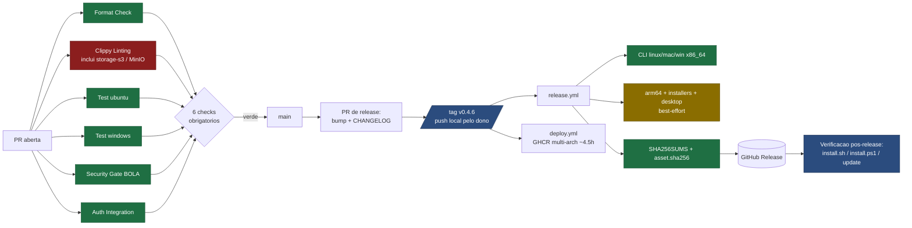

# Plan 0364 — Release v0.4.6: pré-voo, inventário e gate

- **Data:** 2026-09-25 (America/New_York)
- **Status:** **parado no gate**, por duas regras que coincidem: o prompt de
  missão diz *"if any of these [credentials] are missing, report and stop
  before proceeding"*, e o `CLAUDE.md` classifica release como R5 (sempre
  escala ao humano). Nenhum commit, tag, merge, fechamento de issue ou push
  de imagem foi feito. Este arquivo é o Checkpoint 1 do prompt (inventário)
  mais tudo o que dava para verificar sem tocar em nada.
- **Origem:** prompt de missão "Release v0.4.6" colado na sessão (audit de
  64 issues + 3 PRs, CI verde, instaladores para 3 SOs, QR do WhatsApp na
  GUI, mensagem real, persistência após restart, evidências).
- **Antecedentes:** [plan 0363](0363-desktop-whatsapp-sem-terminal.md)
  (o QR na GUI é um plano de várias etapas, não um item de release),
  [`docs/releasing.md`](../docs/releasing.md), memória de sessão sobre a
  automação da release (v0.4.3–v0.4.5).

---

## 0. Resumo executivo

**A missão, como escrita, não pode ser cumprida de ponta a ponta por um
agente, e três premissas dela estão erradas.** O que é verdade e o que não é:

| Afirmação do prompt | Verificado | Fato |
|---|---|---|
| "64 open issues and 3 PRs" | ✅ | 64 issues e 3 PRs abertas em `michelbr84/GarraRUST` (2026-09-25). |
| "gateway workspace bug **#3653**" | ❌ | Não existe issue #3653 (o repo está em #1465). O bug do workspace é a **#1378**, com a PR **#1448** pronta e travada por um achado R4 (**#1449**), mais quatro filhotes (#1459, #1463, #1464, #1465). |
| "MinIO removed DockerHub images; switch to **quay.io**" | ❌ **invertido** | O CI **já** usa `quay.io` desde a #1230. Desde 2026-09-24 ~17:22 UTC o **quay.io passou a exigir autenticação** (#1458): o step `Pre-pull MinIO` falha com 401 em toda PR. Trocar para quay.io é a causa, não a cura. |
| "CI green" é possível fechando issues | ⚠️ | `main` está verde só porque nada rodou nela desde 2026-09-23; o check obrigatório `Clippy Linting` está **vermelho nas três PRs abertas** por causa do MinIO. Nenhuma PR entra até isso ser resolvido. |
| "signed .dmg", "Authenticode", "notarization" | ❌ | Não há **nenhum** secret no repositório (`gh secret list` vazio) e nenhum passo de assinatura em workflow algum. Windows sai sem assinatura (SmartScreen); **não existe job de desktop para macOS**. |
| "scan the WhatsApp QR **in the GUI**" | ❌ hoje | O QR só existe em `garraia whatsapp link`, no terminal. Colocá-lo na GUI é o [plan 0363](0363-desktop-whatsapp-sem-terminal.md): etapas E0–E7, com decisões R5 pendentes. Não é item de uma release de manutenção. |
| "Tauri self-update" | ❌ | `tauri-plugin-updater` está inerte (sem chave, sem `latest.json`) — `docs/releasing.md` §Débito conhecido. |
| Telefone real, VM limpa por SO, macOS | ❌ para o agente | Só o dono tem telefone, máquina macOS e credenciais. |

**Recomendação:** dividir. **v0.4.6 = estabilização** (destravar o CI,
mergear o que está pronto, fechar as P1 de segurança novas, fixar toolchain,
adotar o checklist de dogfood manual) — cabe em uma a duas semanas e fecha
ou avança cerca de 15 das 64 issues. As outras ~49 são **três épicos de
produto** (Access Policy v2, Runtime Capability Registry, administração do
WhatsApp no Web Console) mais o onboarding desktop do plan 0363, e vão para
um milestone **v0.5.0** com justificativa registrada em cada uma — isso é
"resolvido ou fechado com razão" sem apagar backlog legítimo.

O que precisa do dono **antes** de qualquer passo está em §8.

---

## 1. Gate de permissões e credenciais (o prompt manda checar primeiro)

| Requisito | Estado | Evidência / consequência |
|---|---|---|
| GitHub: branch, push, PR, merge, release | ✅ | `permissions: admin/maintain/push` no repo público. `main` protegida por ruleset com 6 checks obrigatórios (Format, **Clippy Linting**, Test ubuntu, Test windows, Security Gate, Auth Integration). |
| CI: pull de imagens e builds nos 3 SOs | ⚠️ | Runners Linux/Windows/macOS existem (`release.yml` já compila a CLI nos três). **Pull do MinIO está quebrado** (#1458) — bloqueia o check obrigatório. |
| Certificado de assinatura Windows | ❌ ausente | Sem secret, sem `signtool` em workflow. Instaladores saem **não assinados**; "signed binary evidence" é impossível. |
| Apple Developer ID / notarização | ❌ ausente | Nenhum job macOS de desktop existe. Sem conta, `.dmg` seria não assinado (Gatekeeper). |
| Chave do updater Tauri (`TAURI_SIGNING_PRIVATE_KEY`) | ❌ ausente | `docs/releasing.md:93-101` descreve os 3 passos manuais. |
| Token para espelhar imagem no GHCR | ❌ | O token do `gh` desta máquina tem `gist, read:org, repo, workflow` — **sem `write:packages`**. O `deploy.yml` empurra para o GHCR com `GITHUB_TOKEN`, mas só a partir de uma imagem que o runner consiga puxar, e o quay.io não serve mais. |
| Chave do provedor de IA para o teste ponta a ponta | ⚠️ | É a chave OpenRouter do dono; a memória da sessão registra que ela estourou o limite total em 2026-09-19 (403). Precisa de saldo confirmado antes do dogfood. |
| Telefone WhatsApp (vinculado + um segundo número autorizado) | ❌ para o agente | Só o dono. O celular vinculado **não** conversa com o Garra (`from_me` é ignorado), então são **dois** aparelhos. |
| Máquinas de teste limpas (Win 10/11, Ubuntu 22.04, macOS) | ❌ para o agente | Linux via container é possível para a CLI; a GUI e os outros SOs, não. |

Por regra do prompt e do repositório, **parado aqui**. O resto do documento é
o que o gate permite entregar sem mutação: fatos, inventário, plano, tabelas
e diagramas.

---

## 2. Estado real do repositório (2026-09-25, 15:40 EDT)

- **Última release:** `v0.4.5` (2026-09-22 13:47 UTC). Desde então, **13
  commits** em `main` e **10 fragmentos** em `changelog.d/` (3 `added`, 1
  `changed`, 4 `fixed`, 1 `security`, 1 do wizard) — há conteúdo para uma
  v0.4.6 de manutenção mesmo sem nada novo.
- **CI em `main`:** último `CI` verde em `5608900d` (2026-09-23 18:40). Desde
  2026-09-24 17:22 UTC toda execução do job `Clippy Linting` falha no step
  `Pre-pull MinIO image for testcontainers` (`ci.yml:611-620`), 401 do
  quay.io, em runners e branches diferentes, inclusive com o retry da PR
  #1457 aplicado (3 tentativas, 3 × 401).
- **PRs abertas (3):** todas `MERGEABLE`, todas com **30 checks verdes e 1
  vermelho** (`Clippy Linting`):
  - **#1448** `fix(gateway): sessao sem projeto ganha workspace padrao seguro`
    — fecha #1378; pelas issues-filhas (#1463–#1465) a PR já foi revisada
    para **escopo por sessão** (o achado da #1449), e a #1459 já foi
    corrigida nela. Precisa de revisão R4 (`security-auditor`) e do dono.
  - **#1457** `fix(ci): retry docker pull do MinIO com backoff` — correto e
    inócuo, **não resolve** a #1458; mergeável depois da correção real.
  - **#1455** `chore(dev): script para fixar toolchain Rust` — a #1452 pede
    `rust-toolchain.toml`; a PR entrega um script. Decidir um dos dois.
- **Secrets do repositório:** nenhum. **Milestones:** nenhum.
- **Assets da v0.4.5:** 54 (binários crus + `.sha256` de cada, archives,
  `.deb`/`.rpm`/AppImage x86_64 e aarch64, desktop Windows MSI + NSIS,
  desktop Linux `.deb` + AppImage, APK Android, `install.sh`/`install.ps1`,
  `SHA256SUMS`). **Não há** `.dmg` nem qualquer artefato desktop para macOS.

### 2.1 O bloqueio do MinIO: três saídas

| Opção | O que é | Custo | Recomendação |
|---|---|---|---|
| **A. Espelhar no GHCR do projeto** | Esta máquina tem em cache `minio/minio:RELEASE.2025-04-22T22-12-26Z` (digest `sha256:a1ea29fa2835…`, amd64, criado 2025-04-22). `docker tag` + `docker push ghcr.io/michelbr84/minio:RELEASE.2025-04-22T22-12-26Z`, e o `ci.yml` passa a puxar **por digest** desse espelho. | Um `docker login ghcr.io` com PAT `write:packages` **do dono** (o token atual não tem o escopo); uma PR de 3 linhas; registro de cadeia de suprimento no próprio comentário do `ci.yml` (o repo já trata isso assim no job de coverage). A tag é mais nova que a do CI (`2025-02-28`), então a suíte `tests/s3_integration.rs` roda de novo contra ela na própria PR. | **Fazer agora.** Destrava as três PRs em horas, sem trocar backend de teste. |
| B. Trocar o backend S3 de teste (Garage, SeaweedFS, RustFS, LocalStack) | Substituir o testcontainer e revalidar a suíte de integração e o `S3Compatible` (SSE-S3 obrigatório, presigned URLs). | Dias; risco de a semântica S3 do substituto divergir no SSE. | Follow-up da #1458, não bloqueador. |
| C. Credencial autenticada no quay.io | Depende de a MinIO ainda oferecer tier gratuito; secret novo no CI. | Incerto e recorrente. | Não. |

---

## 3. Inventário de issues e PRs (Checkpoint 1)

Legenda de **Ação**: **v0.4.6** = entra na release de estabilização ·
**verificar+fechar** = já atendida em parte por commits pós-v0.4.5, conferir
critérios restantes e fechar ou estreitar · **v0.5.0 / épico** = vai para o
milestone seguinte com o épico nomeado · **decisão do dono**.
Bloqueadores de release e itens de segurança marcados com **🔴**.

### 3.1 Bloqueadores e correções para a v0.4.6

| # | Título (resumido) | Tipo | Prioridade | Ação proposta |
|---|---|---|---|---|
| **#1458** | quay.io exige auth — job `storage-s3` quebrado repo-wide | infra/CI | **🔴 P1 · bloqueia todo merge** | **v0.4.6** — opção A de §2.1 (espelho no GHCR por digest); revalidar `s3_integration` |
| #1456 | pre-pull do MinIO sem retry | infra/CI | baixa | **v0.4.6** — mergear a PR #1457 **depois** da #1458 (retry continua útil) |
| **#1378** | sessão WhatsApp sem workspace (NoRoots) | bug P0 | **🔴 P0** | **v0.4.6** — mergear a PR #1448 após revisão R4 |
| **#1449** | workspace default compartilhado entre sessões/principais | segurança P0 (R4) | **🔴 P0** | **decisão do dono + `security-auditor`** — confirmar que a revisão da #1448 (escopo por sessão) fecha o achado; fechar junto |
| #1459 | `/api/diagnostics` recomputa raízes por request | P2 | baixa | **verificar+fechar** — a #1465 afirma que já foi corrigida na #1448 |
| #1463 | diretório nasce com umask antes do `0700` | P2 | média | **v0.4.6** — criar já com `DirBuilder::mode(0o700)`; pequeno |
| #1464 | guarda de `ToolContext` casa só a forma exata | P2 (teste) | baixa | **v0.4.6** — junto com a #1448 |
| #1465 | `/api/diagnostics` expõe caminho absoluto do host (raízes MCP) | segurança P2 | média | **v0.4.6** — mesmo `exibir_raiz` das outras linhas |
| **#1462** | `X-Session-Id` forjado na rota compat OpenAI lê resumo + 100 turnos | segurança P1 | **🔴 P1 (R4)** | **v0.4.6** — amarrar sessão ao chamador/token na rota compat; `security-auditor` |
| **#1461** | iMessage usa `group_name` cru como `session_key` | segurança P1 | **🔴 P1 (R4)** | **v0.4.6** — chave por identificador estável do grupo (`chat_id`/`guid`), não o nome; `security-auditor` |
| #1460 | lógica de symlink/permissão duplicada agents × gateway | refactor P2 | baixa | **v0.4.6 se sobrar** (após #1448); senão v0.5.0 |
| #1452 | pinar toolchain (`rust-toolchain.toml`) | chore | média | **v0.4.6** — decidir `rust-toolchain.toml` (preferível: `rustup` obedece sozinho) vs script da PR #1455 |
| #1453 | hook bloqueia `rm -rf` de qualquer caminho absoluto (substring) | tooling P2 | baixa | **v0.4.6** — casar por regex ancorada (`rm -rf /$`, `~`, `./`), R1 |
| #1439 | gate de dogfood AAA antes do tag | processo P2 | média | **v0.4.6 (parcial)** — adotar o checklist de §4 como passo do runbook; automação (#1426) fica |
| #1429 | wizard oferece gestão de acesso logo após o QR | P2 | média | **verificar+fechar** — `link` já pergunta quem pode falar, mostra resumo da política (#1444) e há `users/remove/owner`; conferir "restricted/open" (depende de #1388) e fechar ou estreitar |
| #1387 | honestidade do runtime (hidden/denied/unavailable/not configured) | P0 | alta | **verificar+estreitar** — `#1437` (diagnostics) e `#1382` (`garra_status` explica `withheld`) já entraram; o que resta (prompt de sistema, erros com remediação) vai para o épico Registry |
| #1390 | usuário curinga nunca recebe Full por padrão | P0 | alta | **verificar+fechar como "satisfeita por construção"** — `allow '*'` é recusado (#1389) e o piso é `search`; volta a valer quando a #1388 criar o modo `open` (registrar lá) |
| #1418 | erros NoRoots acionáveis | P1 | média | **v0.4.6 (parcial)** — com a #1448 o NoRoots deixa de ser o caso comum; mensagem distinta "sem raiz" × "fora do jail" é pequena; o resto (prompt estruturado) vai ao épico Registry |
| #1426 | E2E dogfood: instalação limpa → WhatsApp | P1 | alta | **v0.4.6 manual + v0.5.0 automação** — a matriz de §4 é executada à mão nesta release; a automação com fixture entra no épico E2E |
| #1419 | `garraia doctor whatsapp` | P1 | média | **candidata v0.4.6** (só se houver capacidade depois dos 🔴) — a classificação `health::classify` e os checks existem; é costura + JSON |
| #1384 | modo `search` deve permitir MCP somente-leitura | P0 | alta | **candidata v0.4.6** — mudança contida na política do modo; exige teste de que write/edit/delete seguem negados; senão v0.5.0 |

### 3.2 Épico **Access Policy v2** (admissão `restricted|open`, papéis, write on/off) → milestone v0.5.0

| # | Título (resumido) | Prioridade | Ação |
|---|---|---|---|
| #1388 | Access Policy v2 com `restricted|open` explícitos | P0 | **épico raiz** — precisa de design (onde mora a política, migração de `allow/owners`) antes de qualquer UI |
| #1391 | permissões efetivas por identidade | P0 | v0.5.0 (depende de #1388) |
| #1392 | write como capability compilada, nunca boolean de bypass | P0 | v0.5.0 (depende de #1385) |
| #1396 | CLI `whatsapp access open|restricted` | P1 | v0.5.0 |
| #1397 | CLI `whatsapp write on|off` | P1 | v0.5.0 |
| #1398 | CLI níveis `chat|read|full` | P1 | v0.5.0 |
| #1399 | CLI default para desconhecidos | P1 | v0.5.0 |
| #1400 | CLI `whatsapp access` imprime política efetiva | P1 | v0.5.0 — parte já coberta por `users` + resumo do wizard; o JSON e o "efetivo por principal" dependem de #1391 |
| #1401 | CLI `whatsapp access reset` | P1 | v0.5.0 |
| #1412 | hot reload confiável CLI/API/Web | P1 | v0.5.0 — `allow/owners/enabled` já recarregam por mensagem; o que falta é atomicidade e a rota única de mutação |
| #1413 | dry-run e preview de impacto | P1 | v0.5.0 |
| #1414 | audit log local de mudanças de permissão | P1 | v0.5.0 |
| #1421 | resolver phone/JID/LID de forma transparente | P1 | v0.5.0 |
| #1423 | política independente para grupos | P1 | v0.5.0 |
| #1424 | persistir modo/projeto/acesso por sessão/contato | P1 | v0.5.0 |
| #1427 | E2E multiusuário (owner Full, user Read, curinga Chat) | P1 | v0.5.0 (prova do épico) |
| #1434 | presets Chat Only / Read / Developer / Full Pod | P2 | v0.5.0 |
| #1435 | import/export de políticas sem segredos | P2 | backlog |

### 3.3 Épico **Runtime Capability Registry** (uma verdade para tools/modos/saúde) → v0.5.0

| # | Título (resumido) | Prioridade | Ação |
|---|---|---|---|
| #1381 | Registry como fonte única | P0 | **épico raiz** |
| #1385 | classificar tools por capability, não por nome | P0 | v0.5.0 |
| #1383 | unificar política de workspace nativo × MCP filesystem | P0 | v0.5.0 (a #1448 resolve o default; a unificação do resolvedor fica) |
| #1379 | persistir projeto/workspace por sessão remota | P0 | v0.5.0 |
| #1416 | `garra_status` reporta saúde operacional | P1 | v0.5.0 (parte veio em #1347/#1382) |
| #1417 | circuit breaker de tools | P1 | v0.5.0 |
| #1425 | esconder/marcar tools de canal não operacional | P1 | v0.5.0 |
| #1428 | testes comportamentais de respostas sobre capacidades | P1 | v0.5.0 |
| #1415 | Capability Panel por conversa (Web Console) | P1 | v0.5.0 |
| #1438 | observabilidade local de tools e canais | P2 | backlog |

### 3.4 Épico **WhatsApp no Web Console** (depende de 3.2 e das rotas do plan 0363) → v0.5.0

| # | Título (resumido) | Prioridade | Ação |
|---|---|---|---|
| #1402 | página Access & Permissions | P1 | **épico raiz** |
| #1403 | adicionar telefone | P1 | v0.5.0 |
| #1404 | remover / bloquear / dono | P1 | v0.5.0 |
| #1405 | toggle "Anyone (*)" | P1 | v0.5.0 (depende de #1388) |
| #1406 | write on/off por telefone | P1 | v0.5.0 (depende de #1392) |
| #1407 | seletor Chat / Read / Full | P1 | v0.5.0 (depende de #1398) |
| #1408 | defaults de curinga | P1 | v0.5.0 |
| #1409 | modo efetivo por sessão | P1 | v0.5.0 |
| #1411 | matriz de capacidades por principal | P1 | v0.5.0 (depende de #1381) |
| #1420 | "Test WhatsApp" no console | P1 | v0.5.0 — mesmas rotas do plan 0363 §4.1 |
| #1422 | mensagens recusadas (agregado, sem PII) | P1 | v0.5.0 — os contadores já existem para `@lid` |
| #1432 | Settings Registry com controles de telefone/identidade | P2 | backlog |
| #1433 | página global Agents & Permissions | P2 | backlog |
| #1436 | retenção de memória/ledger no console | P2 | backlog |
| #1431 | cofre para a sessão do WhatsApp no onboarding | P2 | v0.5.0 junto do plan 0363 (follow-up 3 do ADR 0023) |

### 3.5 PRs abertas

| PR | Título | Estado | Ação |
|---|---|---|---|
| #1448 | workspace padrão seguro por sessão (fecha #1378) | mergeável; `Clippy` vermelho só pelo MinIO | revisão R4 (`security-auditor`) + dono → **merge na v0.4.6** |
| #1457 | retry no pull do MinIO (fecha #1456) | idem | **merge depois** da correção da #1458 |
| #1455 | script `setup-toolchain.sh` | idem | decidir com a #1452: se entrar `rust-toolchain.toml`, o script vira opcional ou fecha como superseded |

**Contagem honesta:** das 64 issues, **~21** entram ou são verificadas na
v0.4.6 (3.1), **~43** vão para os três épicos de v0.5.0 (3.2–3.4). Nenhuma é
fechada "por decreto": as de v0.5.0 recebem milestone e o link do épico, que
é a justificativa que o prompt pede.

### 3.6 A mesma lista nas três categorias do prompt revisado (Bloqueador · Melhoria · Opcional)

| Categoria | Critério | Issues / PRs |
|---|---|---|
| **Bloqueador** (impede a entrega da v0.4.6) | CI vermelho, bug que impede o fluxo principal, segurança P1 nova | #1458 (+ PR #1457), #1378 (+ PR #1448) com #1449, #1461, #1462, #1452 (+ PR #1455) |
| **Melhoria** (entra se couber antes do tag; nunca antes dos bloqueadores) | correção pequena, dívida deixada pela #1448, processo | #1463, #1464, #1465, #1459 (verificar), #1460, #1453, #1439 (checklist manual), #1418 (parcial), #1426 (manual nesta release), #1419 e #1384 (candidatas) |
| **Melhoria — verificar e fechar** (já atendidas em parte por commits pós-v0.4.5) | conferir critérios restantes | #1429, #1387, #1390 |
| **Opcional** (funcionalidade nova; milestone v0.5.0 com épico) | Access Policy v2, Capability Registry, WhatsApp no Web Console, onboarding desktop (plan 0363) | as 43 issues de §3.2–§3.4 |

---

## 4. Checklist de release (com o estado de hoje)

| # | Item | Estado hoje | Quem | Evidência exigida |
|---|---|---|---|---|
| 1 | Check obrigatório `Clippy Linting` verde (MinIO resolvido) | ❌ vermelho em toda PR | dono (PAT `write:packages`) + agente (PR) | URL do run verde do `ci.yml` na PR |
| 2 | PRs #1448, #1457, #1455 mergeadas ou fechadas com razão | ❌ | R4 + dono | links de merge; comentário de revisão |
| 3 | 🔴 de §3.1 corrigidos (#1461, #1462, #1463, #1465, #1452, #1453) | ❌ | agente + `security-auditor` | PRs verdes; testes de regressão nomeados |
| 4 | Fragmentos em `changelog.d/` para cada PR | ✅ para os 10 existentes | agente | `python3 scripts/changelog/assemble.py --check` |
| 5 | `main` verde de novo (CI, Security Gate, CodeQL, Quality Ratchet) | ⚠️ verde só porque nada rodou | — | runs em `main` no SHA final |
| 6 | Dogfood manual (matriz de §6) executado e registrado | ❌ | **dono** (telefone, SOs) | tabela de §6 com data/SO/resultado; screenshots do QR e da resposta; log redigido |
| 7 | Bump de versão `0.4.5 → 0.4.6` em `Cargo.toml` + `cargo check` (lock) + `pubspec.yaml` do mobile | ❌ | agente (PR de release) | diff |
| 8 | `assemble.py --write` + seção `## [0.4.6] - 2026-MM-DD` no `CHANGELOG.md` | ❌ | agente (mesma PR) | diff; prosa de abertura curta (o `notes.py` a usa no corpo da release) |
| 9 | PR de release mergeada com os 6 checks | ❌ | dono (merge) | URL |
| 10 | Tag `v0.4.6` no merge commit, **push a partir da máquina local** (o proxy das sessões cloud cortou o `send-pack` na v0.4.2) | ❌ | **dono** | `git show v0.4.6` |
| 11 | `release.yml` verde (best-effort podem ficar amarelos: arm64, installer, package-linux, desktop) | ❌ | automático | URL do run; lista de assets |
| 12 | `<asset>.sha256` para **cada** asset e `SHA256SUMS` presentes; nomes crus intactos (regra 15) | ❌ | automático + conferência | `gh release view v0.4.6 --json assets` |
| 13 | `deploy.yml` (imagem GHCR multi-arch, ~4,5 h por causa do QEMU arm64) concluído | ❌ | automático | URL do run; `docker pull ghcr.io/michelbr84/garraia:0.4.6` |
| 14 | Verificação pós-release: `install.sh`/`install.ps1` da release, `garraia update` de uma v0.4.5 para v0.4.6, checksum conferido no lado do consumidor | ❌ | agente (Linux) + dono (Windows/macOS) | transcrições de terminal |
| 15 | `TODO.md`, `ROADMAP.md` (linha "Última atualização"), wiki `Novidades-v0.4.6` | ❌ | agente | diffs |
| 16 | Assinatura Windows / notarização macOS | ❌ **fora da v0.4.6** | dono | — |

Regras de rollback específicas deste repositório (memória das v0.4.2–v0.4.5):
**nunca** redisparar o `release.yml` para o mesmo tag (sobrescreve assets);
**nunca** mover um tag `v*` (re-push dispara release + deploy de novo); uma
imagem GHCR errada se republica por branch de fix + `deploy.yml` com
`--ref`; código errado em `main` volta por PR de revert, não por force push;
usuário afetado volta com `garraia rollback` (o `.old` fica ao lado do
binário).

---

## 5. Matriz de empacotamento

| SO | Arch | Formato | Existe na v0.4.5? | Host de build | Assinatura | Notas |
|---|---|---|---|---|---|---|
| Windows | x86_64 | CLI `.exe` cru + `.zip` | ✅ | `windows-latest` | não | contrato do `garraia update` (regra 15) |
| Windows | x86_64 | **Desktop** MSI (WiX) + NSIS `-setup.exe` | ✅ best-effort | `windows-latest` (`build-installer.ps1`) | **não** (SmartScreen) | WebView2 via bootstrapper online; MSI só builda no Windows; tag `-rc` quebra o WiX |
| Windows | ARM64 | CLI `.exe` + `.zip` | ✅ best-effort | `windows-latest` | não | wasmtime Tier 3 |
| Windows | ARM64 | Desktop | ❌ | — | — | fora |
| Linux | x86_64 | CLI cru + `.tar.gz` + `.deb`/`.rpm`/AppImage | ✅ | `ubuntu-22.04` (glibc 2.35) + nfpm/appimagetool pinados | não | |
| Linux | x86_64 | **Desktop** `.deb` + AppImage | ✅ best-effort | `ubuntu-22.04` (`build-desktop-linux.sh`) | não | `.deb` instala `/usr/bin/garraia` (Provides/Conflicts/Replaces) |
| Linux | aarch64 | CLI cru + `.tar.gz` + `.deb`/`.rpm`/AppImage | ✅ best-effort | `cross` | não | |
| Linux | aarch64 | Desktop | ❌ | — | — | fora |
| macOS | x86_64 | CLI cru + `.tar.gz` | ✅ | `macos-15-intel` | não | |
| macOS | arm64 | CLI cru + `.tar.gz` | ✅ best-effort | `macos-latest` | não | |
| macOS | x86_64 / arm64 | **Desktop** `.app`/`.dmg` | ❌ | não há job | exige Developer ID + notarização | plan 0363 E5; sem conta Apple, sai não assinado |
| Android | aarch64 | CLI (Termux) + APK do mobile | ✅ best-effort | `ubuntu-latest` (NDK; Flutter) | keystore de debug quando não há secret | |
| Container | amd64 + arm64 | `ghcr.io/michelbr84/garraia` | ✅ | `deploy.yml` | n/a | ~4,5 h |

Conclusão para o prompt: "installers for Win/Linux/macOS" **já saem** para
Windows e Linux (sem assinatura); macOS desktop **não existe** e não nasce
numa release de manutenção.

---

## 6. Dogfood manual da v0.4.6 (o que o agente não consegue fazer)

Executar **antes do tag**, com os assets de um run de `release.yml` em
`workflow_dispatch` de teste ou com o build local da PR de release.

| # | Cenário | SO | Passos | Evidência | Executado (data/quem) |
|---|---|---|---|---|---|
| D1 | Instalação limpa da CLI + `garraia init` + `garraia whatsapp link` + resposta real | Ubuntu 22.04 (VM/container **com** Node 20+) | `curl \| sh`, wizard com OpenRouter, QR no terminal, `allow` de um segundo número, "oi" → resposta | transcrição do terminal (redigida), screenshot do QR e da resposta no celular | **Parcial 2026-09-25, Linux, candidato `1f9dc89f` (Claude Code)**: instalação limpa + `llm.ollama` local + turno real respondido pela API REST em 15 s; falta a parte WhatsApp/telefone |
| D2 | Mesmo cenário | Windows 11 | `irm \| iex`, idem | idem | — |
| D3 | Reinício preserva sessão e `allow` | Ubuntu + Windows | `garraia restart`; nova mensagem responde sem QR | log com `session_found → connected` | — |
| D4 | `garraia update` de v0.4.5 para o candidato; `rollback` | Ubuntu | binário anterior → update → `--version`; `rollback` | transcrição | — |
| D5 | Desktop Windows: MSI instala, papagaio e Chat Bar aparecem, sidecar sobe e morre com o app | Windows 11 | instalar, abrir, `garraia status` no terminal mostra o PID do sidecar, sair | screenshots; `garraia status` antes/depois | — |
| D6 | Desktop Linux `.deb` | Ubuntu 22.04 X11 | idem | idem | — |
| D7 | Workspace default por sessão (#1448) | Ubuntu | duas identidades autorizadas pedem `list_dir`; não veem os arquivos uma da outra | transcrição | — |
| D8 | `install-endpoints.yml` verde após a release (garraia.org) | — | rodar o workflow | URL | — |
| D9 | `/api/diagnostics` numa instalação limpa sem aviso espúrio; `garraia doctor` exit 0 | Ubuntu + Windows | subir o candidato em config dir temporário, ler `/api/diagnostics`, rodar `doctor` e `config check` | saída dos três | **Linux 2026-09-25 (Claude Code)**: `config check`/`doctor` exit 0, `/api/health` `healthy`; dois `warning` não acionáveis (`tools.bash`, `runtime.channels`) → #1471. Windows pendente |

O QR **na GUI**, a mensagem real via app desktop e a persistência via app são
critérios do plan 0363, não desta release; ficam fora desta matriz de
propósito.

---

## 7. Diagramas

### 7.1 Pipeline real: check → merge → tag → release



### 7.2 Cronograma proposto (estabilização, sem datas prometidas de QR na GUI)

```mermaid
gantt
  dateFormat  YYYY-MM-DD
  title v0.4.6 (estabilizacao) e o que fica para v0.5.0
  section Gate
  Decisoes do dono (secao 8)          :crit, g0, 2026-09-26, 2d
  section CI
  Espelho MinIO no GHCR + PR ci.yml   :crit, c1, after g0, 1d
  Merge #1457 e #1455/#1452           :c2, after c1, 1d
  section Correcoes
  Revisao R4 e merge #1448 (#1378/#1449/#1459/#1464) :crit, f1, after c1, 3d
  #1461 iMessage session_key           :f2, after c1, 2d
  #1462 X-Session-Id compat OpenAI     :f3, after f2, 2d
  #1463 #1465 #1453 pequenos           :f4, after c1, 2d
  Verificar+fechar #1429 #1387 #1390 #1418 :f5, after f1, 1d
  section Release
  Dogfood manual D1-D8 (dono)          :crit, r1, after f3, 3d
  PR de release + tag + release.yml    :crit, r2, after r1, 1d
  Verificacao pos-release + docs       :r3, after r2, 1d
  section v0.5.0
  Epicos: Policy v2, Registry, Console, plan 0363 :m1, after r3, 30d
```

---

## 7.5 Diário de execução (a partir do prompt revisado, 2026-09-25)

O prompt revisado liberou builds não assinados e mandou seguir sem esperar
credenciais. O que foi feito nesta sessão, em ordem, com evidência. Horários
em America/New_York, tirados dos timestamps do GitHub e dos arquivos (a
primeira versão desta tabela tinha horários estimados; corrigida).

| Hora | O quê | Evidência |
|---|---|---|
| 17:35 | Verificado que `dl.min.io` responde **410** e que o fonte da tag `RELEASE.2025-02-28T09-55-16Z` segue público no GitHub (`git ls-remote`); testcontainers 0.27 só faz pull no 404 do `create` (`runners/async_runner.rs`) | esta sessão |
| 17:46 | Prototipado o build do MinIO do fonte num container `golang:1.23-bookworm`: 30 s de parede / 3 min 20 s de CPU em 20 núcleos, binário de 117 MB reportando tag + commit | `scratchpad/minio-build.log` (mtime) |
| 17:53 | `scripts/ci/build-minio-image.sh` + step no `ci.yml` + `docker-compose.minio.yml` (sem `mc`) + comentário do teste + fragmento; validado localmente: script idempotente, **68 unitários + 9 de integração contra o MinIO real** verdes | **PR #1466** (criada 21:53Z) |
| 17:59 | Hook `pre-tool-use` com `rm` ancorado no alvo; harness 6 → 20 casos, 20/20 (o próprio hook bloqueou a primeira tentativa de abrir a PR, por citar um padrão literal) | **PR #1467** |
| 18:00 | Análise da #1461: `cache_roomnames` é o id da sala, não o nome exibido — provável não-procede; confirmação exige um `chat.db` real (macOS) | comentário na #1461 |
| 18:11 | #1462 via 1 + escrita REST, por TDD: 4 testes vermelhos (200 onde devia 404) → regra `SUPERFICIES_LOCAIS` + checagem antes da hidratação → 6/6 + 2 unitários; `fmt`, clippy `-D warnings` e a suíte inteira do gateway (43 alvos) verdes | **PR #1468**; via 2 (leitura) registrada como decisão de produto na issue |
| 18:13 | Gate de dogfood manual no runbook (`docs/releasing.md` §1.5, matriz D1–D9) | **PR #1469** (#1439 parcial) |
| 18:14 | #1390 verificada: satisfeita por construção (não há modo `open`; `allow '*'` recusado; piso `search`) → critérios herdados pela #1388; #1429 por critério: 3 ✅, 3 dependem do épico | comentários nas issues |
| 18:15 | CI da #1466: o step novo **construiu a imagem do MinIO do fonte no runner** (cache frio) e o `storage-s3` passou contra ela | job `Clippy Linting` do run 36193986252 |
| 18:19 | **#1466 mergeada** (`c4d7f1ba`) com os 6 checks obrigatórios verdes. #1458 fechada por `Closes`; #1456 fechada como superada; #1457 fechada pela automação do dono com a mesma razão | GitHub (22:19Z) |
| 18:20 | Auto-merge da #1448 **desligado**; trem `train/v046-a` = main + #1448 + #1455 + #1467 + #1468 + #1469, cinco merges `--no-ff` sem conflito (única sobreposição de arquivo era #1457 × #1466) | **PR #1470** (22:20Z) |
| 18:22 | **Colisão com a automação do dono**: uma sessão cloud mergeou `main` na branch da #1448 (head `48aa8cb`) e **reativou o auto-merge** dois minutos depois de eu desligá-lo — a corrida que derrubou o trem da v0.4.3. Auto-merge desligado de novo, head novo re-mergeado no trem (`1f9dc89f`), comentário de coordenação na #1448; `Fixes #1449` trocado por `Refs` (regra: issue com decisão do dono não fecha por PR) e estado registrado na #1449 | #1448, #1449, #1470 |
| 18:25 | Verificação local do trem: fmt, clippy (gateway + agents) e as suítes completas das duas crates **verdes** | comentário na #1470 (22:25Z) |
| 18:30 | Build release do candidato a partir do trem (`target/release/garra`, 64 MB, `0.4.5` porque o bump veio depois) | `scratchpad/build-candidato.log` |
| 18:31 | Branch `release/v0.4.6` preparado **localmente** a partir do trem: bump `0.4.5 → 0.4.6` (`Cargo.toml`, `pubspec.yaml` `0.4.6+10`, `app_version.dart`), `cargo check` (lock), `assemble.py --write` consumiu **18 fragmentos**, seção `[0.4.6] - 2026-09-25` com prosa de abertura que o `notes.py` extrai corretamente; `assemble --check` = 0 fragmentos. Dois commits (`4700afcb`, `fcf0c5af`), **não empurrados**: só depois de o trem entrar | local |

| 18:32 | **D9 local** contra o candidato: `config check` e `doctor` exit 0 numa instalação limpa (único aviso: segredo de auth ausente, opcional num gateway local); gateway `healthy` em 3899, `/api/health` sem avisos. `/api/diagnostics`: um `error` legítimo (`provider.default` sem provedor) e dois `warning` **não acionáveis** numa instalação padrão (`tools.bash` desligado por desenho do ADR 0024; `runtime.channels` none) → **issue #1471** (P2). `files.workspace` já mostra `<data_dir>/workspace/<sessao>` (#1448) | `scratchpad/d9-dogfood.sh` |
| 18:34 | **D1-lite local**: mesma instalação limpa + `llm.ollama` (`qwen3.5:0.8b`, Ollama da máquina); `/api/health` `healthy` com provider/model; diagnostics agregado `warning` só pelos dois de #1471; `POST /api/sessions` + `/messages` → **resposta real do modelo** em 15 s. Sem WhatsApp, sem telefone, sem chave paga. Daemon do dono em 3888 (v0.4.4) intocado | `scratchpad/d1-lite.sh` |
| 18:29 | Revisão independente da automação do dono na #1468 acha um **falso negativo**: sessão REST criada com `agent_id` fica etiquetada `api:<agent>` em memória e a comparação exata a recusava (404 na própria sessão). Confirmado por TDD (vermelho: 404 e `false`), corrigido em `77400cbd` (`superficie_e_local` compara antes do `:`; `telegram:<id>` segue fechado); 7/7 + 2/2, clippy limpo | comentário na #1468 |
| 18:40 | Head novo da #1468 no trem (`e18b38fc`) e no branch local de release; CI do trem reinicia | #1470 |

Depois do trem entrar: empurrar `release/v0.4.6`, abrir a PR em **rascunho**
com a tabela de dogfood de §6 preenchida no que foi executado (D1 parcial e
D9 locais, Linux) e vazia no resto — **não se mergeia antes de ela estar
preenchida**, a data da seção acompanha o dia do tag, e o tag é do dono.

## 8. O que só o dono decide (gate)

1. **MinIO:** autorizar o espelho `ghcr.io/michelbr84/minio` a partir da
   imagem em cache nesta máquina (digest `sha256:a1ea29fa2835…`) — o push
   exige um PAT com `write:packages`, que o token atual não tem. Sem isso,
   nenhuma PR entra.
2. **Escopo:** aceitar a divisão v0.4.6 (estabilização, §3.1) / v0.5.0 (três
   épicos + plan 0363) e a criação dos milestones e das três issues-épico.
   Alternativa: insistir em "tudo na v0.4.6", que este pré-voo considera
   irrealista e não recomenda.
3. **R4:** revisão e aprovação de #1448/#1449, #1461 e #1462 (o
   `security-auditor` roda com o modelo da sessão; sem Opus 5 pago).
4. **Toolchain:** `rust-toolchain.toml` (recomendado) ou o script da #1455.
5. **Dogfood:** quem executa a matriz de §6 (telefones, Windows, macOS) e
   confirma saldo na chave OpenRouter.
6. **Tag e push:** feitos pelo dono, da máquina local, como nas últimas
   releases.
7. **Assinatura/notarização/updater:** confirmar que ficam fora da v0.4.6.

Com o item 1 e o item 2 respondidos, o agente pode abrir a PR do `ci.yml`,
os PRs das correções de §3.1 e a PR de release, nessa ordem, cada um com
fragmento de changelog e evidência de CI anexada aqui.
